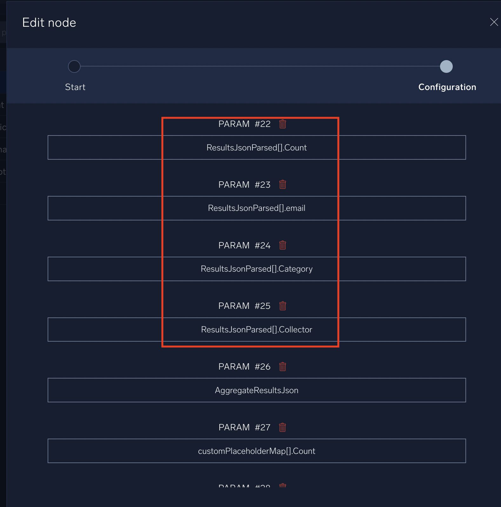
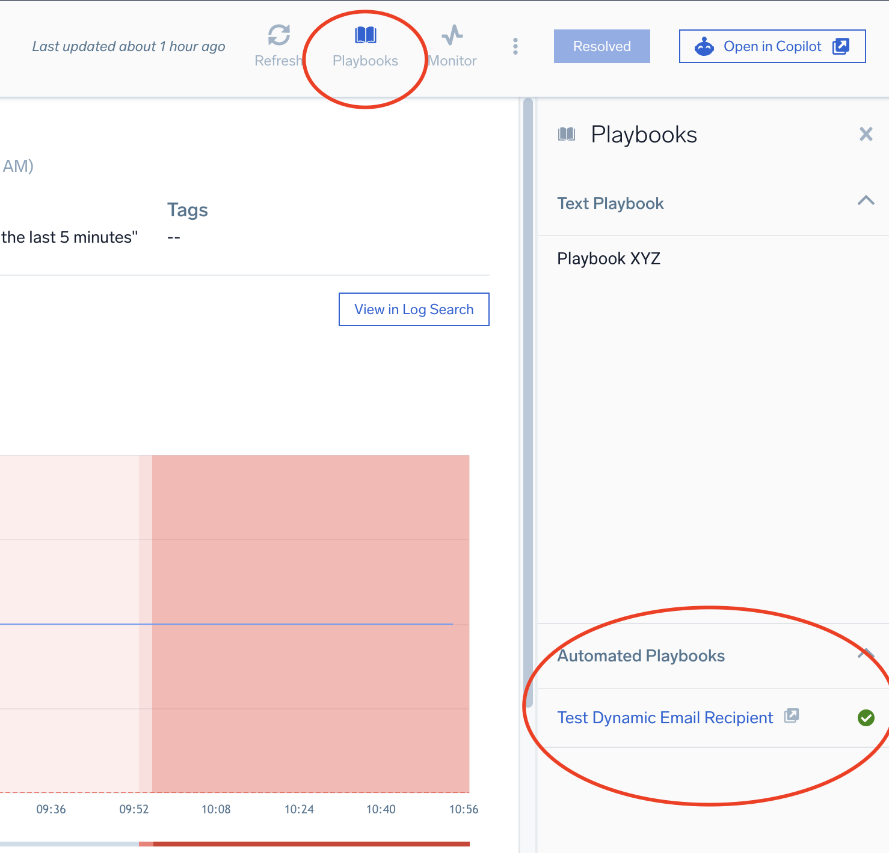
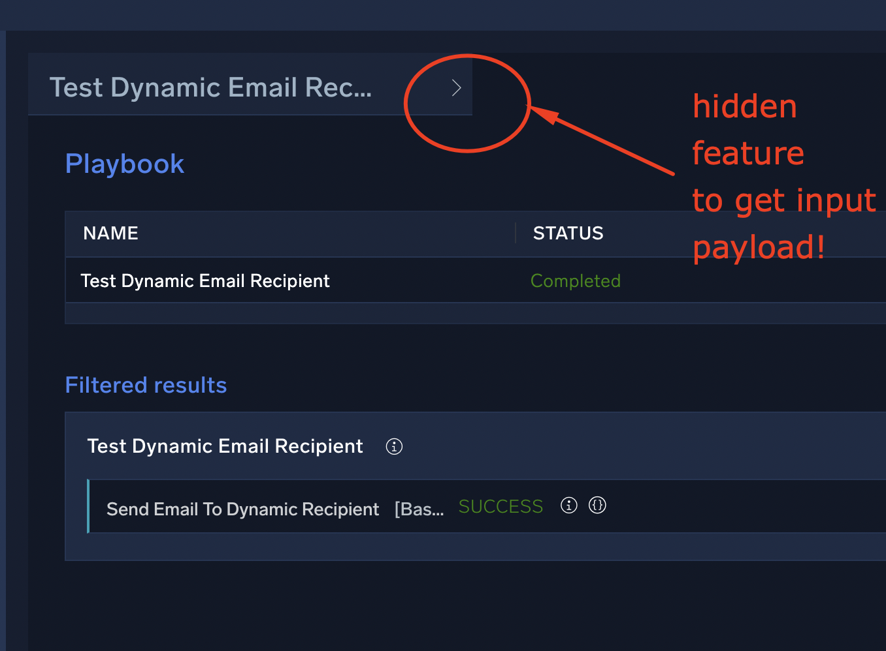
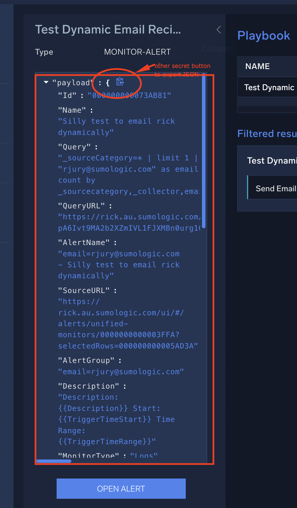
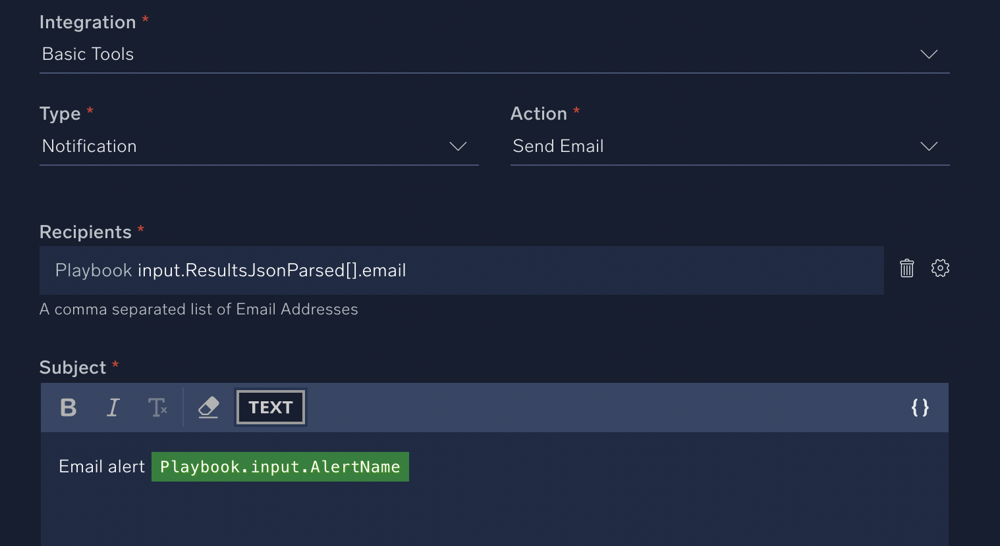
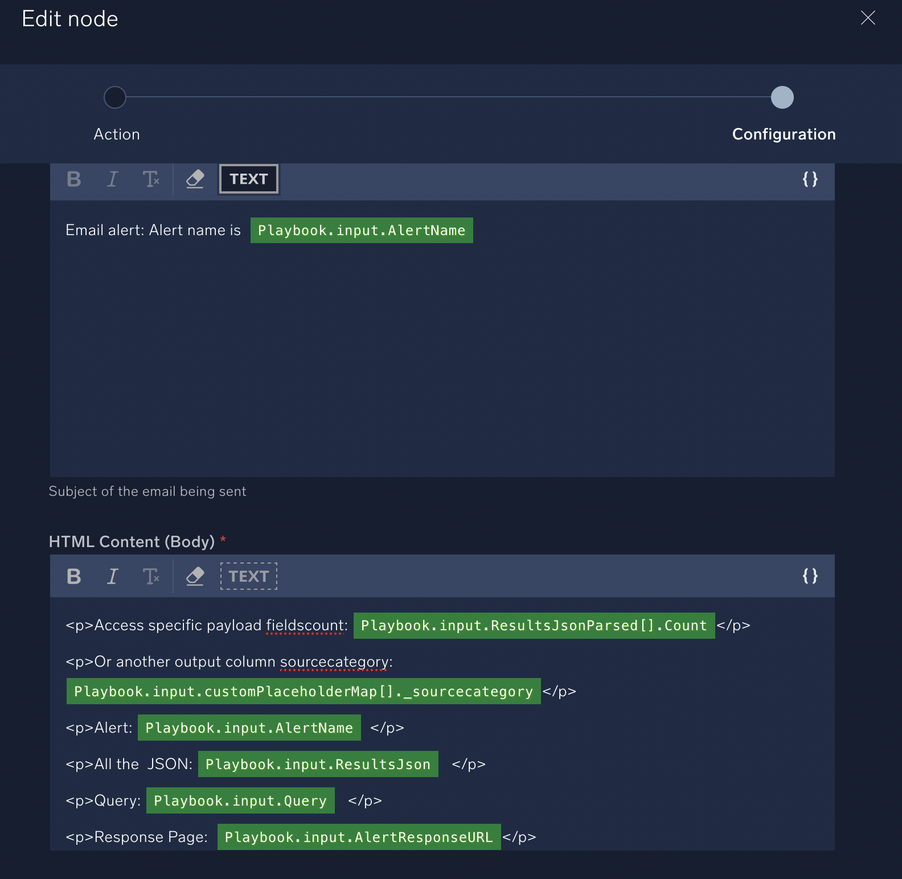

# Email alert to dynamic recipients using Automation Service

It's possible to use automation service to respond to a monitor alert and email a custom recipient extracted from the alert body or a field that is the output column of an aggregated log search.

There are two ways to do this:

1. The simple way: in 'Basic tools' use 'Payload Regex' to extract an email address from any text field in input and then use the field output. You can then use Regex_result_string output in a subsequent node such as "send email" as input parameter. The problem here is when you get to the email body you can't use ResultsJSON.fieldname to format the event. Instead you are stuck with just ```Parsed Output: Playbook.input.ResultsJsonParsed``` that makes a 'jsonified' output format which may not be desirable.
2. The complicated but better result way: Create the playbook with a custom input JSON - which is the captured output of an alert trigger to a playbook (or a custom built version of a previous one.) This works because the alert has two fields that if the alert is aggregate have field names them that can be directly referenced for email or email formatting of the subject.

**This document is about METHOD 2**. This is the most flexible method that gets the best final results since we can then access all fields in the email body section not just a 'JSON-fied' version. It does require more upfront work and needs the playbook to be crafted to a specific alert output.

## Crafting the alert query
It's always easier to work with aggregate alerts. For the log query for the monitor make sure it has aggergate output, and one of these columns is the email. For example. Here is a simple demo that will generate a static email alert on each run. You can have multiple emails though as the result. For the rest of this example we will assume this is the alert having output columns: Category (_sourcecategory), Collector (_collector), email and Count (_count). It's a bit tricky in the alert payload as built in fields get renamed sometimes to their UI versions in some of the resulting fields.

```
_sourceCategory=* | limit 1
| "foo@somewhere.com" as email
| count by _sourcecategory,_collector,email
```

## Accessing fields in playbooks.
This part is a bit catch-22. You need the output of an alert to define the input fields of the email. but the contents of these these JSON arrays will change to the aggregate columns output from your query:
- **ResultsJsonParsed**: Output fields one field per column. Element[0] only will be present - because you selected alert grouping one alert per earlier (right?!). The field names will change based on your actual query. So you must either capture a real output in automation service playbook UI, or fake the fields before importing it.
- **customPlaceholderMap**: output fields one field per column plus some built in ones (_sourcecategory, _collector). Element[0] only will be present - because you selected alert grouping one alert per earlier (right?!). The field names will change based on your actual query. So you must either capture a real output in automation service playbook UI, or fake the fields before importing it.

This output field has the same name but will be a variable JSON foramtted representation of your results:
- **AggregateResultsJson**: element[0] will be the single row of results as JSON. We don't need to edit this since it's always just one element of JSON data.

Full example of these fields payloads:
```
"ResultsJsonParsed": [
    {
      "Count": 1,
      "email": "someone@somwhere.com",
      "Category": "kubernetes/sumologic/sumo/metrics/collector",
      "Collector": "sumo"
    }
  ],
  "AggregateResultsJson": "[{\"Collector\":\"sumo\",\"Count\":1,\"Category\":\"kubernetes/sumologic/sumo/metrics/collector\",\"email\":\"someone@somwhere.com\"}]",
  "customPlaceholderMap": [
    {
      "Count": "1",
      "email": "someone@somwhere.com",
      "_count": "1",
      "Category": "kubernetes/sumologic/sumo/metrics/collector",
      "Collector": "sumo",
      "_collector": "sumo",
      "_sourcecategory": "kubernetes/sumologic/sumo/metrics/collector"
    }
  ],
  "AggregateResultsJsonParsed": [
    {
      "Count": 1,
      "email": "someone@somwhere.com",
      "Category": "kubernetes/sumologic/sumo/metrics/collector",
      "Collector": "sumo"
    }
  ]
```


There are two ways to proceed to get this custom input JSON for the Playbook so we can create the required fields in the input schema of the Playbook:
A) custom edit the example file in this repo to have your field names
B) sandbox a real alert to capture the payload.

## Method A: Making the Playbook With Custom Input Fields
### A.1 Edit the example file to match your output field schema
Make a new version of this [alert.payload.json](examples/alert.payload.json) where the fields ```ResultsJsonParsed``` and ```customPlaceholderMap``` match the output columns of your alert query. You only need to edit a few parts of this file where the output field schema is going to be different for your specific alert query.

Say my query made different columns: a,b, sum email. Instead this would have to be edited to this before I use it as the input of a playbook:
```
"ResultsJsonParsed": [
    {
      "Sum": 1,
      "email": "someone@somwhere.com",
      "a": "foo",
      "b": "bar"
    }
  ],
```

### A.2 Playbook creation using custom input JSON for input fields schema
Start a new playbook.
- Choose type General
- Open edit mode and edit the "Start" node
- For 'Add one or more params as a playbook input' select 'Parse from JSON'
- Paste in your lovingly crafted version of [alert.payload.json](examples/alert.payload.json) that you prepared earlier with your output fields and click "Parse"
- Make sure your fields appear in the ```ResultsJsonParsed[]``` section similar to this:

You are now good to go adding the email node and referencing the input fields in the email address. In the email body you can also use other fields to nicely format output. Proceed to step "Adding Send Email Node"

## Method B: Making the Playbook With Custom Input Fields From the Alert
### B.1  Setup a sandbox to get the actual payload
This is kind of like catch-22. To get a real output payload you need to trigger the alert one time vs an actual playbook.
- Create your monitor as per "creating a monitor below"
- Make a General playbook that has "Alert" as the input type. This will have the generic alert fields like AlertName but you can't access specific fields in the output easily.
- Add any node it doesn't matter if it works or fails and publish it
- Go back to your monitor and link it to the automated playbook section.

### B.2 Trigger an instance of alert to capture the payload
Getting the actual alert payload is not obvious. Do these steps:
- Make sure it triggers - you might need to set a silly threshold or "Resolve" it in the alerts screen so it triggers again
- Open Alerts, then open the Alert Response Page for this specific alert
- Click Playbooks then the alert action on the right hand side:

- Click the secret > button to open the actual payload.

Now you can copy and paste the **actual payload with your correct fields** to use as the input for step A.2 above by clicking the 'Copy to clipboard' icon directly to right of ```"payload":{```


Now you have the actual alert JSON with all the correct fields to proceed with step B.2

## Adding Send Email Node
You can now add and link a "Basic tools / Send Email" action node in your playbook. If you have the correct custom field schema then in the email body you can also use other fields to nicely format output.


### Formatting Body Output with ResultsJsonParsed
If you add the ResultsJsonParsed field to the body you will get a "Json-ified" email output. For example: ```Parsed Output: Playbook.input.ResultsJsonParsed``` will generate this body in email:

```
Parsed output: {
    "Count": 1,
    "email": "rjury@sumologic.com",
    "Category": "kubernetes/kube/system/kindnet",
    "Collector": "sumo"
}
```

### Formatting Body Output with custom schema fields
You can create a custom HTML email body using fields in the input schema. This allows for nice custom formatting of the email alert using input fields in: customPlaceholderMap or resultsJsonParsed.

If you have used a custom input field schema for the playbook you can directly access the field names as variables (similar to how ResultsJSON.fieldname works in monitor payload editing). For example: ```Playbook.input.ResultsJsonParsed[].email``` or any other field name that you have defined in the input phase. This enables advanced formatting options for the output email.


## Creating a Monitor with a link to the Automation Playbook
Create your monitor. Most settings don't matter too much but some do.
- use static evaluation
- Use alert grouping  'one alert per' with email or email and one or more other columns as group. That will trigger one alert per resulting group (email)
- Critical / Warning etc: you need at least one trigger so alert fires
- Advanced Settings: Suggest default of 'Use "Alert Group - Monitor Name"'
- Notifications: none are required as this is triggering automation service instead
- Playbooks: leave static text area blank unless you want to put something in!
- Automated Plabooks: This will target our playbook. If you have the final playbook ready (method A) you can make this this the final published playbook. If you are in sandbox stage (method B) this would be your sandbox playbook to capture input payload.
- Monitor Details: Enter a monitor name, tags (optional) and description. These are all text that will appear in the payload but are static.