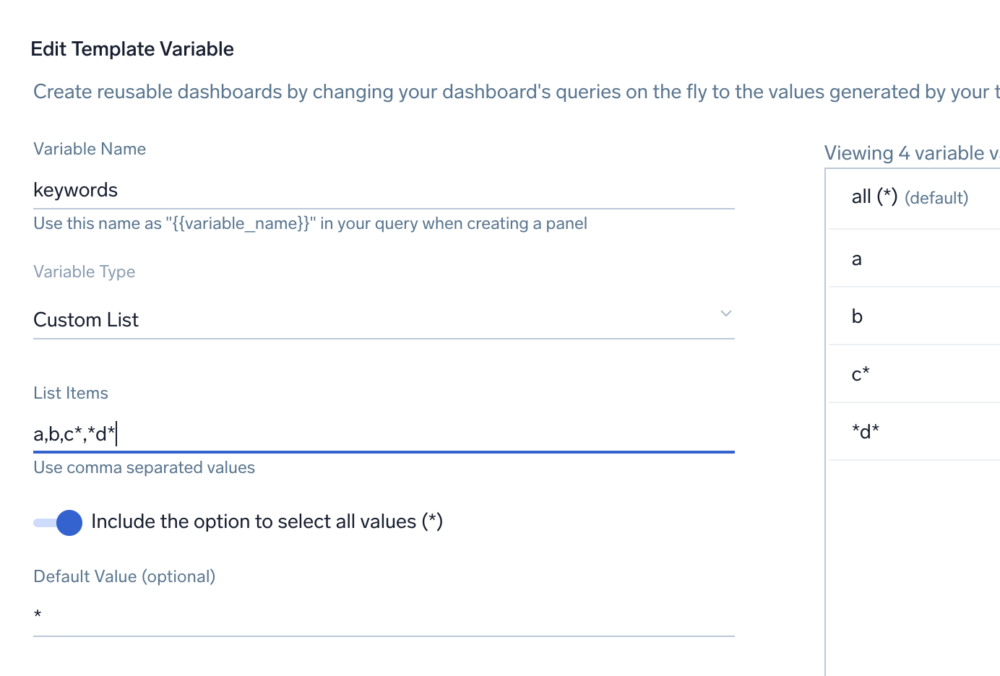
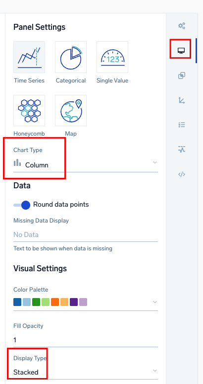

# Create a Dashboard Training Lab


This lab uses the Training Org that is used in Sumo Certjams.
Log in as a training user as per usual method such as training+analyst###@sumologic.com where ### is a number from 0001-999.

You can find this month's training password by going to your Sumo instance, then use the Home, Certification tab to open the training portal.


# In this Lab
- How to create a new dashboard with basic properties like name and time range.
- Add a filter template variable and use this for filtering
- Duplicating and Editing panels
- Time series panels and time compare
- Categorical, Time series, Honeycomb and Map panels


# About Cloudfront Logs
Amazon CloudFront is a web service that speeds up distribution of your static and dynamic web content, such as .html, .css, .js, and image files, to your users. CloudFront delivers your content through a worldwide network of data centers called edge locations.

Logs can provide a rich and detailed source for troubleshooting issues and undestanding if the cache layer is being used effectively. Sumo Logic has many out of the box dashboard apps to solve key use cases for many log types including the [AWS Cloudfront App](https://help.sumologic.com/docs/integrations/amazon-aws/cloudfront/).

In this lab we will use [AWS Cloudfront logs](https://docs.aws.amazon.com/AmazonCloudFront/latest/DeveloperGuide/logging.html) and build up a starting dashboard with a few different panel types. This will demonstrate some key concepts like adding panels and writing log searches for different panel types.

## 1. Create a dashboard
- Use the + New button, on the top of the Sumo UI and click Dashboard to make an new dashboard
- It should open a new tab with a mostly blank dashboard
- First click the time range selector in the top right corner.
- Tick 'set as dashboards's default time range' and change it to 'Last 60 Minutes'
- It will color blue to indicate this is not the default range for future users. Click the downward icon in the time selector and select 'Set as default time range'

Choosing a good default time range for the dashboard use case means usually other panels can just inherit the dashboard level setting.

## 2. Set a name
- Change your dashboard name including your initials for example: ```My Demo Cloudfront Dashboard - RJ``` by clicking on the name to edit it.
  
## 3. Setup a template variable 
[Filter template variables](https://help.sumologic.com/docs/dashboards-new/filter-template-variables/) allow flexible custom parameters within a dashboard. Users can then filter the dashboard panels based on custom criteria making your dashboard more versatile and in many cases a powerful accellerator for first stages of investigion.

- Click Create new variable + to add a new parameter on top left of the dashboard (if you can't see this click the filter button in top right.)
- For Variable Name use  ```keywords```
- For Variable Type use ```Custom List```
- You can put a list of things such as a,b,c in the list but it's optional
- Users can actually type anything in a template variable the list is only suggesitons
- Save it.
  

## 4. Add a Categorical panel
[Categorical](https://help.sumologic.com/docs/dashboards-new/panels/#categorical-panel) panels are the most common type of aggregate search panel. Categorical panels provide information on the number of occurrences of distinct values such as in pie, table, and column charts. Many other types of dashboard panels are available as you can see [here](https://help.sumologic.com/docs/dashboards/panels/).

These are best used to understand the distribution of data by categories. For example, understanding the number of CPUs used by machine type, or the number of requests handled by a pod.

- Add a new panel of type Categorical using the Add panel button in top right of the dashboard.
**note** the variable name must match what you set in the last step or the query will not run.
- This search selects cloudfront logs by sourcecategory, parses the tab separated fields into runtime fields and counts by the status field.
- copy and paste the search into the panel query window
  
```
_sourcecategory = *cloudfront* {{keywords}} 
| parse "*\t*\t*\t*\t*\t*\t*\t*\t*\t*\t*\t*\t*\t*\t*\t*\t*\t*\t*\t*\t*\t*\t*\t*" as _filedate,time,edgeloc, scbytes, c_ip,method,cs_host,uri_stem,status,referer,user_agent,uri_query,cookie,edgeresult,edge_request,domain,protocol,bytes,time_taken,forwarded_for,ssl_protocol,ssl_cipher, x_edge_response_result_type,protocol_version 
| count by status | sort _count
``` 

The first line of the query is the scope of the search and would typically include metadata and keywords.
Line 2 uses 'schema on read' - the ability to parse out and create fields at search time.
Line 3 makes this an aggregate query. Dashboard panels must use some form of aggregation.

- Click the looking glass icon or press enter to run the search.
- In the "Categorical" section try changing the chart type to try Table, Bar or Pie
- You can click the panel title 'Untitled' to change it's name
- When you are happy with it Click Add to Dashboard to save.

## 5. Using the filter
This dashboard  has a filter defined, we called ```keywords``` . Filters make it easy to re-use dashboards across environments or services, and to enable them to be powerful first step troubleshooting tools. This means are run time the value ```{{keywords}}``` in the panel will be replaced by whatever you type in the filter when searches run.
- Try changing entering a keyword such as ```304``` or ```Miss``` and press enter
- what effect does this have on results?
- Put the value back to *

## 6. Duplicate and edit to create a Time Series Panel
A fast way to build dashboards is to create different vizualiations or panels that use similar searches using an exisitng one as a base. In this step we will **duplicate** the panel and customize it to represent a time series view of the same data.

If you mouse over or highlight a panel you will see an elipsis button in the top right of the panel.
- Use the ellipsis button on the panel to bring up the panel menu
- Choose Duplicate.
  
This will create a new panel the same with (Copy) on the panel name. Drag or resize this panel to where you want to place it.
- Choose Edit on the new panel from the elipsis button on the panel. 
- Remove the count line at the end. You can delete it or add ```//``` to the line to comment it out
- Add a new aggregation instead:

```
| timeslice
| count by _timeslice
```

- Change the panel type to **Time Series**
- Run the query
- Change the panel time range to -3h and run again
- Then try some different time series chart types such as line and area.

## 7. Using Time Compare
[Time compare](https://help.sumologic.com/docs/search/time-compare/) is a very powerful way to understand if current performance is typical compared to previous performance.
- Edit the panel again and add: ``` | compare with timeshift 7d```
  The query should now be:

```
_sourcecategory = *cloudfront* {{keywords}} 
| parse "*\t*\t*\t*\t*\t*\t*\t*\t*\t*\t*\t*\t*\t*\t*\t*\t*\t*\t*\t*\t*\t*\t*\t*" as _filedate,time,edgeloc, scbytes, c_ip,method,cs_host,uri_stem,status,referer,user_agent,uri_query,cookie,edgeresult,edge_request,domain,protocol,bytes,time_taken,forwarded_for,ssl_protocol,ssl_cipher, x_edge_response_result_type,protocol_version 
| timeslice
| count by _timeslice | compare with timeshift 7d
```

- Save the panel by using Update Dashboard
- You will now see the count of events compare to the count of previous events from last week at the same time as two seperate lines on the graph.

## 8. Multi Series Time Charts
It's very useful to represent dynamic series changes over time where the desired outcome is one series per value of a specific field such as status_code or instance.
- Duplicate the time series panel you just created.
- Change the last line so it matches search below.

Transpose reformats time series data with a series column into a format for graphing over time.

```

_sourcecategory = *cloudfront* {{keywords}} 
| parse "*\t*\t*\t*\t*\t*\t*\t*\t*\t*\t*\t*\t*\t*\t*\t*\t*\t*\t*\t*\t*\t*\t*\t*" as _filedate,time,edgeloc, scbytes, c_ip,method,cs_host,uri_stem,status,referer,user_agent,uri_query,cookie,edgeresult,edge_request,domain,protocol,bytes,time_taken,forwarded_for,ssl_protocol,ssl_cipher, x_edge_response_result_type,protocol_version 
| timeslice
| count by _timeslice, status | transpose row _timeslice column status
```

Stacked charts are a powerful vizualization technique for transposed data sets. There are many options in dashboard panels for more advanced layout and customization.
- Change the Chart Type to Column
- Change the Display Type below that to Stacked
- Update the chart and you will see each status code stacked in time series buckets over time.



## 9. Honeycomb Panels
Let's add a new panel type - the honeycomb type. This is good for showing dynamic changes ranges of things like nodes in auto scale groups for example vs a dimension such as CPU use.
- Add a new panel using Add Panel 
- Choose the honeycomb type. 
- Add this search for the panel:
```
_sourcecategory = *cloudfront* {{keywords}}
| parse "*\t*\t*\t*\t*\t*\t*\t*\t*\t*\t*\t*\t*\t*\t*\t*\t*\t*\t*\t*\t*\t*\t*\t*" as _filedate,time,edgeloc, scbytes, c_ip,method,cs_host,uri_stem,status,referer,user_agent,uri_query,cookie,edgeresult,edge_request,domain,protocol,bytes,time_taken,forwarded_for,ssl_protocol,ssl_cipher, x_edge_response_result_type,protocol_version 
| count by edgeloc | sort _count 
 ```

You will see one node for each edge location, and it is color coded by volume of count
 - Name the panel something like Hits by edgeloc and Update Panel

## 10. Map panels with geo location
A common use case in Sumo is to geo-locate web server traffic where a log contains public ip addresses for user sessions.
- Add a Map type panel. Maps require a specific set of fields in the ouput: latitude,longitude

```
_sourcecategory = *cloudfront* {{keywords}}
| parse "*\t*\t*\t*\t*\t*\t*\t*\t*\t*\t*\t*\t*\t*\t*\t*\t*\t*\t*\t*\t*\t*\t*\t*" as _filedate,time,edgeloc, scbytes, c_ip,method,cs_host,uri_stem,status,referer,user_agent,uri_query,cookie,edgeresult,edge_request,domain,protocol,bytes,time_taken,forwarded_for,ssl_protocol,ssl_cipher, x_edge_response_result_type,protocol_version 
| count by c_ip
| geoip c_ip
| sum(_count) as hits by latitude,longitude,country_name
```

## Bonus: Review the Cookbook for more options
This is only a taste of what is possible with dashboards.

Check out the panel cookbook as static PDF versions in this repo in folder [dashboard_demo](./dashboard_demo/). Or you can view live interactive dashboard versions in the training lab organization: 
1. [Basics](https://service.sumologic.com/ui/#/dashboardv2/zAmNYflsUBLmbHKDjheFMPN8TJNMRleMfWy0IaG6aeW1IMWEMa5jg1QEqAyS)
2. [Time Series](https://service.sumologic.com/ui/#/dashboardv2/XVwCzaTFlgVBpBwO19Q0YPe7YpG70nOfjQsSZPK1j8PqWivmlVCbbjnc9tot)
3. [Advanced Analytics](https://service.sumologic.com/ui/#/dashboardv2/Y8bfaK7xavywMlJIOyYBUNBRCCzT2GDTIMmBfnGdlfQlhpL9n48i0QYsG8Dc)
4. [Advanced Techniques](https://service.sumologic.com/ui/#/dashboardv2/pXMmZqEdFKOBskiEJoE5jM0yVxDkhHNMswMF2OSTALCWbF9ZRl16OPAEybFx)

Checkout these micro learning videos:
- [Create a Dashboard ](https://www.youtube.com/watch?v=eiP5yUzGO0s) - [Create a Simple Dashboard](https://www.youtube.com/watch?v=A-O_E-NbxN8) - [Customize a Dashboard](https://www.youtube.com/watch?v=oTCRykqtL2M)  - [Share a Dashboard Inside Your Organization](https://www.youtube.com/watch?v=nQOAYaMad4Q)

