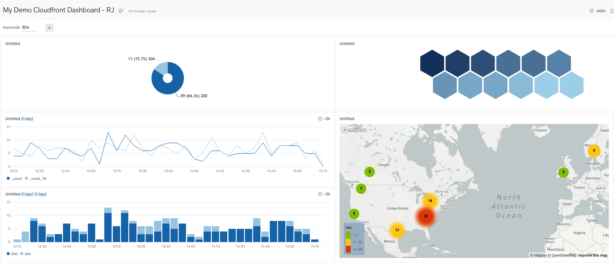
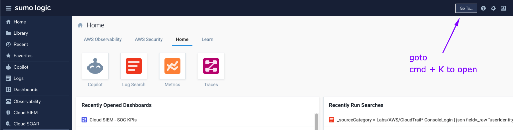
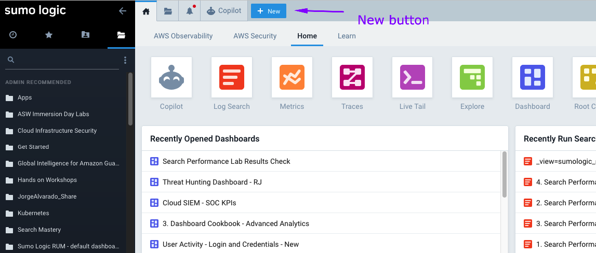
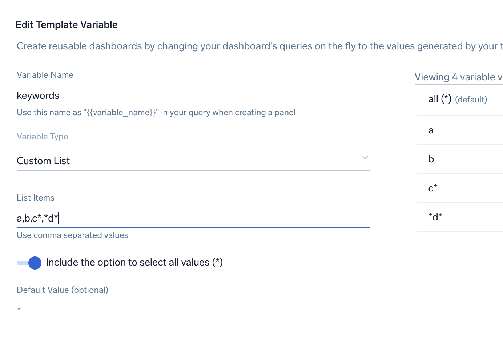
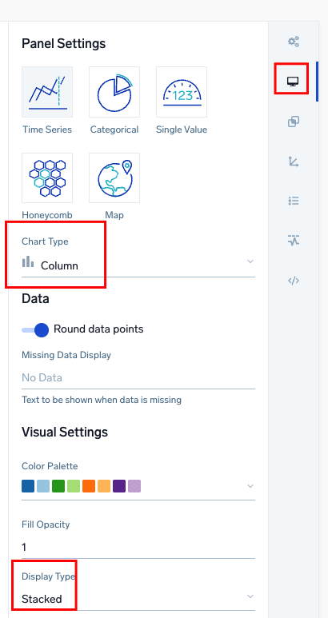
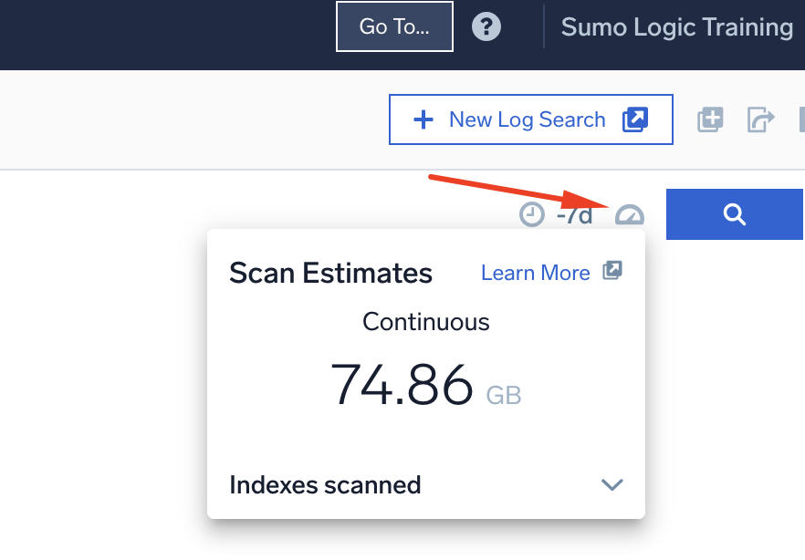

# Dashboard Lab: Building Operational Dashboards



## Overview

In this lab you will build a working dashboard using Amazon CloudFront log data. You will practise creating several panel types, use a template variable filter, and learn how to apply time compare for trend analysis. The lab also introduces scheduled views as a performance optimisation technique.

**Lab environment:** Training Org (used in Sumo Certjams). Log in as `training+analyst###@sumologic.com` where `###` is a number from 001–999. Find this month's password via **Home > Certification** tab in the training portal.

---

## Prerequisites

- You can navigate the Sumo Logic UI and run a basic log search
- You understand the basic of log search: creating searches and using the search UI.
- You are logged in to the Training Org

---

## What You Will Learn

- Create a dashboard and set its default time range using typical query patterns such as scope → parse → aggregate
- Add a template variable filter and use it to scope panel queries to maximise dashboard flexibilty
- Build Categorical, Time Series, Honeycomb, and Map panels
- Use `timeslice`, `transpose`, and `compare with timeshift` techniques for richer visualisations
- Understand why all dashboard panels require aggregation
- See how scheduled views dramatically accelerate dashboard query performance

---

## UI Version Note

This lab supports both the **new UI** and the **legacy UI**. Steps may vary slightly. It is recommended to use the new UI.

New UI: 

Legacy UI:  

In the new UI, the fastest way to open a new tab is:

1. Press **Cmd + K** (or click **Go To**)
2. Start typing what you want - e.g. `log` for Log Search
3. Click the result. Use **Cmd + Click** to open in a new tab.

---

## Background: Amazon CloudFront Logs

Amazon CloudFront is a global content delivery network (CDN). CloudFront logs record every request handled at edge locations and are a rich source for troubleshooting cache effectiveness, identifying errors, and understanding geographic traffic patterns.

> **Did you know?** Sumo Logic has a pre-built [AWS CloudFront App](https://help.sumologic.com/docs/integrations/amazon-aws/cloudfront/) with ready-made dashboards. In this lab you build equivalent panels from scratch so you understand how they work.

The dashboard you are building is an example of a **Investigation / Workflow dashboard** - it uses a template variable filter so any user can quickly scope the view to a keyword of interest, making it a powerful first step in troubleshooting.

---

## Exercise 1: Create the Dashboard and Setup Default Time Range

1. Create a new dashboard using one of the following: **new UI** open the **Go To** dialog and type 'new' or 'das' and select **New Dashboard**; **old UI** click the **+ New** button at the top of the Sumo UI and select **Dashboard**.
2. A new tab opens with a blank dashboard.
3. Click the **time range selector** in the top right corner.
4. Select **Last 60 Minutes** from the relative list.
5. Click the **down arrow** in the time selector and choose **Set as default** to set this as the dashboard default time range.

> **Why this matters:** Setting a sensible default time range means new users who open your dashboard will see a useful window of data immediately. Individual panels can override the dashboard time range if needed, but most panels will inherit this setting.

---

## Exercise 2: Name the Dashboard

Click the dashboard name at the top and rename it to include your initials, for example:

```text
My Demo CloudFront Dashboard - RJ
```

> **Tip:** Including your initials avoids naming conflicts when multiple students are working in the same organisation.

---

## Exercise 3: Add a Template Variable Filter

[Filter template variables](https://help.sumologic.com/docs/dashboards-new/filter-template-variables/) let users change a value at the top of the dashboard to filter all panels simultaneously. This makes a single dashboard usable across many investigation scenarios. It's a good practice to create these at the start of building panels so you can copy the filtering to each panel as it's created.

1. Click **Create new variable +** in the top-left of the dashboard. (If you cannot see this, click the filter icon in the top right.)
2. Set **Variable Name** to `keywords`
3. Set **Variable Type** to **Custom List**
4. Optionally add a few example values such as `304,Miss,Hit` - these become suggestions in the dropdown, but users can type anything
5. Click **Save**
 


> **Key concept:** At runtime, every occurrence of `{{keywords}}` in a panel query is replaced by whatever the user has typed into the filter. The default value `*` matches everything. Template variables can appear anywhere in a query that produces valid syntax - in scope, in a `where` clause, or even as a `timeslice` interval.

---

## Exercise 4: Add a Categorical Panel

[Categorical panels](https://help.sumologic.com/docs/dashboards-new/panels/#categorical-panel) display aggregated data **without a time dimension** - counts, sums, or averages grouped by one or more fields. They are most often displayed as table, bar or pie charts.

> **Rule:** Every dashboard panel must use aggregation. A raw log search without a `count`, `sum`, `avg`, or similar operator will cause an error.

1. Click **Add Panel** (top right) and choose **Categorical**.
2. Copy and paste the query below into the panel query window.

   ```text
   _sourcecategory = *cloudfront* {{keywords}}
   | parse "*\t*\t*\t*\t*\t*\t*\t*\t*\t*\t*\t*\t*\t*\t*\t*\t*\t*\t*\t*\t*\t*\t*\t*" as _filedate,time,edgeloc,scbytes,c_ip,method,cs_host,uri_stem,status,referer,user_agent,uri_query,cookie,edgeresult,edge_request,domain,protocol,bytes,time_taken,forwarded_for,ssl_protocol,ssl_cipher,x_edge_response_result_type,protocol_version
   | count by status | sort _count
   ```

   **Query explained:**

   | Line | Purpose |
   | --- | --- |
   | Line 1 | **Scope** - selects CloudFront logs and applies the `{{keywords}}` template variable filter |
   | Line 2 | **Parse** - extracts the tab-separated CloudFront log fields into named variables (schema on read) |
   | Line 3 | **Aggregate** - counts events grouped by HTTP status code |

   > **Note:** The variable name in the query (`{{keywords}}`) must exactly match the variable name you set in Exercise 3.

3. Click the magnifying glass icon or press **Enter** to run the query.
4. In the **Categorical** section, try the **Table**, **Bar**, and **Pie** chart types.
5. Click the panel title **Untitled** to rename it - e.g. `Requests by Status Code`.
6. Click **Add to Dashboard**.

---

## Exercise 5: Use the Template Variable Filter

Your dashboard now has a filter bar at the top showing the `keywords` variable.

1. Type `304` into the filter and press **Enter**. What changes in the panel results?
2. Try `Miss` - this is a CloudFront cache result status.
3. Try `Hit`.
4. Reset the filter value back to `*` before continuing.

> **Discussion:** Filters like this make a single dashboard reusable for many investigations. An on-call engineer can type an error code, a host, or any other keyword to scope the entire dashboard instantly - without needing to edit any queries. In a production dashboard context it's common to mix keyword type filters (which are fast and open ended), with filters targeting specific fields e.g 

```
| where status_code matches "{{status_code}}"
```

---

## Exercise 6: Duplicate and Convert to a Time Series Panel

A fast way to build dashboards is to **duplicate** an existing panel and modify it rather than starting from scratch.

Time series panels display data **over time** and require a `timeslice` + aggregate `by _timeslice` query pattern, let's try one out!

1. Hover over the Categorical panel to reveal the **ellipsis (⋯)** button in the top right corner of the panel.
2. Choose **Duplicate**. A copy appears with `(Copy)` appended to the name.
3. Drag or resize the new panel to position it on the dashboard.
4. Click the ellipsis on the new panel and choose **Edit**.
5. Remove or comment out the last line (`| count by status | sort _count`). You can comment a line by adding `//` at the start.
6. Add this aggregation instead:

   ```text
   | timeslice
   | count by _timeslice
   ```

7. Change the **Panel Type** to **Time Series**.
8. Run the query and observe the time series chart.
9. Try changing the **panel time range** to `-3h` to override the dashboard default for this panel.
10. Try chart types **Line** and **Area**.
11. Rename the panel - e.g. `Requests Over Time` - and click **Add to Dashboard**.

> **Tip:** Using `timeslice` without a time argument lets Sumo Logic automatically choose an appropriate bucket size based on the selected time range. For precise control, specify a value: `timeslice 5m`, `timeslice 1h`, etc.

---

## Exercise 7: Time Compare

[Time compare](https://help.sumologic.com/docs/search/time-compare/) is a powerful technique for understanding whether current performance is normal compared to the same period in previous weeks.

1. Click the ellipsis on your Time Series panel and choose **Edit**.
2. Append `| compare with timeshift 7d` to the last line of your query. The complete query should now be:

   ```text
   _sourcecategory = *cloudfront* {{keywords}}
   | parse "*\t*\t*\t*\t*\t*\t*\t*\t*\t*\t*\t*\t*\t*\t*\t*\t*\t*\t*\t*\t*\t*\t*\t*" as _filedate,time,edgeloc,scbytes,c_ip,method,cs_host,uri_stem,status,referer,user_agent,uri_query,cookie,edgeresult,edge_request,domain,protocol,bytes,time_taken,forwarded_for,ssl_protocol,ssl_cipher,x_edge_response_result_type,protocol_version
   | timeslice
   | count by _timeslice | compare with timeshift 7d
   ```

3. Click **Update Dashboard**.

> **Expected result:** The chart now shows two lines - the current period and the same period from 7 days ago. Spikes or drops in one line that don't appear in the other are worth investigating.
>
> **Going further:** `| compare with timeshift 7d 3 avg` compares current against the **average of the last 3 weeks** - useful for smoothing out one-off anomalies in the baseline.

---

## Exercise 8: Multi-Series Time Chart

It is often useful to plot a separate time series line for each value of a dimension - for example one line per HTTP status code. This requires the `transpose` operator to reshape the data for charting.

1. Duplicate the Time Series panel you created in Exercise 6 (the one without time compare).
2. Edit the new panel and replace the last two lines with:

   ```text
   | timeslice
   | count by _timeslice, status | transpose row _timeslice column status
   ```

   The full query:

   ```text
   _sourcecategory = *cloudfront* {{keywords}}
   | parse "*\t*\t*\t*\t*\t*\t*\t*\t*\t*\t*\t*\t*\t*\t*\t*\t*\t*\t*\t*\t*\t*\t*\t*" as _filedate,time,edgeloc,scbytes,c_ip,method,cs_host,uri_stem,status,referer,user_agent,uri_query,cookie,edgeresult,edge_request,domain,protocol,bytes,time_taken,forwarded_for,ssl_protocol,ssl_cipher,x_edge_response_result_type,protocol_version
   | timeslice
   | count by _timeslice, status | transpose row _timeslice column status
   ```

   **What `transpose` does:** It pivots data from a "long" format (one row per timeslice per status) into a "wide" format (one row per timeslice, one column per status). Each column then becomes a separate series on the chart.

3. Change the **Chart Type** to **Column** and the **Display Type** to **Stacked**.
4. Rename the panel and then Click **Update Dashboard**.

> **Expected result:** A stacked column chart with each status code as a separate coloured band, making it easy to see how the mix of responses changes over time.



---

## Exercise 9: Honeycomb Panel

Honeycomb panels display one cell per entity (e.g. one cell per edge location). Cell colour indicates a metric value - ideal for spotting outliers across many items at a glance.

1. Click **Add Panel** and choose **Honeycomb**.
2. Enter the query:

   ```text
   _sourcecategory = *cloudfront* {{keywords}}
   | parse "*\t*\t*\t*\t*\t*\t*\t*\t*\t*\t*\t*\t*\t*\t*\t*\t*\t*\t*\t*\t*\t*\t*\t*" as _filedate,time,edgeloc,scbytes,c_ip,method,cs_host,uri_stem,status,referer,user_agent,uri_query,cookie,edgeresult,edge_request,domain,protocol,bytes,time_taken,forwarded_for,ssl_protocol,ssl_cipher,x_edge_response_result_type,protocol_version
   | count by edgeloc | sort _count
   ```

3. Run the query. Each CloudFront edge location appears as a cell, coloured by request volume.
4. Name the panel `Hits by Edge Location` and click **Add to Dashboard**.

> **Use case:** Honeycomb panels are especially valuable in status / snapshot dashboards - imagine one cell per server in a fleet, coloured green/yellow/red by error rate. Outliers stand out immediately even across hundreds of entities.

---

## Exercise 10: Map Panel with Geo-Location

A Map panel plots event data geographically. It is a common pattern for web access logs where client IP addresses can be resolved to a location.

> **Note:** The `geoip` operator resolves **public** IP addresses only. Private/RFC-1918 addresses will not resolve and should be excluded with `| where !isEmpty(country_name)` after the geoip call.

1. Click **Add Panel** and choose **Map**.
2. Enter the query:

   ```text
   _sourcecategory = *cloudfront* {{keywords}}
   | parse "*\t*\t*\t*\t*\t*\t*\t*\t*\t*\t*\t*\t*\t*\t*\t*\t*\t*\t*\t*\t*\t*\t*\t*" as _filedate,time,edgeloc,scbytes,c_ip,method,cs_host,uri_stem,status,referer,user_agent,uri_query,cookie,edgeresult,edge_request,domain,protocol,bytes,time_taken,forwarded_for,ssl_protocol,ssl_cipher,x_edge_response_result_type,protocol_version
   | count by c_ip
   | geoip c_ip
   | sum(_count) as hits by latitude,longitude,country_name
   ```

3. Run the query. You should see traffic plotted on a world map.
4. Name the panel `Traffic by Location` and click **Add to Dashboard**.

> **Map panels require** the output to include `latitude` and `longitude` fields. The `geoip` operator extracts these automatically from an IP address field.

---

## Exercise 11: Scheduled Views - Query Performance

So far every panel has queried **raw log data** directly. As dashboards cover longer time ranges (days or weeks), raw queries scan large volumes of data and can become slow or time out.

**Scheduled views** solve this by pre-computing and storing aggregated results on a rolling basis. Dashboard queries then read from a small, pre-aggregated dataset instead of re-scanning all raw logs.

### Part A: Run the Raw Query and Record Performance

Run the following query in a **new Log Search tab** over the **last 30 days**. When the query completes, note the execution time and data scanned (shown in the search status bar).

```text
 _sourcecategory = "Labs/AWS/WAF"
| json field=_raw "httpRequest.clientIp" as src_ip
| where (ispublicip(src_ip))
| json field=_raw "action"
| threatip src_ip | where !(isempty(malicious_confidence))
//| timeslice 1m
| "AWS" as vendor
| "WAF" as product
| malicious_confidence as threat
| json field=raw_threat "threat_types"
| count by vendor,product,_sourcecategory,_source,src_ip,action,threat,actor,threat_types
| lookup asn,organization from asn://default on ip=src_ip
| geoip src_ip
| fields -latitude,longitude,country_name,state
```

**What this query does - step by step:**

| Step | Operator | What it does |
| --- | --- | --- |
| 1 | `_sourcecategory = "Labs/AWS/WAF"` | **Scope** - restricts the scan to AWS WAF log data only |
| 2 | `json field=_raw "httpRequest.clientIp"` | **Parse** - extracts the client IP from the JSON log structure |
| 3 | `where ispublicip(src_ip)` | **Filter** - discards private/RFC-1918 IPs that cannot be geo-resolved or threat-checked |
| 4 | `json field=_raw "action"` | **Parse** - extracts whether WAF allowed or blocked the request |
| 5 | `threatip src_ip` | **Enrich** - looks up each IP against Sumo Logic's threat intelligence feed; adds `malicious_confidence`, `actor`, and threat metadata |
| 6 | `where !(isempty(malicious_confidence))` | **Filter** - keeps only IPs with a positive threat match |
| 7 | `count by ...` | **Aggregate** - counts matched threat events grouped by source, IP, action, and threat attributes |
| 8 | `lookup ... from asn://default` | **Enrich** - resolves each IP to its ASN and organisation name |
| 9 | `geoip src_ip` | **Enrich** - resolves each IP to country, region, city, latitude, and longitude |
| 10 | `fields -latitude,...` | **Format** - drops geo-coordinate fields not needed in the output |

> **Why this query is expensive over large time ranges:**
>
> This query performs three costly operations on **every matching raw log event** at search time:
>
> - **`threatip`** - each IP is checked against a threat intelligence feed. On high-traffic WAF data this can mean millions of lookups per query run.
> - **`geoip`** - similarly resolves every IP to a location, adding compute overhead proportional to event volume.
> - **JSON parsing** - extracting nested fields from raw JSON is more expensive than querying pre-indexed fields.
>
> Over 30 days of busy WAF traffic, all three operations compound to make this query slow and data-intensive. A scheduled view could cache this work running **once per minute at ingest time** and storing only IOC matches with enrichment already applied - so dashboard queries skip all of this work entirely.

Record your results:

| Metric | Raw Query result |
| --- | --- |
| Query execution time - in search result bar in UI| ___ seconds |
| Data scanned - click the meter icon just to left of run query button | ___ GB |



### Part B: Run the Equivalent View Query

Now run the equivalent query using a scheduled view. The view has already aggregated the AWS WAF data in 1-minute buckets - your query re-aggregates those pre-computed rows to the hourly level.

<!-- INSTRUCTOR: Insert the view-based equivalent query for your training environment below -->

```text
// use the pre-aggregated view instead
_view=threat_geo_asn_aws_waf_v1
// view is timesliced by 1m but we don't need that here
| sum(_count) as matched_events by vendor,product,_sourcecategory,_source,src_ip,action,threat,actor,threat_types, asn, organization 
```

> **sum(_count)** - Note the view query is slightly different - if we used count here we would just count the rows in the view not sum the _count columnn that is the total per minute in the view schema!

Record your results:

| Metric | View Query result |
| --- | --- |
| Query execution time | ___ seconds |
| Data scanned | ___ GB |

### Part C: Compare and Reflect

> How did the runtimes and scan volume compare for the raw vs the view version of the query?
> 
> **Views in dashboards** - We can easily add a query like this to the dashboard we are building using **Add to Dashboard** button in the Aggregates tab.
> 
> **Key takeaway:** Views are most valuable for dashboard panels covering days or weeks of data, queries that run repeatedly (dashboards auto-refresh, scheduled reports), and queries involving expensive operations like `geoip` or complex regex parsing - the view computes these once at ingest time and caches the result. Views are **not** suitable when you need raw message-level detail, or for one-off ad-hoc queries.

## Exercise 12: Optional - Build a custom clickalble drilldown link

Dashboards can be part of a workflow where a clickable link in a query result table opens another web url, sumo dashboard with filters provided as query params, or [start a pre-built search in a new query tab](https://www.sumologic.com/help/docs/search/get-started-with-search/build-search/use-url-to-run-search/).

1. Go back to the browser tab with your dashboard or open it by finding in Recent menu or the library search in your Personal folder. In new UI you can use 'back' in browser history too.
2. Add a new categorical panel with the query below and select table output type:

```text
// use the pre-aggregated view instead
_view=threat_geo_asn_aws_waf_v1

| min(_timeslice) as f,max(_timeslice) as l, sum(_count) as matches by src_ip,_sourcecategory,_source,threat,country_code,organization
| "service.sumologic.com" as dp
| num(l - ( 1000 * 60 * 60 * 3)) as f
// suppress scientific notation must be epoch
| format( "%.0f",f) as f
| format( "%.0f",l) as l
| concat ("_sourcecategory = ", _sourcecategory, " _source = ", replace(_source," ","?"), " " , src_ip) as q
| tourl(concat("https://",dp,"/ui/#/search/@",f,",",l,"@",urlencode(q)),q) as new_query 
|  fields -dp,f,l,q

```

**What this query does - step by step:**

| Step | Operator | What it does |
| --- | --- | --- |
| 1 | `_view=threat_geo_asn_aws_waf_v1` | **Scope** - queries the pre-aggregated scheduled view instead of raw logs; very fast even over long time ranges |
| 2 | `min(_timeslice) as f, max(_timeslice) as l` | **Aggregate** - finds the earliest and latest event timestamps per IP, used to set the time range of the drilldown link |
| 3 | `sum ... by src_ip, ..., organization` | **Aggregate** - counts threat events grouped by IP, source, threat type, country, and ASN organisation |
| 4 | `"service.sumologic.com" as dp` | **Assign** - stores the Sumo Logic domain as a variable for URL construction |
| 5 | `num(l - (1000 * 60 * 60 * 3)) as f` | **Calculate** - shifts the start timestamp back 3 hours to give the drilldown search a wider window around the first match |
| 6 | `format("%.0f", f/l)` | **Format** - suppresses scientific notation so epoch millisecond values are safe to embed in a URL |
| 7 | `concat("_sourcecategory = ", ..., src_ip) as q` | **Build query string** - constructs a Sumo Logic log search query scoped to the specific source and IP address |
| 8 | `tourl(concat("https://", dp, "/ui/#/search/@", ...), q)` | **Build URL** - assembles the full deep-link URL that opens a new Sumo Logic search tab pre-loaded with the query and time range; `urlencode(q)` makes the query string URL-safe |
| 9 | `fields -dp, f, l, q` | **Format** - removes the intermediate working columns from the output, leaving only the display fields and the clickable link |

> **How the drilldown link works:** The `tourl()` operator creates a clickable hyperlink in the table panel. The link encodes the source category, source name, and matched IP directly into a Sumo Logic search URL - including a pre-set time range spanning the matched events. Clicking the link opens a new search tab showing the **raw log events** behind that threat match, giving analysts a one-click path from the summary dashboard panel to the underlying evidence.

3. Name the panel **AWS WAF IOC Matched With Clickable Drilldown** and add the panel.

---

## Bonus: Explore More Options

This lab covers the core panel types. Sumo Logic dashboards offer much more.

### Panel Cookbook Dashboards

View live interactive examples in the training org:

1. [Basics](https://service.sumologic.com/ui/#/dashboardv2/zAmNYflsUBLmbHKDjheFMPN8TJNMRleMfWy0IaG6aeW1IMWEMa5jg1QEqAyS)
2. [Time Series](https://service.sumologic.com/ui/#/dashboardv2/XVwCzaTFlgVBpBwO19Q0YPe7YpG70nOfjQsSZPK1j8PqWivmlVCbbjnc9tot)
3. [Advanced Analytics](https://service.sumologic.com/ui/#/dashboardv2/Y8bfaK7xavywMlJIOyYBUNBRCCzT2GDTIMmBfnGdlfQlhpL9n48i0QYsG8Dc)
4. [Advanced Techniques](https://service.sumologic.com/ui/#/dashboardv2/pXMmZqEdFKOBskiEJoE5jM0yVxDkhHNMswMF2OSTALCWbF9ZRl16OPAEybFx)

Static PDF versions are also available in this repo under [dashboard_demo](./dashboard_demo/).

### Additional Panel Types to Explore

| Panel Type | Best For |
| --- | --- |
| **Single Value** | KPIs and health indicators - one number at a glance with colour thresholds |
| **Text** | Markdown annotations, instructions, links to runbooks - turns a dashboard into a guided workflow |
| **Box Plot** | Latency distribution over time (min, max, median, percentiles) |

### Sharing Your Dashboard

Save your dashboard to a **shared Library folder** so others in your organisation can use it. Administrators can promote high-value dashboards to **Admin Recommended** to surface them prominently for all users.

### Micro-Learning Videos

- [Create a Dashboard](https://www.youtube.com/watch?v=eiP5yUzGO0s)
- [Create a Simple Dashboard](https://www.youtube.com/watch?v=A-O_E-NbxN8)
- [Customize a Dashboard](https://www.youtube.com/watch?v=oTCRykqtL2M)
- [Share a Dashboard Inside Your Organization](https://www.youtube.com/watch?v=nQOAYaMad4Q)
