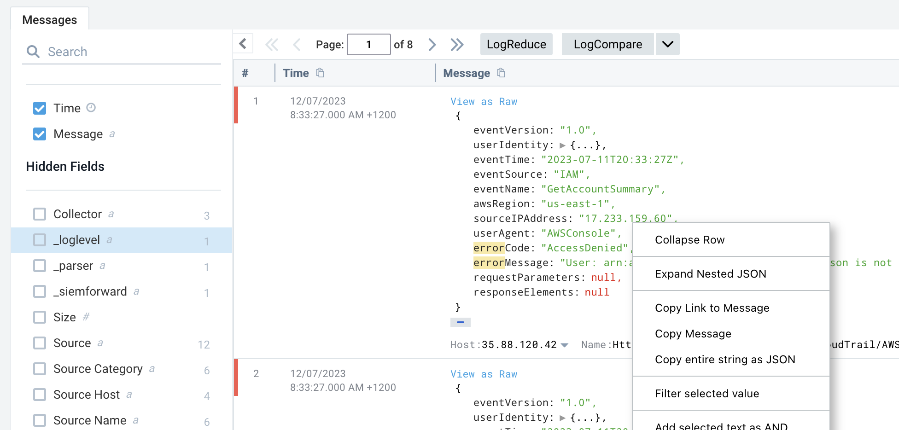
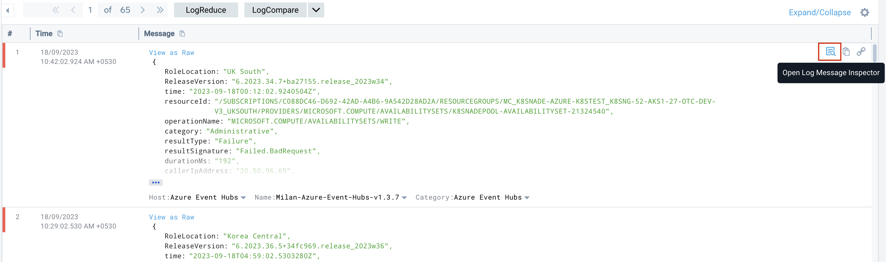
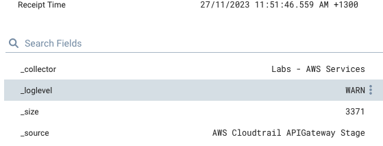
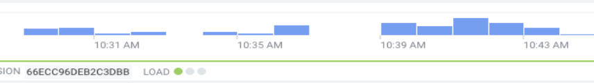
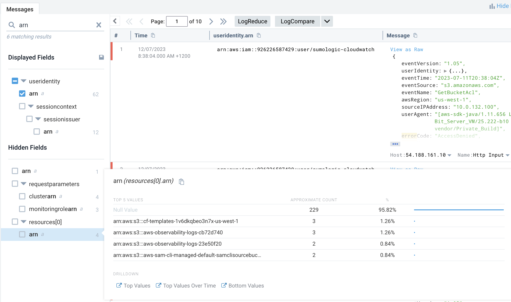
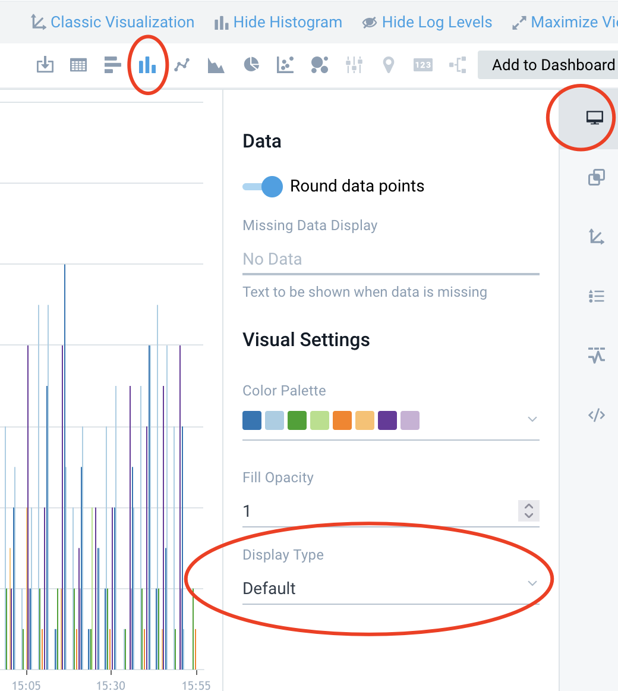

# Lab Search - Working with JSON Cloudtrail
This lab uses the Training Org that is used in Sumo Certjams.
Log in as a training user as per usual method such as:
- training+analyst###@sumologic.com 
  
where ### is a number from 0001-999.

You can find this month's training password by going to your Sumo instance, then use the Home, Certification tab to open the training portal.

Work through the exercises below.

**Note**: In this lab we assume your searches are in Advanced Mode. You might find your UI is in 'basic mode' so you will have to [switch to Advanced](https://help.sumologic.com/docs/search/get-started-with-search/search-page/search-modes/)

**Tips**:
- To add or removing comment lines select use shortcut keys:  ```Cmd + /``` (```Cntrl + /``` on Windows)
- Pressing Enter or Return runs the search
- Add a new line with ```Shift + Enter```  or ```Shift + Return```.

## In this Lab
- How to run a basic search vs a JSON structured log and view results
- How to navigate the UI: histogram, log message inspector, field browser
- Use raw Messages vs Aggregate result tabs
- How to turn raw logs into insights by parsing fields and making aggregation / charting.

## About AWS CloudTrail Logs
JSON structured logs are a common log type ingested into Sumo Logic. A good example of JSON logs is AWS Cloudtrail - the audit log for all API calls vs APIs in an AWS account.

## Use Case Overview: Cloudtrail errorCodes
When an AWS Cloudtrail API call fails, a CloudTrail event is logged containing errorCode and errorMessage keys. This can be a very valuable source for both observability to find and fix broken workloads and in the security domain to prevent, detect and respond to security threats.

For example AccessDenied could indicate a broken workload or a failed authentication attempt by a malicious user. Rate limiting and exceeding account limits are other good examples of useful errors in Cloudtrail.

In these exercises we will create some searches to drill into AWS API errors in AWS Cloudtrail logs and show how to turn JSON logs into insights.

## 1. Run a search and review Messages Tab
At top of the Sumo Logic UI window click the blue + New button then choose Search. 

The search below includes a metadata value (sourcecategory) and some keywords to narrow down results to just valid Cloudtrail events with an errorCode string in them.

**Tip**: It's a good search practice to include a **_sourcecategory** or **_index** in each search to scope for best performance.

- Paste this into your new search window. This simple search has as scope sourcecategory, which is a good best practice, and two keywords to limit results returned.
```
_sourcecategory = Labs/AWS/CloudTrail* recipientaccountid errorcode
```

-  Change the time range to "last 60 minutes" (time picker is just to left of blue search icon)
-  Run the search by clicking the blue search button icon or pressing enter in the search window.

You will now see Messages returned in the **Messages Tab** in the right pane, and fields in the **Field Browser** in the left pane.


- In the "message" column note how the [UI formats the logs as JSON events](https://help.sumologic.com/docs/search/get-started-with-search/search-basics/view-search-results-json-logs/) to make them more readable. 
- Underneath the Message you can see the key metadata values like host, category (_sourcecategory) and index (also known as _index or _view). If you click on the index value under the messge it will update your query with the new scope. This is a easy way to add metadata to the current query. 
- You can right click on JSON key or values to bring up menu quick actions for working with the logs such as 'Copy Message' or 'Parse the selected key'
- You can click 'view as Raw' to see the raw JSON formatted message
- There are other UI options to expand/collapse JSON

Take a quick visit to the [Getting Started With Search docs page](https://help.sumologic.com/docs/search/get-started-with-search/). This is the key resource as a new user to learn more about how to use the search interface. 


## 2. Use Log Message Inspector To Drill Into Fields In An Event
Hover over any message in the results and use the pop up menu on the right to open [Log Message Inspector](https://help.sumologic.com/docs/search/get-started-with-search/search-page/log-message-inspector/). 



This shows detailed field values for each field in the event in a single panel on the right of the UI.



**TIP**: You can use Log Messge Inspector to quickly add more filtering syntax to your query. In inspector select a field row and use the elipsis menu on right to 'Filter Selected Value'. You can use this to quickly build the next iteration of your search to return only specific field values.

## 3. Use the Search histogram and Auto Log Level Detection Feature
The search histogram shows the count of results over time, and can be color coded by auto detected log level.

There are several really useful features of the search histogram:
- You can click a segment of the histogram to move to the messages page for that time range
- If you ```Shift + click``` on a single or range of selected histogram bars it will open a duplicate search window for that new time range. This is fast shortcut to drill into specific narrower time ranges.
- Events are color coded in the histogram by [auto detected log level](https://help.sumologic.com/docs/search/get-started-with-search/search-page/log-level/). You can click a level such as "ERROR" to filter to only logs of that level.



## 4. Use the Field Browser For Quick Insights
On the left of the Messages tab you will see the [field browser](https://help.sumologic.com/docs/search/get-started-with-search/search-page/field-browser/). This shows all fields that exist in the current search scope, which could be a mix of metadata, pre-indexed fields and fields extracted at search time.

By default sumo extracts every JSON field from logs at search time using "Auto Parsing" search mode so every possible Cloudtrail JSON key value will appear in the current search.



In your search window with results try the following:
1. Tick a box next to some fields in the browser and note how this changes the columns displayed.  
2. Type 'error' in the search box in the top section of the field browser to see fields with 'error' in the name. For Cloudtrail this would include errorCode and errorDescription.
3. Click on the ```errorCode``` field name in browser to show a pop up. The pop up shows the breakdown of events for the first 100k results. This is a quick way to get insights about what is happening in your logs for key field dimensions. Clicking a single value in the popup will open a new query filtered to that field value.

## 5. Turning fields into insights with Aggregation
By starting with raw logs, parsing fields and then using aggregation we can turn large volumes of log events into valuable insights in real time.

Aggregate queries enable you to take the fields you have parsed in the search and turn these into insights or thresholds for alerting using a range of aggregation operations like: count, min, max, avg, pct & many others.

In our current use case how can we answer the question: what are the top API errors by errorcode?

- In the field brownser click the field name errorCode. At the bottom of the pop window click:  ```Top Values```. This will open a new search tab that adds to your base query in a new search window: 

```
( _sourcecategory = Labs/AWS/CloudTrail*  )
| count errorcode | top 10 errorcode by _count
```

- Run this new search above. This is now an aggregate search. You will now have **TWO** search tabs: **Messages and Aggregates**. In the aggregates tab you can have tabular or graphical results, export results, sort by clicking column headings or add your search to a dashboard.


## 6. Graphing Over Time To Understand Trends and Distribution
A key use case for Sumo Logic is to understand trends in extracted fields over time. How can we tell what errors are occurring and what the pattern is over the last six hours? When did the problem start and is there any periodic nature to what we can observe?

- Use time range picker to change the time range to another value by entering a relative time expression: ```-6h```

- Run the search below which counts each value of eventname but in 5 minute time buckets (using timeslice) and outputs this in a format suitable for charting (using transpose):

```
 _sourcecategory = Labs/AWS/CloudTrail*
| json field=_raw "eventName"
| timeslice 5m 
| count _timeslice, eventname 
| transpose row _timeslice column eventname
```

Since this is an aggregate query we will have both Messages and Aggregates tabs. On the Aggregates tab:
- change to the column chart type using the column chart icon
- click the display tab just below "add to dashboard"
- in the display type to 'Stacked'
The new stacked chart nicely shows the distribution of errors over time. Since this is a lab environment the errors are quite periodic.



## 6. Parsing Fields Manually
By default JSON logs are auto parsed and all fields extracted. It's a good search practice as you get more advanced with Sumo Logic to parse out fields using parsing operators - since other types of logs might not have an auto parse mode.

Here you see an example search with parse operators - **json**, simple **parse** anchor, and **parse regex** which are some of the many parse operators available. Don't worry if the search syntax is overwhelming right now - the key things to note are:
- parsing is a key skill to extract fields and generate insights from structured or semi-structured logs
- there are many parse operators for different log formats
- parse operators act as a filter unless you use **nodrop** keyword. So if a field is optional add nodrop.

```
 _sourcecategory = Labs/AWS/CloudTrail* errorcode
// Parse a field using JSON operator
| json field=_raw "errorCode" 
| json field=_raw "errorMessage"
| json field=_raw "recipientAccountId"

// Parse a field using Parse anchor for simple patterns
| parse "eventSource\":\"*\"" as event_source 
| parse "\"eventName\":\"*\"" as event_name 

// nodrop keyword tells sumo to include all results even ones that fail parse.
// This is desired behaviour for optional JSON keys
| parse "\"userName\":\"*\"" as user nodrop
| json "userIdentity.arn" as arn nodrop

// You can parse a field as well as the whole message
// Here is example using the parse regex capture group parser
| parse regex field=arn "^arn:aws:[a-z]+::[0-9]+:(?<role>.+)" nodrop
```

- Run this search and you will see that parsed fields are already displayed as a column in results, and ticked in field browser. Parsing fields specifically like this an easy way to include them in results columns in the field browser. There is a fields operator that is similar for formatting but that removes all fields from the final scope but those specified.

## Bonus Activities
If you have finished that lab and have time to spare checkout these resources.

### Search Cheat Sheet
The [log operators cheat sheet](https://help.sumologic.com/docs/search/search-cheat-sheets/log-operators/) provides a list of available parsers, aggregators, search operators, and mathematical expressions with links to full details for each item.

## Review the search basics microlesson
This  [Introduction to search microlesson](https://www.youtube.com/watch?v=VbFsfpmP6LY) provides a great overview of the search pipeline. 


### Review Best Practices for Search
Review the [search best practices](https://help.sumologic.com/docs/search/get-started-with-search/build-search/best-practices-search/) to understand how to write fast high performing searches. 

