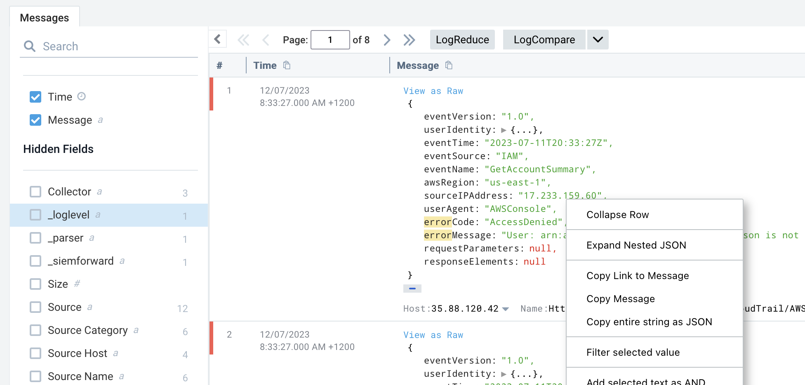
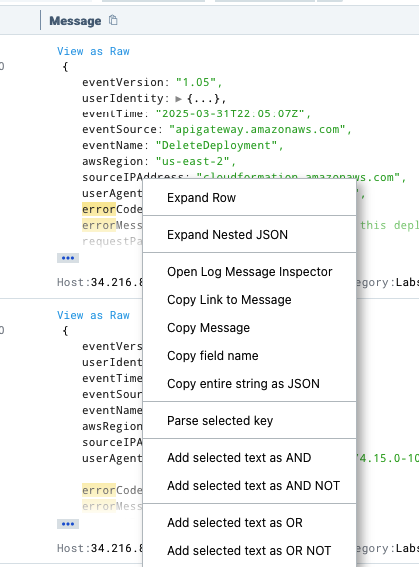
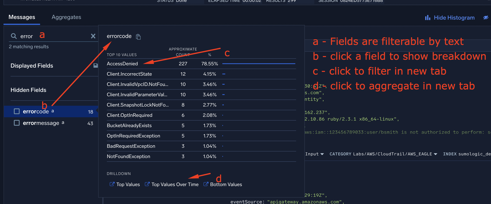
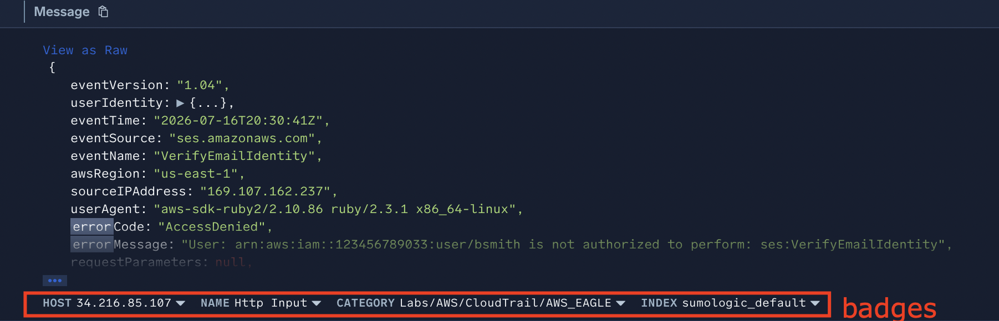
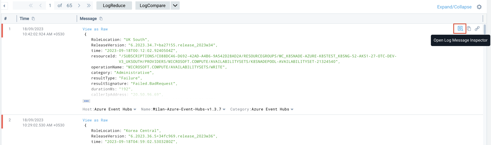
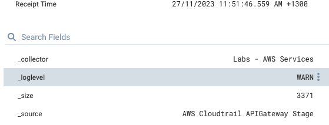
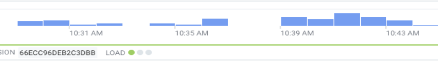
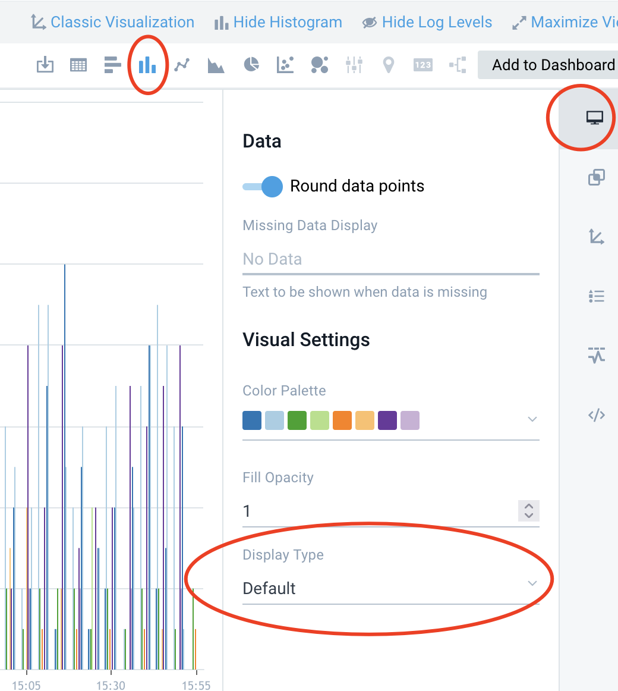

# Lab 1: Iterative Log Search — Working with JSON Structured Logs (AWS CloudTrail)

Sumo Logic is a cloud-native multi-tenant log analytics platform that consolidates search and correlation across structured and unstructured log sources. Its unified platform ingests logs from legacy infrastructure, cloud platforms, applications, and SaaS — with 120+ search operators and a flexible schema-on-read model.

**Key capabilities covered in this lab:**

| Capability | Description |
| --- | --- |
| Metadata scoping | Use `_sourcecategory`, `_index`, and keywords to focus searches |
| Schema on Read | Parse fields at search time — no pre-schema required |
| Iterative investigation | Narrow and pivot without leaving the UI |
| Aggregation & charting | Turn raw logs into categorical and time-series insights |

---

## Learning Objectives

By the end of this lab you will be able to:

1. Scope a search using metadata fields and keywords against JSON logs
2. Use the Field Browser and Log Message Inspector to explore log structure
3. Iterate and pivot searches using UI shortcuts
4. Parse JSON and semi-structured fields using multiple parse operators
5. Build categorical and time-series aggregate queries and visualise results

**Estimated time:** 15-25 minutes

---

## Environment Setup

### Training Org Access

This lab uses the Sumo Logic Training Org at [https://service.sumologic.com](https://service.sumologic.com).

Log in as a training user: `training+analyst###@sumologic.com` where `###` is a number from 0001–999. Your trainer will supply the password, or find this month's password via your own Sumo instance → **Home → Learn** tab.

> **Important:** This is a shared public training environment. Never upload your own data to it.

### Choosing the Right UI

Sumo Logic has two web UIs. **Use the new UI** for this lab. You can identify which UI you are in from these screenshots:

**New UI**


**Old UI**


To open a new Log Search in the **new UI**:

1. Press `Cmd + K` (Mac) or `Ctrl + K` (Windows) to open the **Goto** dialog
2. Type `log` and select **Log Search**
3. Use `Cmd + click` (Mac) or `Ctrl + click` (Windows) to open in a new browser tab

### Search Mode

This lab uses **Advanced Mode**. If your UI shows a simplified query bar, switch to Advanced Mode via the [Search Modes documentation](https://help.sumologic.com/docs/search/get-started-with-search/search-page/search-modes/).

---

## Background: AWS CloudTrail

AWS CloudTrail is the audit log for every API call made in an AWS account. It is one of the most common JSON-structured log sources in Sumo Logic and is essential for:

- **Observability:** detect rate limit errors and broken workloads
- **Security:** identify suspicious API activity or credential misuse
- **Compliance:** audit user and service activity by account, region, and resource

When an API call fails, CloudTrail records an event with `errorCode` and `errorMessage` fields. This lab uses those error events to demonstrate the full search-to-insight workflow.

---

## Exercise 1: Run a Search and Review Raw Results

### Step 1.1 — Scope and run the search

Open a new Log Search window, then paste the query below. This search scopes to CloudTrail data using the `_sourcecategory` metadata field and filters to events containing both `recipientaccountid` and `errorcode` as keywords.

```sql
_sourcecategory = Labs/AWS/CloudTrail* recipientaccountid errorcode
```

> **Note:** Spaces between terms are implicit `AND`. Complex logic like `(a OR b) AND c` is also supported.

Set the time range to **Last 60 minutes** using the time picker to the left of the search button, then run the search.

### Step 1.2 — Review results in the Messages tab

Results appear in the **Messages** tab. The **Time** column shows `_messagetime` (parsed at ingestion), and the **Message** column shows `_raw`. JSON logs are automatically formatted for easy navigation.



**Try these UI actions:**

- Right-click any JSON key or value to access quick actions such as **Copy Message** or **Parse the selected key**

  

- Click **View as Raw** to see the unformatted JSON
- Review the [View Search Results for JSON Logs](https://help.sumologic.com/docs/search/get-started-with-search/search-basics/view-search-results-json-logs/) docs page for all display options
- Bookmark the [Getting Started With Search](https://help.sumologic.com/docs/search/get-started-with-search/) page — it is the primary reference for new users

### Search Editor Shortcuts

| Action | Mac | Windows |
| --- | --- | --- |
| Run search | `Enter` | `Enter` |
| New line (no run) | `Shift + Enter` | `Shift + Enter` |
| Toggle comment | `Cmd + /` | `Ctrl + /` |

**Comment syntax:**

```sql
// single-line comment

/*
  multi-line comment
*/
```

---

## Exercise 2: Explore Fields and Iterate

Raw message results are a starting point. Experienced Sumo Logic users follow an **iterative workflow**:

1. Scope the search using metadata and keywords
2. Explore fields to understand log structure
3. Narrow or pivot using UI shortcuts
4. Parse fields and aggregate into insights

### Step 2.1 — Use the Field Browser

The **Field Browser** (left panel on the Messages tab) lists all fields available in the current search scope. This includes:

- **Metadata fields** (e.g. `_sourcecategory`, `_index`)
- **FER fields** pre-extracted at ingest time by administrators
- **Auto-parsed JSON fields** extracted at search time (e.g. `%"useridentity.arn"`)

With your search results displayed:

1. **Add columns:** Check the box next to any field to add it as a column in the Messages tab and move it to **Displayed Fields**. Displayed fields are added to the messages result table in right pane.
2. **Filter fields:** Type `error` in the Field Browser search box to find `errorCode` and `errorMessage` — select checkbox next to each to add them as columns
3. **Quick distribution:** Click anon text of any field name in field browser list such as  `errorCode` field to see a pop-up showing the distribution of the top values across the first 100k results. This is a simple and fast technique to gain insights into log trends.



### Step 2.2 — Iterate Using the Field Browser

From the field distribution pop-up, you have two pivot options:

1. Click any **individual value** to open a new search filtered to that specific value
2. Click **Top Values** or **Top Values Over Time** to open a new aggregate query in a separate search tab

### Step 2.3 — Narrow Scope via the Messages Tab

Below the message text in the 'Message' column in the Messages tab you will see metadata badges: **host**, **category** (`_sourcecategory`), and **index** (`_view`). (Note you may have to scroll to right to see this if messages column is not visible).



- **Click a badge** to append it as a scope constraint to the current query, in the current search tab. The resulting query might now look like this for example:

  ```sql
  (_sourcecategory = Labs/AWS/CloudTrail* recipientaccountid errorcode)
  AND _sourceCategory="Labs/AWS/CloudTrail/APIGateway"
  AND _view=prod_cloudtrail
  ```

  > `_view` is the internal query name for the `index` field shown in the UI.

- **Click the down-arrow** next to a badge to open a new search tab for [surrounding messages](https://help.sumologic.com/docs/search/get-started-with-search/search-basics/search-surrounding-messages/) — useful for context around a specific event.

### Step 2.4 — Drill Into Fields with Log Message Inspector

Hover over any message row and click the pop-up icon on the far right to open the [Log Message Inspector](https://help.sumologic.com/docs/search/get-started-with-search/search-page/log-message-inspector/).



The inspector shows every field and its value for that event in a dedicated right-hand panel.

To narrow your query from the inspector:

1. Click any field row
2. Use the ellipsis `...` menu on the right
3. Select **Filter Selected Value** — this appends the field filter to your current query



### Step 2.5 — Use the Histogram to Narrow by Time or Log Level

The search histogram shows event count over time, colour-coded by auto-detected log level. Useful actions:

| Action | Result |
| --- | --- |
| Click a histogram bar | Filter Messages tab to that time period |
| `Shift + click` a bar | Open a **new search** scoped to that time range |
| Click a log level (e.g. `ERROR`) | Filter Messages tab to that `_loglevel` value only |



---

## Exercise 3: Parse Fields from Logs

By default, JSON logs use **Auto Parse mode** — every JSON key becomes a queryable field. Explicit parsing is faster and works for non-JSON logs too.

The example below demonstrates four parse operators. **Run this search** and observe that parsed fields automatically appear as columns in the results.

```sql
_sourcecategory = Labs/AWS/CloudTrail* errorcode

// json operator — parse a named JSON key into a field
| json field=_raw "errorCode"
| json field=_raw "errorMessage"
| json field=_raw "recipientAccountId"

// parse anchor — match a simple text pattern
| parse "eventSource\":\"*\"" as event_source
| parse "\"eventName\":\"*\"" as event_name

// nodrop — include events even if the field is missing (optional fields)
| parse "\"userName\":\"*\"" as user nodrop
| json "userIdentity.arn" as arn nodrop

// parse regex — use a capture group for more complex patterns
| parse regex field=arn "^arn:aws:[a-z]+::[0-9]+:(?<role>.+)" nodrop
```

**Key parse operator concepts:**

| Concept | Description |
| --- | --- |
| `json` operator | Extracts a JSON key by name — most readable for JSON logs |
| `parse` anchor | Matches surrounding text as anchors; `*` captures the value |
| `parse regex` | Full regex with named capture groups; slowest but most flexible |
| `nodrop` keyword | Prevents the parse from acting as a filter — use for optional fields |

---

## Exercise 4: Aggregate and Visualise

Aggregation transforms large volumes of raw log events into measurable insights for dashboards, alerting, and investigation. The **Aggregates tab** is where Sumo Logic's analytical power becomes most visible.

### Step 4.1 — Categorical Aggregation

**Goal:** Which error codes appear most frequently?

Start with the base search again:

```sql
_sourcecategory = Labs/AWS/CloudTrail* errorcode
```

Use the Field Browser shortcut:

1. Click the `errorCode` field name in the Field Browser
2. Click **Top Values** at the bottom of the pop-up

This opens a new search tab with the aggregate query already written:

```sql
_sourcecategory = Labs/AWS/CloudTrail* errorcode
| count errorcode
| top 10 errorcode by _count
```

Run this query. The **Aggregates tab** now shows tabular results. From this tab you can:

- Switch between table and chart views
- Sort by clicking column headers
- Export results to CSV
- Click **Add to Dashboard** to pin the panel to a dashboard

### Step 4.2 — Time-Series Aggregation

**Goal:** How are errors trending over time? When did they start? Is the pattern periodic?

Change the time range to a **relative time expression** by typing `-6h` directly in the time range box (meaning *last 6 hours*).

Run the following query, which counts errors per error code in 5-minute buckets and reshapes the output for charting using `transpose`:

```sql
_sourcecategory = Labs/AWS/CloudTrail* errorcode
| json field=_raw "errorCode"
| timeslice 5m
| count _timeslice, errorCode
| transpose row _timeslice column errorCode
```

In the **Aggregates tab**:

1. Select the **Column chart** type from the chart icons
2. Open the **Display** tab (below **Add to Dashboard**) and set the type to **Stacked**

The stacked column chart shows the error distribution over time. In this lab environment errors have a regular pattern.



### Step 4.3 — Filter to Specific Error Categories

**Goal:** Are any workloads hitting API rate limits or throttling?

Change the time range to **Last 24 hours**, then run the refined query below. The keyword pre-filter on line 2 is fast (bloom filter) and keeps the `where` filter from scanning all data unnecessarily.

```sql
_sourcecategory = Labs/AWS/CloudTrail* errorcode
// keywords pre-filter events before any parsing — keep these broad
(*exceed* or *limit*)

| json field=_raw "errorCode"
// narrow to rate-limit style errors only
| where errorcode matches "*Limit*" or errorcode matches "*Exceeded*"

| timeslice 15m
| count _timeslice, errorCode
| transpose row _timeslice column errorCode
```

This query surfaces workloads that may need AWS API soft limit increases. From here you could further iterate — add `recipientAccountId` or `arn` to the `count` to identify which accounts or workloads are responsible.

---

## Bonus Activities

Finished early? Explore these resources:

| Resource | What to focus on |
| --- | --- |
| [Log Operators Cheat Sheet](https://help.sumologic.com/docs/search/search-cheat-sheets/log-operators/) | Full list of parsers, aggregators, and math operators |
| [Search Best Practices](https://help.sumologic.com/docs/search/get-started-with-search/build-search/best-practices-search/) | How to write high-performance queries |
| [Introduction to Search (video)](https://www.youtube.com/watch?v=VbFsfpmP6LY) | 5-minute overview of the search pipeline |

**Challenge query:** Extend the rate-limit search to show the top 5 affected AWS accounts over the last 24 hours. Add `recipientAccountId` as a dimension in the `count` and use `top 5` to limit the results.
