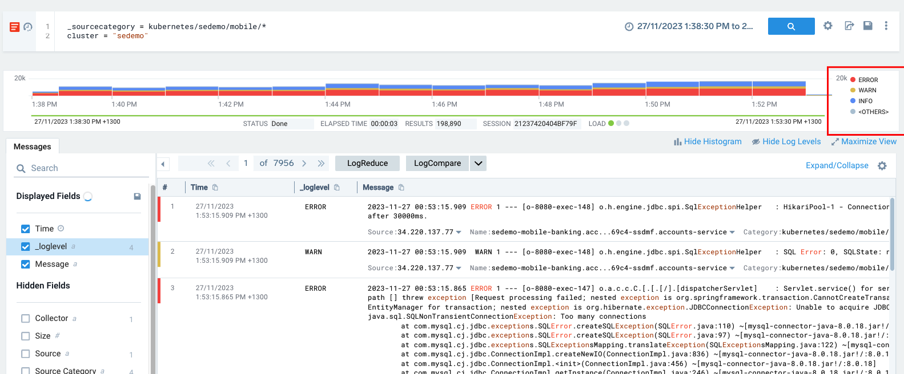

# Lab 1: Powerful, iterative, flexible Log Search - Working with JSON Structured Log

Sumo Logic is a powerful and flexible Cloud Native multi-tenant log analytics platform that enables consolidated log search or correlation from any structured or unstructured log data sources. Sumo Logic's unified flexible platform can ingest logs from legacy or on-prem infrastructure, cloud platforms, applications or SaaS enabling the same log search approach with over 120 operators to search or correlate across sources. Features include:

- Scope using metadata or keyword expressions
- Schema on Read: Parse fields when you need them at search time
- Iterative approach for modern observability or security investigations
- Drill into to raw query from any dashboard panel or alert.

## In this Lab

- Learn basic search using metadata and keywords vs AWS Cloudtrail stuctured JSON log
- Use the UI features to explore and gain instant insights
- Iterate or pivot to new searches via UI shortcuts and features
- Turn raw logs into insights using fields and aggregation via Categorical or Time Series Charts.

### Training Lab Environment

This lab uses the Training Org that is used in Sumo Self Paced or classroom training at https://service.sumologic.com. Log in as a training user: ```training+analyst###@sumologic.com``` where ### is a number from 0001-999. Your trainer will supply the current training user password or you can find this month's training password by going to your own Sumo instance, then access the self paced training portal via Home, Learn tab.
**This is a public shared training environment. Never upload your own data to it!**

### New UI vs Old UI
There are two Web UIs for Sumo Logic the [new UI](https://help.sumologic.com/docs/get-started/sumo-logic-ui/) and legacy old UI. Some steps in lab might vary based on what UI you are using. You can tell which UI your user account is using by checking these images. **It's suggested to switch to use UI**. In new UI the easiest way to start a new tab is:
1. click 'goto' or use cmd + k to open the goto dialog
2. start typing what you want to open e.g log for log search
3. click the menu item to open it. New UI uses native browser tabs so you can cmd + click to open this page as new tab

**new UI**


**old UI**


### Log search advanced vs basic mode
In this lab we assume your searches are in Advanced Mode. You might find your UI is in 'basic mode' so you will have to [switch to Advanced](https://help.sumologic.com/docs/search/get-started-with-search/search-page/search-modes/)

## AWS CloudTrail Logs
Sumo Logic can easily handle structured or unstructured logs but JSON structured logs are a very common log format. A good example of JSON logs is AWS Cloudtrail - the audit log for all API calls vs APIs in an AWS account. AWS Cloudtrail is key to many Observability, Security analytics or compliance use cases.

When an AWS Cloudtrail API call fails, a CloudTrail event is logged containing errorCode and errorMessage JSON keys. These errors could be useful:

- observability: to find and fix rate limit issues or broken workloads
- security domain: to prevent, detect and respond to security threats
- compliance: audit activities by user, account and region.
  
In these exercises we will drill into AWS API errors in AWS Cloudtrail logs and show how to turn JSON logs into insights, looking at key UI features that enable the user to iterate and pivot during a live investigation.

## 1. Run a search and review results in the Messages Tab
First step is to scope the search using metadata and possibly keywords - in this case let's start with Cloudtrail events with an "errorCode" string in them.
**Note:** The first search has an implicit "AND"  as each space is equivalent to " AND ". More complex logic like ```(a OR b) and C``` is possible too.

**Open a new Log Search**: in new UI: cmd + K or open Goto and select Log Search, in old UI: At top of the Sumo Logic UI window click the blue + New button then choose Search

- Paste the search below into your new search window. This simple search has as scope using the _sourcecategory metadata field, which is a good best practice, and two keywords to limit results returned.
- Change the time range to "last 60 minutes" - using the time picker that is just to left of blue search icon
- Run the search by clicking the blue search button icon or pressing enter in the search window.
  
```
_sourcecategory = Labs/AWS/CloudTrail* recipientaccountid errorcode
```

You will now see Messages returned in the **Messages Tab** in the right pane. The Time column shows the timestamp parsed at ingestion time from each event (_messagetime field) and the "Message" (_raw field). For JSON logs the UI formats them for easier navigation and review.


 You can right click on JSON key or values to bring up menu quick actions for working with the logs such as 'Copy Message' or 'Parse the selected key'


- You can click 'view as Raw' to see the raw JSON formatted message
- There are other UI options to for JSON logs. Review the docs page: [View Search Results for JSON Logs](https://help.sumologic.com/docs/search/get-started-with-search/search-basics/view-search-results-json-logs/)
- Take a quick visit to the [Getting Started With Search docs page](https://help.sumologic.com/docs/search/get-started-with-search/). This is the key resource as a new user to learn more about how to use the search interface. 

### 1.1 Search Editing Tips
- Searches can have comments such as:

```
// one line comment

/*
multi line comment
*/
```

- To add or removing comment lines select use shortcut keys:  ```Cmd + /``` (```Cntrl + /``` on Windows)
- Pressing Enter or Return runs the search
- Add a new line with ```Shift + Enter```  or ```Shift + Return```.

## 2. Gain Instant Insights Using Pre-parsed Fields
Raw message results might be what you are looking for but powerful users of Sumo Logic use the search UI as part of a **flexible and iterative workflow** to:
- transform logs into insights using pre-parsed or new fields
- iterate on the query to ask a new questions or narrow the probled domain scope
- continue to parse/iterate to root cause or the required insights.

### 2.1 Gain Instant Insights From Parsed Fields Using the Field Browser
Key to transforming log events into valuable insights are fields. On the left of the Messages tab you will see the [field browser](https://help.sumologic.com/docs/search/get-started-with-search/search-page/field-browser/). This shows all fields that exist in the current search scope, which could be a mix of metadata, fields pre-extracted by administrators at ingestion or fields extracted at search time. 

By default "Auto Parsing" search mode parses every JSON field, so every possible Cloudtrail JSON key value will appear in field browser for this search scope. Administrators of Sumo Logic can also pre-parse fields and store them along with the data to make the logs easier to use and faster to query. In this screenshot there is an "arn" field that was pre-parsed by and admin as well as auto parsed fields created by JSON auto parse mode such as %"useridentity.arn"


In your search window with results try the following:

1. Display fields of interest: Select a box next to a field in the field browser and note how this moves the fields to "selected fields" and adds to the columns displayed in the Messages tab.
2. Find specific fields: Type 'error' in the search box in the top section of the field browser to see fields with 'error' in the name. For Cloudtrail this would include errorCode and errorDescription so we can select those to enable faster exploration in the Messages tab.
3. Click on the ```errorCode``` field name in browser to show a pop up. The pop up shows the breakdown of events for the first 100k results. This is a quick way to get insights about what is happening in your logs for key field dimensions. For example clicking errorCode would show an indicative breakdown of error codes.

## 2.2 Iterating Techniques
Iteration is one of the most powerful ways to explore your log data.

### Iterating with Field Browser
Click on a specific field in the field browser. There are two ways to pivot to a new search from here:
1.  Click any value of the field in the top values breakdown to open a new search filtered to that field
2.  Click on "top Values" or "Top Values over Time" would open a new aggreate query search window.

### Iterating: Narrow search scope with the Messages Tab
Underneath each Message in Messages tab you will see key metadata values like host, category (_sourcecategory) and index (also known as _index or _view). 

- Clicking the metadata value adds this to search scope in the same search window. For example clicking index and sourcecategory would add:

```
((_sourcecategory = Labs/AWS/CloudTrail* recipientaccountid errorcode
)
AND _sourceCategory="Labs/AWS/CloudTrail/APIGateway")
AND _view=prod_cloudtrail

// _view is the internal name of the 'index' field in the UI

```

- It's also possible to start a new search for [surrounding messages.](https://help.sumologic.com/docs/search/get-started-with-search/search-basics/search-surrounding-messages/) by selecting the down-arrow next to one host, Name or category under each Message.

### Iterating: Use Log Message Inspector To Drill Into Fields In An Event
Hover over any message in the results and use the pop up menu on the far right to open [Log Message Inspector](https://help.sumologic.com/docs/search/get-started-with-search/search-page/log-message-inspector/). 


This shows detailed field values for each field in the event in a single panel on the right of the UI. You can use Log Messge Inspector to quickly add more filtering syntax to your query. In inspector select a field row and use the elipsis menu on right to 'Filter Selected Value'. You can use this to quickly build the next iteration of your search to return only specific field values.


### Iterating: Narrow the time range or scope using histogram and Auto Log Level Detection Feature
The search histogram shows the count of results over time, and can be color coded by auto detected log level. There are several really useful features of the search histogram:

- You can click a segment of the histogram to narrow messages displayed in the Message Tab to that time range
- Highlight then ```Shift + click``` on a selected histogram bars it will open a new search window for that new narrower time range.
- Events are color coded in the histogram by [auto detected log level](https://help.sumologic.com/docs/search/get-started-with-search/search-page/log-level/). You can click a level such as "ERROR" to filter Messages displayed in Messages tab to only that specific _loglelevel field value.



## 3. Pivoting: Parsing New Fields
By default JSON logs are auto parsed and all fields extracted. It's a good search practice to parse out fields using parsing operators - explicit parsing fields is faster. Many logs are not JSON though or might have custom field extraction requirements - that's where custom field parsing operators come in.

Here you see an example search with parse operators - **json**, simple **parse** anchor, and **parse regex** which are some of the many parse operators available. Don't worry if the search syntax is overwhelming right now - the key things to note are:
- parsing is a key skill to extract fields and generate insights from structured or semi-structured logs
- there are many parse operators for different log formats
- parse operators act as a filter unless you use **nodrop** keyword. So if a field is optional add nodrop.

```
 _sourcecategory = Labs/AWS/CloudTrail* errorcode
// Parse a field using JSON operator
| json field=_raw "errorCode" 
| json field=_raw "errorMessage"
| json field=_raw "recipientAccountId"

// Parse a field using Parse anchor for simple patterns
| parse "eventSource\":\"*\"" as event_source 
| parse "\"eventName\":\"*\"" as event_name 

// nodrop keyword tells sumo to include all results even ones that fail parse.
// This is desired behaviour for optional JSON keys
| parse "\"userName\":\"*\"" as user nodrop
| json "userIdentity.arn" as arn nodrop

// You can parse a field as well as the whole message
// Here is example using the parse regex capture group parser
| parse regex field=arn "^arn:aws:[a-z]+::[0-9]+:(?<role>.+)" nodrop
```

- Run this search and you will see that parsed fields are already displayed as a column in results (selected in field browser).

## 4. Turning log events into insights with Aggregation
By starting with raw logs, parsing fields and then using aggregation we can turn large volumes of log events into valuable insights in real time. Aggregate queries enable you to take the fields you have parsed in the search and turn these into insights or thresholds for alerting using a range of aggregation operations like: count, min, max, avg, pct & many others.

### 4.1 Categorical Aggregation
In our current use case how can we answer the question: what are the top API errors by errorcode? Categorical aggregation groups results without a time series dimension usually for graphing in a pie, bar or similar chart. The aggregates tab is where the true power of Sumo Logic emerges turning raw log events into valuable observabilty, security or buisiness insights!

Start with our origional search again: ``` _sourcecategory = Labs/AWS/CloudTrail*  errorcode```

- In the field browser click the field name errorCode. 
- At the bottom of the pop window click:  ```Top Values```. This will open a new search tab that adds to your base query in a new search window with some aggregate operators

```
 _sourcecategory = Labs/AWS/CloudTrail*  errorcode
| count errorcode | top 10 errorcode by _count
```

- Run this new search above. This is now an aggregate search so you will now have **TWO** search tabs: **Messages** and  **Aggregates**. 
- In the aggregates tab you can have tabular or graphical results, export results, sort by clicking column headings, move or pin columns, or add your search to a dashboard.

## 4.2 Time series: Understanding Trends Over Time

A key use case for Sumo Logic is to understand trends in extracted fields over time.  

- How can we tell what errors are occurring over time?
- When did the problem start or occur?
- Is it still happening?
- Is there a pattern or periodic distribution over time?

- Use time range picker to change the time range to a [relative time expression](https://help.sumologic.com/docs/search/get-started-with-search/search-basics/time-range-expressions/#relative-time-range-expressions) by entering n: ```-6h``` which means 'last 6 hours' in the time range box.

- Run the search below which counts each value of eventname but in 5 minute time buckets called timeslices and outputs this in a format suitable for charting where are single field might have dynamic values (eventname) using transpose operator:

```
 _sourcecategory = Labs/AWS/CloudTrail* errorcode
| json field=_raw "errorCode" 
| timeslice 5m 
| count _timeslice, errorCode 
| transpose row _timeslice column errorCode
```

Since this is an aggregate query we will have both Messages and Aggregates tabs. On the Aggregates tab:
- change to the column chart type using the column chart icon
- click the display tab icon just below "add to dashboard" and in the display type to 'Stacked'
The new stacked chart nicely shows the distribution of errors over time. Since this is a lab environment the errors are quite periodic.


Now let's pivot again. I love my chart but only want to see errors about exceptions or rate limit exceeded. Update the search and execute it again but over a longer range Last 24 hours. This query would show if there are potential issues in an AWS account for workloads generating rate limit exceptions where the rate of requests is too fast, or a limit increase is needed on AWS API soft limit.  By further searches and iteration I could drill down into speciifc workloads and exceptions say by accountid, user or workload arn.

```
 _sourcecategory = Labs/AWS/CloudTrail* errorcode
 // keywords are very fast at removing unwanted events
 (*exceed* or *limit*)
| json field=_raw "errorCode" 
// this narrows down to quite specific match but could be a much slower query without keywords on line 2
| where errorcode matches "*Limit*" or errorcode matches "*Exceeded*"
| timeslice 15m 
| count _timeslice, errorCode 
| transpose row _timeslice column errorCode
```

## 5. Bonus Activities
If you have finished that lab and have time to spare checkout these resources.

- The [log operators cheat sheet](https://help.sumologic.com/docs/search/search-cheat-sheets/log-operators/) provides a list of available parsers, aggregators, search operators, and mathematical expressions with links to full details for each item.
- Review the [search best practices](https://help.sumologic.com/docs/search/get-started-with-search/build-search/best-practices-search/) to understand how to write fast high performing searches. 
- This  [Introduction to search microlesson](https://www.youtube.com/watch?v=VbFsfpmP6LY) provides a great overview of the search pipeline.
