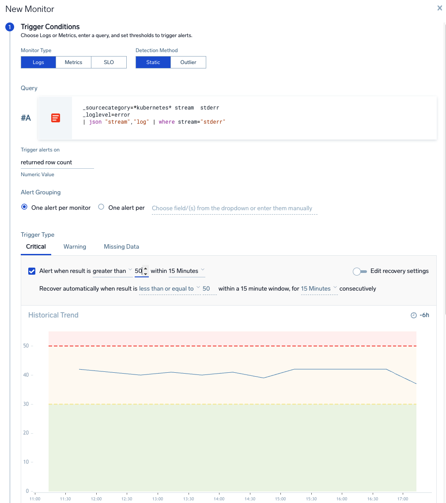
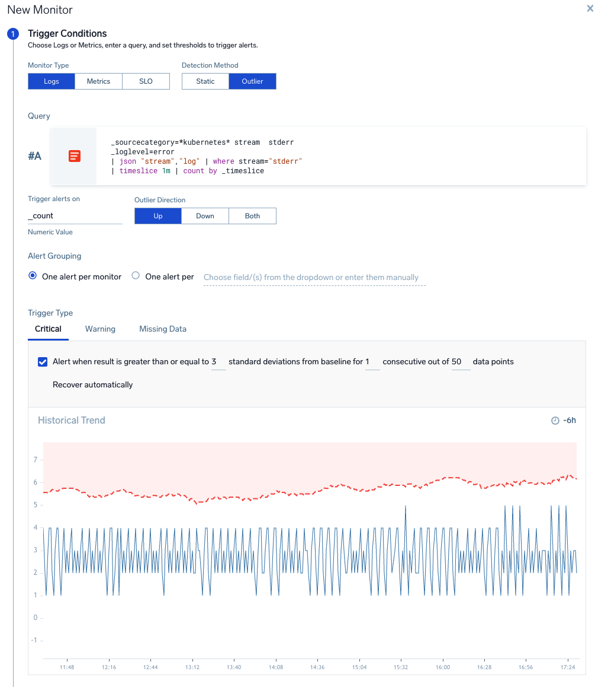
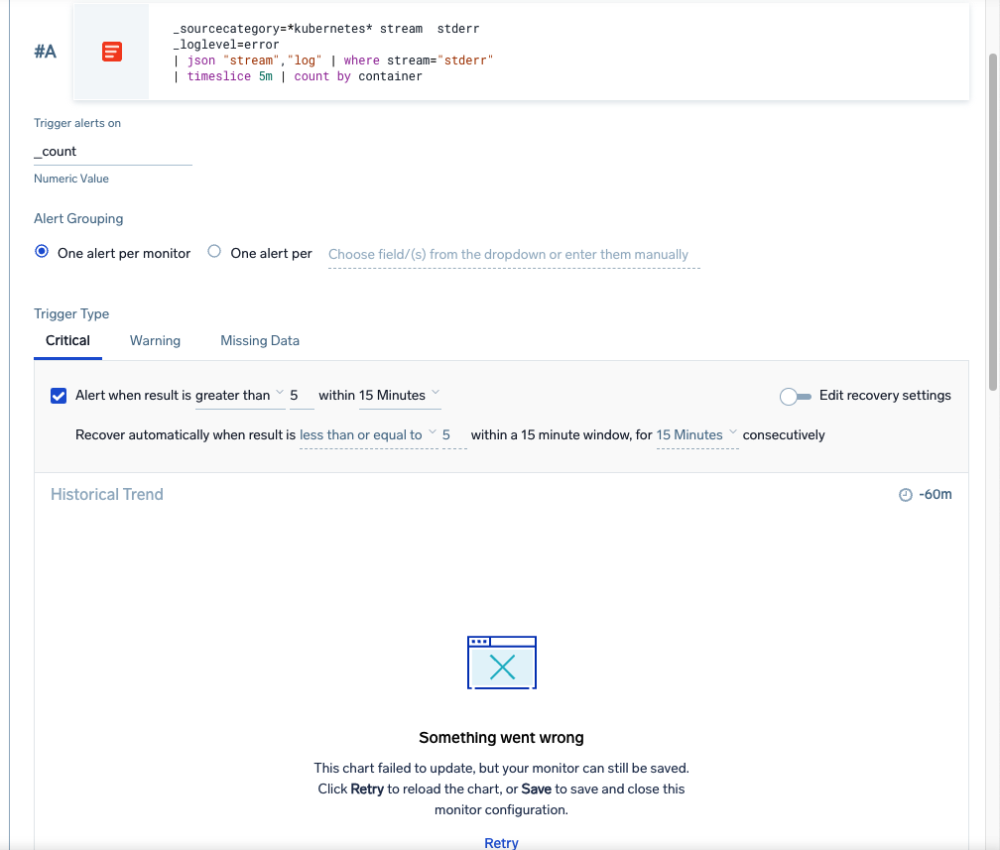
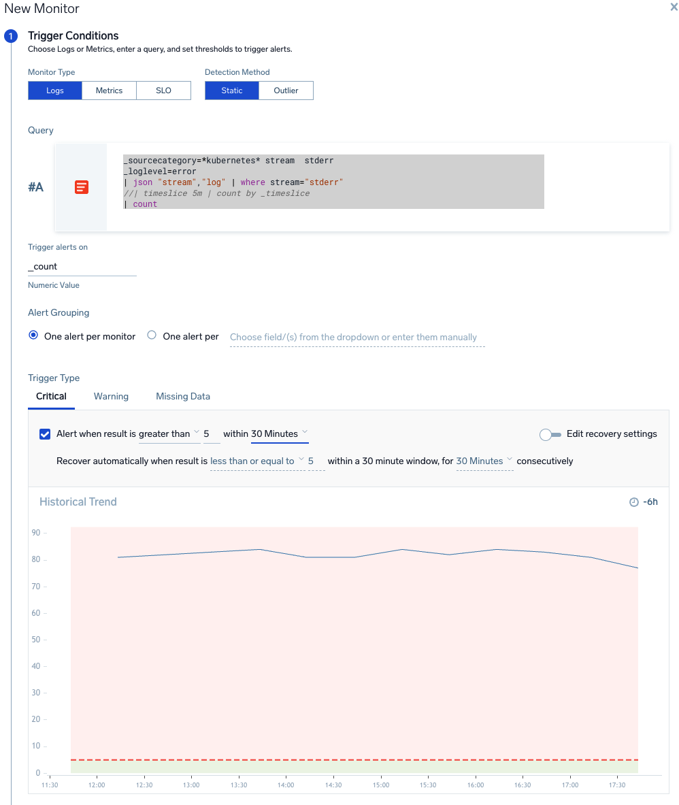
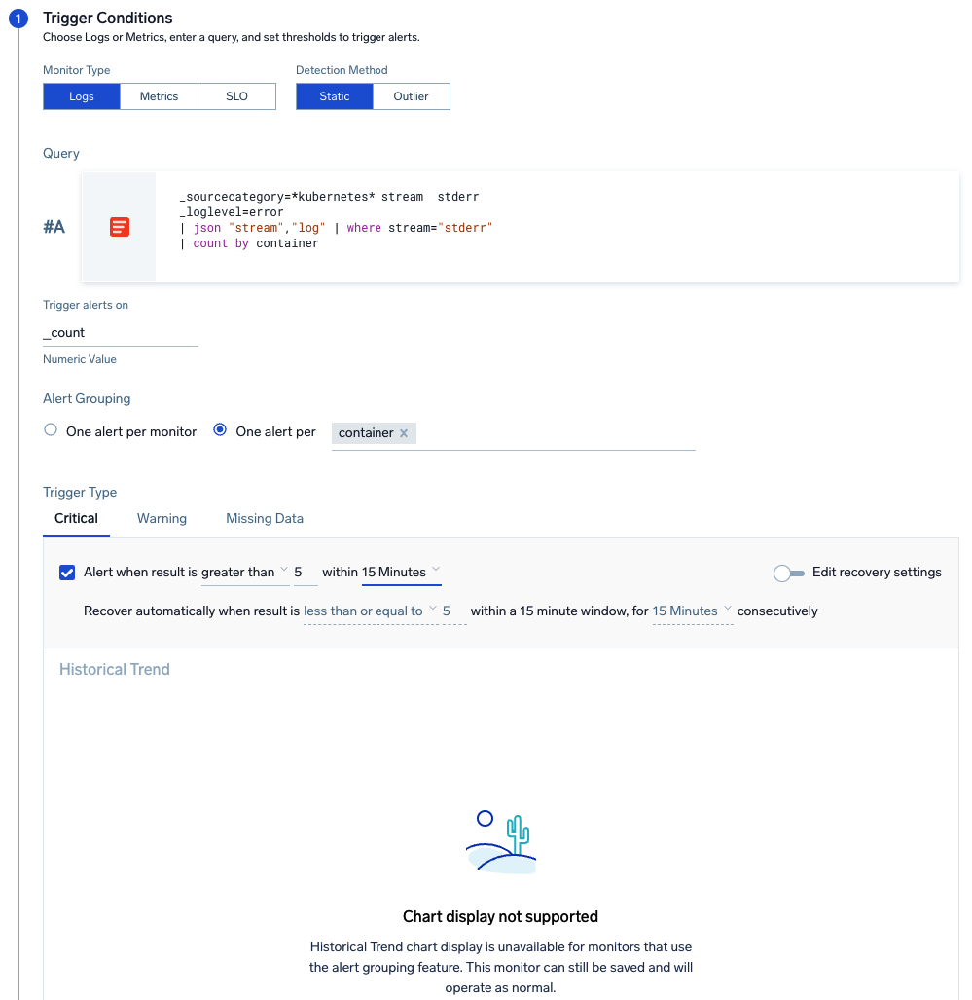

# Lab: Creating Log Search Based Monitors

This lab uses the Training Org that is used in Sumo Certjams but should work in any Sumo org ingesting Cloudwatch metrics for AWS ALB via AWS Observability (since metrics are formatted the same and have an account tag added.)

Log in as a training user as per usual method such as:
- training+analyst###@sumologic.com 
  
where ### is a number from 0001-999.

You can find this month's training password by going to your Sumo instance, then use the Home, Certification tab to open the training portal.

## New UI vs Old UI
There are two Web UIs available the [new UI](https://help.sumologic.com/docs/get-started/sumo-logic-ui/) and legacy old UI. Some steps in lab might vary based on what UI you are using. 
You can tell which UI your user account is using by checking these images. It's suggested to switch to new UI. In new UI the easiest way to start a new tab is:
1. click 'goto' or use cmd + k to open the goto dialog
2. start typing what you want to open e.g log for log search
3. click the menu item to open it. New UI uses native browser tabs so you can cmd + click to open this page as new tab

**new UI**


**old UI**


## In this Lab
**Note**: Detailed desciptions for all monitor UI options such as types of monitor, thresholds, and payload settings can be found in the [metrics lab](<./Lab metric search and create monitor.md>).

This lab only covers the process to model monitors specifically for log search not all settings.
- How to run a logs search and create a monitor for a simple use case counting rows
- using timeslice searches in monitors
- using alert groups with log search monitors

## Scenario
For this lab the logs will count kubernetes container log errors to create log monitors. We will look at both how to alert for total errors or errors for each container seperately using alert grouping.

## 1. Create a new log search
Use blue + New menu on the top of the screen to create a new Logs search window.

**Tips**: 
- you might be in 'basic' or 'advanced' search mode. For this lab we will use advanced mode to make it easy to paste in complete  searches. Verify you are in advanced mode by clicking the elipsis button on the right of the query window (just next to Blue query button).
- Pressing Enter or Return runs the search
- Add a new line with ```Shift + Enter```  or ```Shift + Return```
- you can comment out search syntax by prefixing the line with //

- paste in the search below:

```
_sourcecategory=*kubernetes* stream  stderr
_loglevel=error
| json "stream","log" | where stream="stderr"
```

- Click the Blue search icon or press enter in the search window

You now have an raw log query with Messages tab only showing results.

The histogram in the search window gives you some indication of the event count over time which would give you some indication of a good row count threshold to use in the monitor in later steps. 

## 2. Create a New Monitor For Simple Row Count Use Case

### > 0 rows log monitors
A common use case to note is the > 0 rows model. For this query type we would:
- setup the query with filtering where clause(s) so it returns no results unless there is an error
- setup a threshold in the alert in a monitor if the row count is >0

For this scenario here the lab data usually returns a row count > 0 so we can use higher thresolds for demonstration.

### Create the log monitor
From the query elipsis menu select Create a [Monitor](https://help.sumologic.com/docs/alerts/monitors/overview/)


You might find the docs page for [Create a Monitor](https://help.sumologic.com/docs/alerts/monitors/create-monitor/) helpful if you get stuck on any of the following sections.

### Trigger Conditions
In the trigger conditions section:
- note this is a **Logs** type (Metrics and SLO are also possible types)
- note that for detection method this is **static** but anomaly models are  available

Log monitors can use any resulting column from output. Usually this is a numeric column. 
- For the simplest use case change the Trigger alerts on dropdown to **returned row count**.

note:
- for a raw log query this is the count of events in each alerting period after any filter such as query scope or where clauses
- for an aggregate query this would be the *count of rows* in the aggregate result table

### Alert Grouping
Monitors only alert on a change of state. This is different to legacy scheduled search that alerts whenever the condition (such as number of results) is satisfied.

Two models are possible for monitors to track state for the monitor:
1. one alert /state per monitor as a whole
2. maintain separate states for each group (value of a field) or time series.

For this example choose the default **one alert per monitor**. The monitor will ONLY alert when state changes for the row count threshold for the whole query.

### Trigger Types
Monitors can have multiple trigger types: Critical, Warning or no data and each can have separate notification payloads or destinations.
- select **critical** trigger
- set value > 50 within 15 minute window.
- change to **warning** tab
- set value > 30 within 15 minute window
- The recovery value will be set automatically. You can have custom recovery settings by selecting 'Edit Recovery Settings'

- Change the "Historical Trend" graph time to -6h and wait for the graph to update.
  **Tip: sometimes Historical Trend will get stuck running a previous query. To force refresh press Enter in the Query window to apply new query, 'trigger alerts on' or time range settings.



### Other Settings
In this lab the focus is just on considerations for making log searches into monitors. There are many other monitor settings such as naming, notifications, payload variables and playbooks. For a lab on these settings try the: [metrics lab](<./Lab metric search and create monitor.md>).

- **cancel out of the new monitor** and return to the log search screen

## 3. Create a Monitor for a timeslice query
In some log monitor scenarios the query might contain a timeslice operator and that can impact final evaluation.

You should be back on a log search window. Execute this search using a time range of -6h
```
_sourcecategory=*kubernetes* stream  stderr
_loglevel=error
| json "stream","log" | where stream="stderr"
| timeslice 5m | count by _timeslice
```

The Aggregates tab shows tabular output of what will be passed to the monitor engine (since it's an aggregate query).
- Change this to a line graph layout to see trend over time.
- Use the elipsis to create a new monitor.

### Outlier (for another day)
Since the data is timesliced it would also support the outlier type
Here is an example of an outlier but we will not configure this in the lab


### Trigger Conditions
As before this is a logs, static monitor.

For this monitor trigger settings:
- keep the "logs" and "static" type values
- trigger alerts on _count
- change the Trigger type to Critical, alert when > 5 for 5 minutes
- change the historical trend graph time range to -6h
- Press enter in the query box to execute the query.

Often the graph does not render properly if you use a timeslice in the monitor query, and depending on the timeslice you pick it could make the final threshold evaluation hard to predict.
If the graph does render ok note what the trend is over time. How does changing the 'when' period to say 15m or 60m affect the graph?



## Comparing the timeslice to simple count query
A good best practice unless using an outlier model is to remove the timeslice from your search. Let's try this now.
Modify this query to this version and press enter in query box to execute it. It's the same but there is no timeslice now only a straight count.

```
_sourcecategory=*kubernetes* stream  stderr
_loglevel=error
| json "stream","log" | where stream="stderr"
| count
```

You will see that the way the monitor evaluates the results the data from the log query is *effectively timesliced* even though it's a straight count. If you are modelling the series over time in the log search window or dashboard you still need to timeslice the data to infer what the equivalent trend is over time.



The effective 'timeslice' value in a monitor used is the 'within X minutes' value. So if this was say 15m then the _count would be the total count in each 15m time range.
- Try changing this wihtin value to say 15m or 10m and review the changes to the 'Historical Trend' graph.
- note how the trend line value will increase as you use larger time blocks and this could impact the threshold value.

If you have larger 'within' values you would need larger thresholds values also. When creating a log monitor you can tune it by using less granular / larger window/threshold settings.

## 3. Log Monitors With Grouping
You can create log alerts with status tracked for different fields values using [Alert Grouping](https://help.sumologic.com/docs/alerts/monitors/alert-grouping/).

Change the query and execute it again in the monitor window.
```
_sourcecategory=*kubernetes* stream  stderr
_loglevel=error
| json "stream","log" | where stream="stderr"
| count by container
```

- choose 'one alert per' container
  
*The historical trend chart does not yet support representing alert groups.*  However with this configuration each value of container will be tracked as a seperate alert with it's own _count in each window and a seperate alert sent. This enables you to create alerts for multiple different instances, services, containers etc or any variable value of a log field in an aggregate query.



### Modelling alert group behaviour
Since the histogram doesn't yet support log alert group threshold prediction, to model a good threshold for an alert grouped query like this we would need to run a test query in a new log search window using timeslice and transpose.

- cancel the monitor creation
- open a new log search
- select -6h
- paste and execute this query:

The timeslice, count by timeslice, transpose syntax below is the standard method in Sumo Logic to graph multiple values of a field as seperate dynamic series over time.

```
_sourcecategory=*kubernetes* stream  stderr
_loglevel=error
| json "stream","log" | where stream="stderr"
| timeslice 15m | count by container, _timeslice |transpose row _timeslice column container
```

This search shows that both the containers with errors would have over 15 but less than 30 errors in the current time range in any 15m period. So this query would provide a good basis for evaluating a good threshold level for a monitor query - even though we would not use timeslice in the final monitor version!


