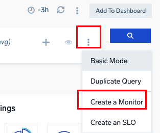

# Lab: Creating Log Search Based Monitors

This lab uses the Training Org that is used in Sumo Certjams but should work in any Sumo org ingesting container logs via the Kubernetes Collection Solution.

Log in as a training user as per usual method such as:
- training+analyst###@sumologic.com 
  
where ### is a number from 0001-999.

You can find this month's training password by going to your Sumo instance, then use the Home, Certification tab to open the training portal.

## New UI vs Old UI
There are two Web UIs available the [new UI](https://help.sumologic.com/docs/get-started/sumo-logic-ui/) and legacy old UI. Some steps in lab might vary based on what UI you are using. 
You can tell which UI your user account is using by checking these images. It's suggested to switch to new UI. In new UI the easiest way to start a new tab is:
1. click 'goto' or use cmd + k to open the goto dialog
2. start typing what you want to open e.g log for log search
3. click the menu item to open it. New UI uses native browser tabs so you can cmd + click to open this page as new tab

**new UI**


**old UI**


## In this Lab
**Note**: Detailed descriptions for all monitor UI options such as types of monitor, thresholds, and payload settings can be found in the [metrics lab](<./Lab metric search and create monitor.md>).

This lab only covers the process to model monitors specifically for log search not all settings.
- How to run a logs search and create a monitor for a simple use case counting rows
- using timeslice searches in monitors
- using alert groups with log search monitors

## Scenario
For this lab the logs will count kubernetes container log errors to create log monitors. We will look at both how to alert for total errors or errors for each container seperately using alert grouping.

## 1. Create a new log search
- new UI: cmd + K or open Goto and select Log Search
- old UI: At top of the Sumo Logic UI window click the blue + New button then choose Search.

**Tips**: 
You might be in 'basic' or 'advanced' search mode. For this lab we will use advanced mode to make it easy to paste in complete  searches. Verify you are in advanced mode by clicking the elipsis button on the right of the query window (just next to Blue query button). When editing log searches:
- Pressing Enter or Return runs the search
- Add a new line with ```Shift + Enter```  or ```Shift + Return```
- you can comment out search syntax by prefixing the line with //

Let's create the first search:
- paste in the search below:

```
_sourcecategory=*kubernetes* stream  stderr
_loglevel=error
| json "stream","log" | where stream="stderr"
```

- Click the Blue search icon or press enter in the search window

You now have an raw log query with Messages tab only showing results.

The histogram in the search window gives you some indication of the event count over time which would give you some indication of a good row count threshold to use in the monitor in later steps.

## 2. Create a New Monitor For Simple Row Count Use Case

### > 0 rows log monitors
A common use case to note is the > 0 rows model. For this query type we would:
- setup the query with filtering where clause(s) so it returns no results unless there is an error
- setup a threshold in the alert in a monitor if the row count is >0

For this scenario here the lab data usually returns a row count > 0 so we can use higher thresolds for demonstration.

### Create a log monitor
From the query elipsis menu select Create a [Monitor](https://help.sumologic.com/docs/alerts/monitors/overview/)



You might find the docs page for [Create a Monitor](https://help.sumologic.com/docs/alerts/monitors/create-monitor/) helpful if you get stuck on any of the following sections.

### Make it aggregate
Aggregate searches are easier to setup for alerting. Add | count to your search so now it is:
```
_sourcecategory=*kubernetes* stream  stderr
_loglevel=error
| json "stream","log" | where stream="stderr"
| count
```

### Trigger Conditions
In the trigger conditions section:
- note this is a **Logs** type (Metrics and SLO are also possible types)
- note that for detection method this is **static** but anomaly models are  available. AI anomaly or outlier anomaly (using standard deviation) can also be used.
- choose '_count' as the 'Trigger Alerts on' value
  
Note: Log monitors can use any resulting column from output. Usually this is a numeric column. For a raw query this would usually be  **returned row count**.
- for a raw log query this is the **count of events** in each alerting period after any filter such as query scope or where clauses
- for an aggregate query this would be the **count of rows** in the aggregate result table

### Alert Grouping
Monitors only alert on a change of state. This is different to legacy scheduled search that alerts whenever the condition (such as number of results) is satisfied.

Two models are possible for monitors to track state for the monitor:
1. one alert /state per monitor as a whole
2. maintain separate states for each group (value of a field) or time series.

For this example choose the default **one alert per monitor**. The monitor will ONLY alert when state changes for the row count threshold for the whole query. 

It's possible to make one monitor that tracks each alert grouped entity seperately and will generate an alert per entity. If the query was grouped by one or more things eg:

```
_sourcecategory=*kubernetes* stream  stderr
_loglevel=error
| json "stream","log" | where stream="stderr"
| count by pod
```

The we could use alert grouping.


On the alert list page you can tell which alerts are per monitor or grouped based on if they have an entity defined.


### Time compare alerting 
[Time compare](https://help.sumologic.com/docs/search/time-compare/) is a standard log query technique to compare current vs previous baseline performance. It works very well to compare performance for the monitor or per group in alert situations. Here is an example that would produce > 0 rows only where error counts are much higher than the same time last week, and could use 'alert grouping' one per path
```
_index=Apache_Access1
status_code = 5*
| replace(url,/\?.*/,"") as path
| count by path
| compare with timeshift 7d 2 avg
| if(isnull(_count_14d_avg),0,_count_14d_avg) as _count_14d_avg
| _count - _count_14d_avg as change 
| 100 * (change / _count_14d_avg) as increase_pct
| where change > 5 and increase_pct > 50
```

### Trigger Types
Monitors can have multiple trigger types: Critical, Warning or no data and each can have separate notification payloads or destinations. Set a critical trigger similar to the image below:
- select **critical** trigger
- set value > 500 within 15 minute window. Evaluate every 5 minutes.
- The recovery value will be set automatically. You can have custom recovery settings by selecting 'Edit Recovery Settings'


### Advanced Settings
It's nice to have descriptive alerts at 3am on your phone and there are many [alert variables](https://help.sumologic.com/docs/alerts/monitors/alert-variables/) available to customize the title and payload for the notification.

One very useful field is ```{{ResultsJson.fieldName}}```. In our example ```{{ResultsJson.pod}}``` will put the pod name in the text in title or description or payload. For a log query this could be any column in the aggregate query output.

- Customize the 'alert name' with: ```High container errors for pod: {{ResultsJson.pod}}```
- For type choose 'Create New Email'.
- enter any email address 
- For subject choose: ```Monitor Alert: {{TriggerType}} on {{AlertName}}```
- The message can be any customizable payload here is a suggested payload. This includes the url for the Alert Response Page.
  
```
High errors found in kubernetes pod: {{ResultsJson.pod}}
Alert Response Page: {{AlertResponseURL}}
Description: {{Description}}
Detection: {{DetectionMethod}}
Type: {{MonitorType}}
Level: {{TriggerType}}
Condition: {{TriggerCondition}}
Value: {{TriggerValue}}
Query {{Query}}
```

- tick 'Critical' for the notification level. This will alert on critical only (not resolution)
  

### Monitor Details
- Enter a monitor name such as "High error count for a Kubernetes Pod"
- Location: you can create folders to organize monitors, for now leave as is
- Tags: You can [tag monitors](https://help.sumologic.com/docs/alerts/monitors/settings/#tags). Lets add: ```service=foo owner=bar``` tags. These will flow through to alerts generated from this monitor for filtering on the alerts page.


### Playbook
In the final playbook section this would enable admins to codify tribal knowledge for an on-call so they know what exactly to do when they receive an alert. Playbooks support markdown and are visible in the alert response page, or can be added to notifications via the ```{{Playbook}}``` variable.

Automated playbooks are also possible via the Automation Service. For more info see: [automated playbooks](https://help.sumologic.com/docs/alerts/monitors/use-playbooks-with-monitors/)

- We are done with editing for now. **Cancel out of the new monitor** and return to the log search screen

## 3. Create a Monitor for a timeslice query
In some log monitor scenarios the query might contain a timeslice operator and that can impact final evaluation.

You should be back on a log search window. Execute this search using a time range of -6h
```
_sourcecategory=*kubernetes* stream  stderr
_loglevel=error
| json "stream","log" | where stream="stderr"
| timeslice 5m | count by _timeslice
```

The Aggregates tab shows tabular output of what will be passed to the monitor engine (since it's an aggregate query).
- Change this to a line graph layout to see trend over time. This will give you a good idea what 'normal' is and some benchmarks for threshold levels.


- Use the elipsis to create a new monitor.

### Timeslice For AI Anomaly
Since the data is timesliced it would support the [AI Anomaly](https://www.youtube.com/watch?v=nMRoYb1YCfg) type, where each timeslice period data is streamed to the external data model. AI-driven alerting provides a simple easy to configure dynamic alerting experience:

- Model-driven anomaly detection: AI-driven alerts use 60 days of historical data (when available) to train and test an ML model so that hourly, daily and weekly (especially, weekday/weekend) seasonality are factored into baselines.
- AutoML: AI-driven alerts embed an AutoML framework where the analytics tune itself based on model performance on training datasets. Simply put, AutoML supports a “set it and forget it” experience with minimal user intervention.
- Model contextual and dynamic thresholds: AI-driven alerts have a sensitivity setting (low sensitivity for signals that are expected to be noisy and high sensitivity for critical indicators). Additionally, the user can configure the incident detector based on context. For example, in the Cluster detector, the user can specify how many data points in a detection window of say 5m need to be unusual before triggering an alert.

Let's **stay with 'static' for this lab.**

### Timesliced Data and Trigger Conditions
As before this is a logs, static monitor.

For this monitor trigger settings:
- keep the "logs" and "static" type values
- trigger alerts on _count
- change the Trigger type to Critical, alert when > 250 for 5 minutes
- change the historical trend graph time range to -6h

The 'Historical Trend' graph may render differently if you use a timeslice in the monitor query, and will depend relationship between the timeslice vs the 'within > x' time value.
If the graph does render ok note what the trend is over time. How does changing the 'within' period to different values affect the graph?
- 15m
- 1 hour

## Timeslice vs 'effective timeslice'
Go back to the Query box and change it to a 'non timesliced' version below and press enter in the query box to run it

```
_sourcecategory=*kubernetes* stream  stderr
_loglevel=error
| json "stream","log" | where stream="stderr"
//| timeslice 5m 
| count // by _timeslice
```

You will see that the way the monitor evaluates the results the data from the log query is *effectively timesliced* even though it's a straight count. This means that:
- timeslice queries are useful for predicting what a montior might do over a certain time range
- you don't need to timeslice log monitor queries and you might get more predictable results if you don't timeslice them.

The 'effective timeslice' value in a monitor used is the 'within X minutes' value. So if this was say 15m then the _count would be the total count in each 15m time range.
- Try changing this within value to say 15m or 1h and review the changes to the 'Historical Trend' graph.
- note how the trend line value will increase as you use larger time blocks and this could impact the threshold value.

If you have larger 'within' values you would need larger thresholds values also. When creating a log monitor you can tune it by using less granular / larger window/threshold settings.

### Modelling alert group behaviour
'Historical Trend' graph on the monitors page doesn't yet support log alert group threshold prediction for logs. This means to model a good threshold for an alert grouped log query we would need to run a test query in a new log search window using timeslice and transpose.

- cancel the monitor creation
- open a new log search
- select -6h
- paste and execute this query:

The timeslice, count by timeslice, transpose syntax below is the standard method in Sumo Logic to graph multiple values of a field as seperate dynamic series over time.

```
_sourcecategory=*kubernetes* stream  stderr
_loglevel=error
| json "stream","log" | where stream="stderr"
| timeslice 15m | count by container, _timeslice |transpose row _timeslice column container
```

This screenshot shows that both the containers with errors would have over 15 but less than 30 errors in the current time range in any 15m period. So this query would provide a good basis for evaluating a good threshold level for a monitor query - even though we would not need timeslice in the final monitor version!


