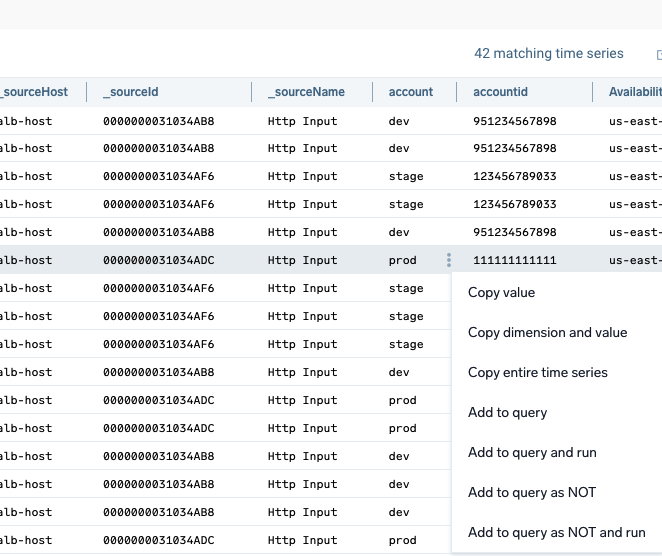

# Lab: Create a Metric Based Monitor

This lab uses the Training Org that is used in Sumo Certjams but should work in any Sumo org ingesting Cloudwatch metrics for AWS ALB via AWS Observability (since metrics are formatted the same and have an account tag added.)

Log in as a training user as per usual method such as:
- training+analyst###@sumologic.com 
  
where ### is a number from 0001-999.

You can find this month's training password by going to your Sumo instance, then use the Home, Certification tab to open the training portal.

## In this Lab
- How to run a metrics search and create a monitor
- Review new monitor UI options such as types of monitor, thresholds, and payload settings

## About AWS CloudWatch Metrics
Cloudwatch metrics for [AWS Application Load Balancer](https://docs.aws.amazon.com/elasticloadbalancing/latest/application/load-balancer-cloudwatch-metrics.html) are an excellent source for high level service monitoring for [SRE Golden Signals](https://sre.google/sre-book/monitoring-distributed-systems/) such as errors and latency. In particular the metric HTTPCode_ELB_5XX_Count is a good indicator of the error rate for a web service behind an ALB.

In this lab we will create a metrics search for 'prod' account load balancers to detect high rates HTTP 500 errors

## 1. Create a new metrics search
Create a new [metrics search](https://help.sumologic.com/docs/metrics/metrics-queries/) window in Sumo Logic. The blue + New menu on the top of the screen has metrics as an option.

**Tips**: 

- you might be in 'basic' or 'advanced' search mode. For this lab we will use advanced mode to make it easy to paste in complete metric searches. Verify you are in advanced mode by clicking the elipsis button on the right of the metric explorer window (just next to Blue query button).
- Pressing Enter or Return runs the search
- Add a new line with ```Shift + Enter```  or ```Shift + Return```
- you can comment out search syntax by prefixing the line with //

Run the first metric search using these steps:
- change the time range to 'last 3 hours' to provide some historical context.
- paste in the metric seearch below

```
metric=HTTPCode_ELB_500_Count namespace=aws/applicationelb 
```

- Click the Blue search icon or press enter in the search window

You now have a raw metrics query with one time series for each set of metric tag.

## Metrics Explorer: Discover and Filter Metric Dimensions
Review the [metrics explorer](https://help.sumologic.com/docs/metrics/metrics-queries/metrics-explorer/) docs page to understand what options are available.

- Open the Time Series Tab in the results section. Time series helps with metric discovery, and important element to building metrics searches, since we need to discover and understand tags and values.
- Scroll across to review the metric dimensions avilable in the query.
- Locate the account column and a row value of 'prod'
- Click the elipsis next to 'prod' and choose **add to query and run**

Now the metrics chart will only show results for the 'prod' value of account tag. This filters the monitor results just to our production environment.



- Add an aggregation line to the query so the query is as per below. This will tidy up the data for later by showing only key dimensions:
- Run the query again. It will look similar but the chart legend now defaults to key dimensions only. It's a good practice to add aggregation to monitor searches to cleary define the expected output.
  
```
account="prod" metric=HTTPCode_ELB_500_Count namespace=aws/applicationelb 
| sum by account, loadbalancer
```

## Create a New Monitor
From the query elipsis menu select Create a [Monitor](https://help.sumologic.com/docs/alerts/monitors/overview/)


You might find the docs page for [Create a Monitor](https://help.sumologic.com/docs/alerts/monitors/create-monitor/) helpful if you get stuck on any of the following sections.

### Trigger Conditions
In the trigger conditions section:
- note this is a **Metric** type (Logs and SLO are also possible types)
- note that for detection method this is **static** but anomaly models are  available

### Alert Grouping
Monitors only alert on a change of state. This is different to legacy scheduled search that alerts whenever the condition (such as number of results) is satisfied.

Two models are possible for monitors to track state for the monitor:
1. one alert /state per monitor as a whole
2. maintain separate states for each group (value of a field) or time series.

Change the grouping type to **One alert per time series**. 
This will mean each load balancer in the prod account will have it's own status and generate alerts separately - removing the need to create multiple monitors for individual load balancers.

### Trigger Types
Monitors can have multiple trigger types: Critical, Warning or no data and each can have separate notification payloads or destinations.
- select **critical** trigger 
- set value to 30 at all times within 5 minutes. 
- The recovery value will be set automatically. You can have custom recovery settings by selecting 'Edit Recovery Settings'


### Advanced Settings
It's nice to have descriptive alerts at 3am on your phone and there are many variables available to customize the title and payload for the notification. Often you might use these variaables to create a custom webhook format.

For metrics queries or for aggregate log queries one very useful field is ```{{ResultsJson.fieldName}}```. In our example ```{{ResultsJson.loadbalancer}}``` will put the actual LB name in the text in title or description. For a log query this could be any column in the aggregate query output.

- Customize the 'alert name' with: ```AWS ALB High 500 Errors for LB {{ResultsJson.loadbalancer}}```
- For type choose 'Create New Email'. 
- enter any email address 
- For subject choose: ```Monitor Alert: {{TriggerType}} on {{AlertName}} For LB {{ResultsJson.loadbalancer}}```
- the message can be any customizable payload here is a suggested payload. This includes the url for the Alert Response Page.
```
Account:  {{ResultsJson.account}}
Load Balancer: {{ResultsJson.loadbalancer}}
Alert Response Page: {{AlertResponseURL}}
Description: {{Description}}
Detection: {{DetectionMethod}}
Type: {{MonitorType}}
Level: {{TriggerType}}
Condition: {{TriggerCondition}}
Value: {{TriggerValue}}
Query {{Query}}
```
- tick 'Critical' for the level

### Monitor Details
- Monitor Name: AWS ALB High 500 Error In Prod plus your user number such as 'AWS ALB High 500 Error In Prod 123'
- Location: you can create folders to organize monitors, for now leave as is
- Tags: You can [tag monitors](https://help.sumologic.com/docs/alerts/monitors/settings/#tags). Lets add: ```service=foo owner=bar``` tags. These will flow through to alerts generated from this monitor for filtering on the alerts page.


### Playbook
In the final playbook section this would enable admins to codify tribal knowledge for an on-call so they know what exactly to do when they receive an alert. Playbooks support markdown and are visible in the alert response page, or can be added to notifications via the ```{{Playbook}}``` variable.

## Final Review
** Don't save the monitor just yet**
This is a training environment. You have two options at this point:

### 1. exit with out saving (recommended)
You can click "Cancel" and end the lab without saving any changes.

### 2. trigger the monitor then remove it
If you want to trigger the alert for real:
- use your email address as the email target
- reduce the threshold so it's below the typical value so will trigger in a few minutes
- wait for an email to arrive. Click on the alert response page link to review it's response page
- go to the Manage Data / Monitors tab
- Find your monitor you created and delete it.