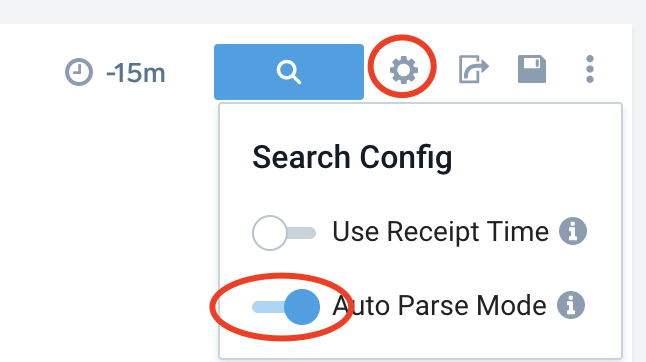

# Search Lab - Working with JSON Cloudtrail.
This lab uses the Training Org that is used in Sumo Certjams.
Log in as a training user as per usual method such as training+analyst###@sumologic.com where ### is a number from 0001-999.

You can find this month's training password by going to your Sumo instance, then use the Home, Certification tab to open the training portal.

**Note**: In this labe we assume your searches are in Advanced Mode. You might find your UI is in 'basic mode' so you will have to switch to Advanced as per: https://help.sumologic.com/docs/search/get-started-with-search/search-page/search-modes/


**Tip:** Adding and removing comment lines. You can select lines and comment/uncomment them with ```Cmd + /``` (```Cntrl + /``` on Windows)

**Tip:** Pressing Enter or Return runs the search but you can add a new line with Shift + Enter|Return.

# In this Lab
- How to run a basic search vs JSON formatted log
- How to navigate the UI: field browser, time picker etc
- Raw messages vs Aggregate results
- How to turn raw logs into insights by parsing fields and making charts

## About AWS CloudTrail Logs
AWS Cloudtrail is the audit log for all API calls vs APIs in an AWS account.
When an AWS Cloudtrail API call fails, a cloudwatch event is logged containing an errorCode key. This can be a very valuable source for both observability to find and fix broken workloads and in the security domain to prevent, detect and respond to security threats. These logs provide a good example of a JSON formatted log source in Sumo Logic.

# Lab Exercises

## 1. Run a search
Start with New Button then choose Search

Copy and paste this search code into the search window:
```
_sourceCategory = *cloudtrail*  errorcode
```

Paste this into your new search window and run this search for "last 15m" (which is the default) by clicking the blue search button icon or pressing enter in the search window.

This search is scoped using a metadata field (_sourcecategory) and a keyword so it will only include cloudtrail with errorcode as a string.

You will now see Messages returned in the search window.


In the "message" column note how the UI formats the logs as JSON events to make them more readable. You can right click on JSON key or values to bring up menu quick actions for working with the logs.

## 2. Review the Search UI Page Features in Help Docs

Open this sumo help page and to review key points about the search UI.
https://help.sumologic.com/docs/search/get-started-with-search/search-page/

## 3. Using the search histogram

There are two really useful features of the search histogram which shows messages over time. 
a. You can click a segment to move to the messages page for that time range
b. If you Shift + click on a selected histogram bar it will open a duplicate search window for just that time range. 
Try both of these in a search window.

## 4. Using the Field Browser
The [field browser](https://help.sumologic.com/docs/search/get-started-with-search/search-page/field-browser/) shows fields in the current search scope. 


 In your search window with results try the following:
1. Tick a box next to some fields in the browser and note how this changes the columns displayed.  
2. Type 'arn' in the search box in the top section of the field browser to see fields with 'arn' in the name.
3. Click on the text of a field name to show a pop up. The pop up shows the breakdown of events for the first 100k results. 
4.  In the pop up click on ```Top Values Over Time``` This will open a new search tab that adds to your base query in a new search window. Run this new search and note how there is now an 'Aggregates' tab as well as Messages. 

## Messages and Aggregate Results
Next try changing the time range to another value by entering a relative time expression:
```-6h```

Run the search below which counts each value of eventname but in 5 minute time buckets and outputs this in a format suitable for charting (using transpose). 

```
_sourceCategory = *cloudtrail*  errorcode
| json field=_raw "eventName"
| timeslice 5m 
| count _timeslice, eventname 
| transpose row _timeslice column eventname
```
Since this includes aggregation there will now be two results tabs: Messages and Aggregates.

Try out some of the chart option buttons for results in the Aggregates tab like Column, Area and Line using the icons in the aggregates tab.

## 6. Parsing Fields Manually
By default Sumo auto parses JSON logs at search time but it's good query practice to parse out fields explicitly. Parsing is a key skill for working with logs as it enables you to create any required fields at search time.
Here you see two parse operators - JSON and Parse (which uses pattern matching). Run this search:

```
_sourceCategory = *cloudtrail*  errorcode
| json field=_raw "errorCode" 
| json field=_raw "errorMessage"
| parse "eventSource\":\"*\"" as event_source 
| parse "\"eventName\":\"*\"" as event_name 
| parse "awsRegion\":\"*\"" as aws_Region 
| json field=_raw "recipientAccountId"

// If a field is optional we want to add nodrop or sumo will filter out events that don't match
| parse "\"userName\":\"*\"" as user nodrop
| json "userIdentity.arn" as arn nodrop
```

Since these fields are parsed manually in the search they are already included as columns in the search results tab (tick box in field browser).

### index vs search time fields
Next to the Run search button open the settings cog and disable Auto Parse Mode for JSON logs. 


Run the search again and note how the list of fields in the field browser is very much reduced, as only indexed fields or explicitly parsed fields are shown.

## 7. Filtering searches
Next we will use some filtering to narrow down search results just to AccessDenied in the errorcode field. Run:
```
_sourceCategory = *cloudtrail*  errorcode
| json field=_raw "errorCode" 
| json field=_raw "errorMessage"
| where errorcode = "AccessDenied"
| parse "eventSource\":\"*\"" as event_source 
| parse "\"eventName\":\"*\"" as event_name 
| parse "awsRegion\":\"*\"" as aws_Region 
| json field=_raw "recipientAccountId"
| parse "\"userName\":\"*\"" as user nodrop
| json "userIdentity.arn" as arn nodrop
```

## Iterating on a search to drill down further
One of the most valuable aspects of the Sumo Logic platform is how you can continually iterate a search to drill down to a new insight or root cause. 

For this lab say we want to know more about these access denied errors to better understand what workloads or users are experiencing authentication errors.

To provide more details, this new search version is an iteration that provides a higher level of detail and  aggregation to summarize the results in format suitable for a table.  

Here is the next version of the search to execute:
```
_sourceCategory = *cloudtrail*  errorcode
| json field=_raw "errorCode" 
| json field=_raw "errorMessage"
| where errorcode = "AccessDenied"
| parse "eventSource\":\"*\"" as event_source 
| parse "\"eventName\":\"*\"" as event_name 
| parse "awsRegion\":\"*\"" as aws_Region 
| json field=_raw "recipientAccountId"
| parse "\"userName\":\"*\"" as user nodrop
| json "userIdentity.arn" as arn nodrop
| count by errorcode,errormessage,recipientaccountid,user,arn | sort _count
```
On the aggregates choose the Table format.

## Bonus Time: Review Best Practices for Search
If you still have time in the lab review the key things to know to make fast efficient searches in Sumo.

### Always use a sourcecategory or index in your search 
A good built in metadta scope will reduce data scanned and speed up search and using an index or sourcecategory usually works best. For example:
```
_sourcecategory=prod/*
_index=prod_data
```

### Keywords speed up searches
Add a keyword to make your search specific if you can - even if it just gets rid of most events you don't want. Keywords make searches much faster than those that use just where to filter results because less events must be retrieved to be processed later.

In our above example we could use accesdenied as a keyword:
```
_sourceCategory = *cloudtrail*  AccessDenied
| json field=_raw "errorCode" nodrop
| where errorocde=AccessDenied
```

### Fields can be pre-parsed at indexing time with a Field Extraction Rule
Your Sumo admin can create a Field Extraction Rule that stores fields in the index when data is ingested to make searching easier and faster to execute. If an administrator had setup an extraction rule to pre-parse and index the errorcode field we could simply do this:
```
_sourceCategory = *cloudtrail*  errorcode=AccessDenied
```
