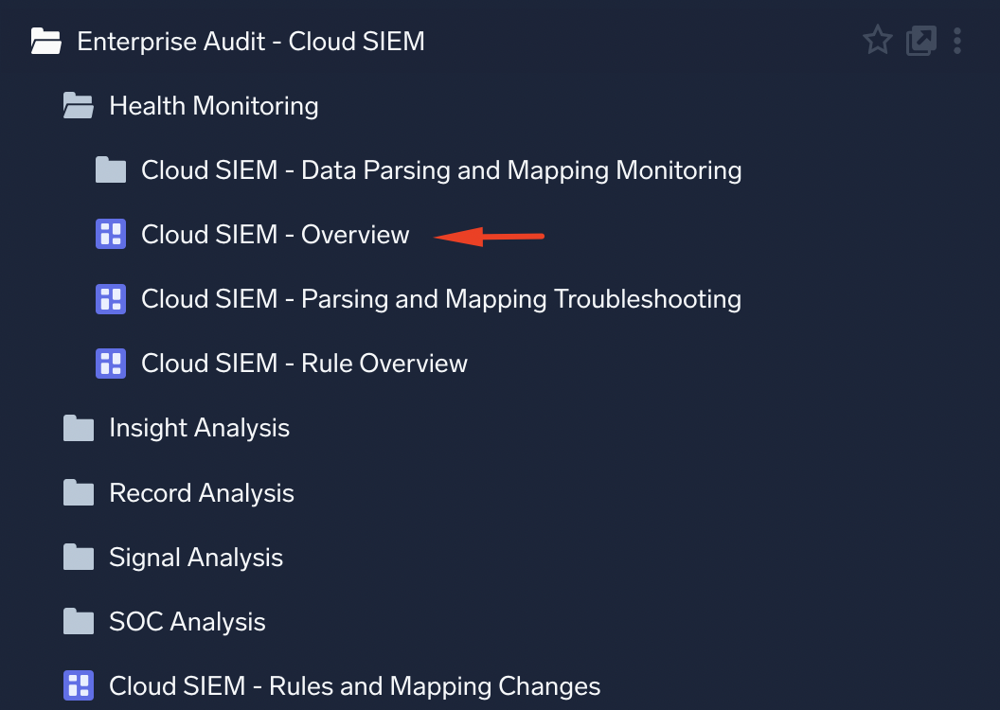

# Lab 2: Normalized Data - Student Lab Guide
## Core Platform Admin for Cloud SIEM Instances

---

### Before You Begin

**Training environment login**

| Field | Value |
|-------|-------|
| URL | https://service.sumologic.com |
| Email | `training+analyst###@sumologic.com` (replace `###` with a unique 3-digit number, e.g. `057`) |
| Password | `<trainer will provde>` |

> **Important:** Post your chosen number in the chat to ensure no one else picks the same one. Never upload your own data to this shared training environment.

---

### Lab 2 - Normalized Data Preparation

**Objective:** Confirm the required app is installed and open the overview dashboard to establish a baseline before working with normalized data.

**Steps:**

1. In the left navigation, open the **Library** and navigate to **Installed Apps**.
2. Confirm the **Enterprise Audit - Cloud SIEM** app is listed. This is a v2 app that updates automatically and includes the Insight Trainer tool in the *Insight Analysis* folder, plus dashboards for records, signals, and insights.
3. If the app is **not** installed, ask an administrator to install it from the **App Catalog** before proceeding.
4. Locate the Enteprise Audit - Cloud SIEM app in 'Installed Apps' in the libray
5. Expand **Health Monitoring**
6. Open the **Cloud SIEM - Overview** dashboard from Installed Apps.
7. Familiarise yourself with the panels available - you will be returning to this app throughout the labs.

 

---

### Lab 2.1 - Normalized Data: Insights

**Objective:** Explore JSON-formatted insight state-change events using the log analytics platform.

**Background:** Any change to a Cloud SIEM Insight - such as a status update, assignee change, or close action - generates a JSON-formatted event stored in the `sumologic_audit_events` or `sumologic_system_events` indexes, scoped under `_sourcecategory=cseinsight`.

**Steps:**

1. In the **Enterprise Audit - Cloud SIEM** app, expand the folder: **Health Monitoring** and open the **Cloud SIEM - Overview** dashboard.
2. Locate the **"Insights For \*"** panel.
3. Click the **ellipsis (⋮) button** in the top-right corner of the panel and choose **"Open in Log Search"**.
4. Observe the query that opens. It will look similar to:
   ```
   _sourcecategory=cseinsight (_index=sumologic_audit_events OR _index=sumologic_system_events) insight * 
   | json "insight.created", "insight.status", "insight.resolution", "insight.severity", "insight.source", "insight.entityValue", "insight.name", "insight.readableId" as insight_createdAt, insight_status, insight_resolution, insight_severity, insight_source, entity_value, insight_name, insight_readableId nodrop
   | urlencode(insight_readableId) as insight_readableId
   | concat("https://","service.us2",".sumologic.com/sec/insight/", insight_readableId,"") as url
   | toUrl(url, "↪") as link
   | where insight_status = "closed"
   | first(insight_status) as insight_status, first(insight_resolution) as insight_resolution by link, insight_createdAt, insight_readableId, insight_severity, insight_source, insight_name, entity_value
   | sort by insight_createdAt, insight_readableId asc, insight_severity asc
   ```

**What this query does - step by step:**

| Step | Operator | What it does |
| --- | --- | --- |
| 1 | `_sourcecategory=cseinsight (_index=sumologic_audit_events OR ...)` | **Scope** - restricts the scan to Cloud SIEM insight events across the audit and system event indexes |
| 2 | `json "insight.created", "insight.status", ... nodrop` | **Parse** - extracts multiple insight fields from the JSON payload in a single operator; `nodrop` keeps events even if a field is absent |
| 3 | `urlencode(insight_readableId)` | **Format** - URL-encodes the insight ID so it is safe to embed in a hyperlink |
| 4 | `concat("https://", "service.us2", ".sumologic.com/sec/insight/", ...)` | **Build URL** - constructs the direct link to the insight in the Cloud SIEM UI |
| 5 | `toUrl(url, "↪")` | **Format** - creates a clickable hyperlink labelled with the arrow symbol for display in the results table |
| 6 | `where insight_status = "closed"` | **Filter** - keeps only closed insights; note this comparison is case-sensitive |
| 7 | `first(insight_status) ... by link, insight_createdAt, ...` | **Aggregate** - deduplicates multiple state-change events per insight, retaining the first value of each field grouped by insight identity |
| 8 | `sort by insight_createdAt, insight_readableId asc, insight_severity asc` | **Sort** - orders results chronologically, then by insight ID and severity |

1. In the **Aggregates** tab, review the result table and how the query fields map to the displayed columns.
2. Switch to the **Messages** tab. Note how many fields are already selected for display in the Field Browser - becuase these were referenced in the query.
3. Scroll to the right of the Messages pane to locate the Message column. This is the payload of each insight status update event sent in JSON format.
4. Locate the **`insightIdentity`** and **`insight`** keys in the JSON payload and expand them to see the full structured data.
5. Observe how the JSON structure represents the insight at the time of the state change.

**Questions to consider:**
- What fields are available at the top level of the JSON payload?
- How would you filter for insights that had a status of closed?

---

### Lab 2.2 - Normalized Data: Signals

**Objective:** Explore JSON-formatted signal data, understand the difference between index-time and search-time fields, and practice filtering on nested JSON structures.

**Background:** Signals are generated each time a rule matches its trigger criteria against an incoming record. They are stored in the `sec_signal` index. Signals have a special UI where some fields are parsed in a special way at search time so the 'Message' column is instead labelled **"Security Record Details"**.

**Steps:**

1. In the **Enterprise Audit - Cloud SIEM** app, expand the **Signal Analysis** folder and open the **Cloud SIEM - Signals Overview** dashboard.
2. Locate the **"Signals Details"** panel.
3. Click the **ellipsis (⋮) button** and choose **"Open in Log Search"**.
4. Review the query. Note that it is scoped to `_index=sec_signal`.
5. Review the **Aggregates** tab and the result columns.
6. Switch to the **Messages** tab. Scroll across to locate **"Security Record Details"** - this is normal for signals and records.
7. Click on ... below the text to expend the full details. Toward the bottom of 'Security Record Details' locate and expand **tags** key - this is the array of tags allocated to the signal. In the field browser search box on the left pane type "tags". Tick tags field if not selected and scroll across to find the Tags field is now shown as a column.


**Part A - Filtering with keywords and index-time fields:**

8. Find a unique string in the JSON - for example, the signal's `id` field value (a UUID). Copy the string.
9. You can use that string directly as a **keyword** in the query scope for fast, case-insensitive filtering. Try:
   ```
   _index=sec_signal <paste-uuid-here>
   ```
10.  Some top-level fields (such as `attackStage`) are indexed and can be used in scope directly. Try:
    ```
    _index=sec_signal attackstage=persistence
    ```

**Part B - Filtering on nested/array fields:**

11. Expand the **`fullRecords`** array - this contains all the records associated with the signal.
12. Locate any field name in the first record such as **matadata_parser** or **`description`**.
13. **Right-click** the field name and choose **"Copy Field Name"**. Paste that in the query window to see what it looks like. Note the longer dotted-path format for example:
   ```
   %"fullRecords[0].metadata_parser"
   ```
14. Since this is a 'search time' field to use it for filtering it needs to be in a `where` clause. For example:
    ```
    _index=sec_signal
    | where %"fullRecords[0].metadata_parser" = "/Parsers/Crowdstrike_CEF_Foo"
    | where %"fullRecords[0].description" matches "*Windows Firewall exception list*"
    ```
    > **Note:** `where` clause comparisons ARE case-sensitive, unlike keyword expressions.

**Key takeaways:**
- Keyword expressions: fast, easy, not case-sensitive - use for broad filtering.
- Top-level index-time fields: can be used in scope directly.
- Nested array fields (e.g. `fullRecords[0].description`): must use `where %"..."` syntax and are case-sensitive.

---

### Lab 2.2 (Bonus) - Signal MITRE ATT&CK Tag Analysis

**Objective:** Use `parse regex ... multi` to extract MITRE ATT&CK tags from signals and analyse severity by technique.

Run the following query and review the results:

```
_index=sec_signal
| if(isempty(suppressedreasons),"NO","YES") as suppressed
| if(suppressed="YES",1,0) as is_suppressed
| if(suppressed="NO",1,0) as is_generated
| where is_generated=1
| json field=entities "[0].value" as entityid nodrop
| json field=fullRecords "[0].metadata_vendor" as vendor nodrop
| json field=fullRecords "[0].metadata_sourceCategory" as sourceCategory nodrop
| json field=fullRecords "[0].metadata_product" as product nodrop
| json field=fullRecords "[0].metadata_mapperName" as mapperName nodrop
| json field=fullRecords "[0].metadata_deviceEventId" as deviceEventId nodrop
| json field=fullRecords "[0].metadata_parser" as parser nodrop
| concat(ruleid," ",rulename) as rule
| parse regex field=tags "\"(?<tagname>[^:\"]+):(?<tagvalue>[^:\"]+)" multi
| where tagname matches "_mitreAttack*"
| if(is_suppressed=1,0,severity) as s
| sum(s) as total_severity, max(severity) as max_sev,
  count_distinct(entityid) as entities, count_distinct(rule) as rules
  by tagname, tagvalue
| sort total_severity
```

**What this query does - step by step:**

| Step | Operator | What it does |
| --- | --- | --- |
| 1 | `_index=sec_signal` | **Scope** - restricts the search to the signals index |
| 2 | `if(isempty(suppressedreasons),"NO","YES") as suppressed` | **Classify** - flags each signal as suppressed or generated based on whether it has suppression reasons |
| 3 | `if(suppressed="YES",1,0) as is_suppressed` / `if(suppressed="NO",1,0) as is_generated` | **Indicator** - creates binary 0/1 columns for suppressed and generated states, used for conditional aggregation later |
| 4 | `where is_generated=1` | **Filter** - keeps only non-suppressed (actively generated) signals |
| 5 | `json field=entities "[0].value" as entityid nodrop` | **Parse** - extracts the primary entity value from the entities array |
| 6 | `json field=fullRecords "[0].metadata_*" ... nodrop` | **Parse** - extracts vendor, product, parser, mapper, source category, and device event ID from the first associated record; `nodrop` tolerates missing fields |
| 7 | `concat(ruleid, " ", rulename) as rule` | **Format** - combines rule ID and name into a single readable label for grouping |
| 8 | `parse regex field=tags "..." multi` | **Parse** - uses `multi` mode to emit one row per tag match, extracting every tag name and value from the tags array |
| 9 | `where tagname matches "_mitreAttack*"` | **Filter** - keeps only MITRE ATT&CK tags, discarding other tag categories |
| 10 | `if(is_suppressed=1,0,severity) as s` | **Calculate** - zeroes out severity for suppressed signals so they do not inflate aggregated totals |
| 11 | `sum(s) as total_severity, max(severity) as max_sev, count_distinct(...) by tagname, tagvalue` | **Aggregate** - sums effective severity and counts distinct entities and rules per MITRE technique |
| 12 | `sort total_severity` | **Sort** - orders results by total severity ascending to surface the highest-impact techniques |

**Questions to consider:**
- Why do we use `parse regex ... multi` rather than a standard `json` operator for the `tags` field?

```
| parse regex field=tags "\"(?<tagname>[^:\"]+):(?<tagvalue>[^:\"]+)" multi
```

This breaks out each signal into multiple new events, one for each matching regular expression capture group.

---

### Lab 2.3 - Normalized Data: Records

**Objective:** Explore normalized security records in `sec_record_*`, understand the data structure and field types, and trace a failed record back to its original raw log event.

**Background:** Each record is a normalized security event that has been ingested and mapped by a parser and log mapper. Normalized records are stored in `sec_record_*` partitions. Like signals, records use the **"Security Record Details"** column label in the UI.

**Steps:**

1. In the **Enterprise Audit - Cloud SIEM** app, open Records - Analysis folder then, the **Cloud SIEM - Record Parsing and Analysis** dashboard.
2. Locate the **"Events by Vendor and Product"** panel.
3. Click the **ellipsis (⋮) button** and choose **"Open in Log Search"**.
4. Review the query - note it is scoped to `_index=sec_record*`.
5. In the **Aggregates** tab, review the result table showing events by vendor and product.
6. Switch to the **Messages** tab and expand a record's JSON payload.
7. Locate the **`fields`** array. These are the raw fields passed through from the event by the parser and/or FER.
   - These fields **must** be referenced using their search-time path, e.g. `%"fields.events.type"`.
   - **Right-click** any field name → **"Copy Field Name"** to get the exact syntax.

8. Run the following query to see which partition (`_view`), parser, product, vendor, mapper, and source category each type of record belongs to:
   ```
   _index=sec_record*
   | count by _view, metadata_parser, metadata_product, metadata_vendor,
     metadata_mapperName, metadata_sourceCategory
   ```

**Investigating failed records:**

9. Back in the dashboard, locate the **"Messages Failed to Parse"** panel and open it in a log search window.
10. Run this query to investigate failure reasons:
    ```
    _index=sec_record_failure objectType=FailedRecord
    | json "reason" nodrop
    | limit 100
    | count by metadata_sourceMessageId, metadata_vendor, metadata_product, reason,
      metadata_sourcecategory
    | concat("_sourcecategory= ", metadata_sourceCategory, " _messageid=",
      metadata_sourceMessageId) as raw_query
    ```
11. In the results, look at the `raw_query` column. Each row contains a ready-to-run query string to retrieve the original raw log event.
12. **Copy** a value from the `raw_query` column (e.g. `_sourcecategory= Labs/Symantec/Scan _messageid=-7431924411405385426`).
13. Open a **new log search** and paste the copied query. This retrieves the original raw event - you can now see exactly what the parser received and why it may have failed.

**Key takeaways:**
- `sec_record_failure` stores events that couldn't be parsed or mapped, with a `reason` field.
- Records carry `_messageid` and `metadata_sourceCategory` of the original event, enabling traceability back to raw logs.
- The `fields` array holds parser-extracted fields and requires full path syntax when filtering (e.g. `%"fields.events.type"`).

---

### Lab 2.4 - ML Analysis with Insight Trainer

**Objective:** Use the Insight Trainer ML tool to identify rule tuning opportunities and understand how small severity adjustments can reduce false positive insight volume.

**Background:** Insight Trainer is a Sumo Logic ML solution included in the **Enterprise Audit - Cloud SIEM** app (under the *Insight Analysis* folder). It learns from your SOC team's historical insight resolutions - true positive, false positive, and no action - and suggests rule severity adjustments that preserve true positives while minimising noise.

**Steps:**

1. In the **Library → Installed Apps**, navigate to the **Enterprise Audit - Cloud SIEM** app.
2. Open the **Insight Analysis** folder.
3. Open the **Insight Trainer** dashboard.
4. Review the **False Positives** and **No Action** suggestion panels.
   - These show rules where the ML model has detected patterns indicating the rule's severity may be too high relative to the outcomes SOC analysts assigned.
5. Locate the **Tunability Score** for each rule.
   - A **high tunability score** means the rule is a strong candidate for tuning - specifically, that a small number of entities are responsible for the majority of false positive or no-action insights.
   - A low score means the false positives are spread broadly and tuning severity alone may not resolve the issue.
6. Identify **2-3 rules** that stand out as strong tuning candidates based on their tunability score and the volume of false positive / no-action insights.
7. Click **"Open in Search"** on the rules details panel to view the underlying data.
8. Optionally, **export results to CSV** for offline review or stakeholder reporting.

**Questions to consider:**
- Which rules have the highest tunability scores?
- If you reduced the severity of a high-tunability rule by 1-2 points, how might that affect Insight generation (given the Activity Score threshold of 12)?
- Are there rules generating many no-action insights but with low tunability - what might that indicate about the data sources or entities involved?

> **Tip:** Making small, targeted severity reductions on rules identified by Insight Trainer is one of the quickest ways to measurably reduce insight noise without disabling rules or losing true positive detection coverage.

---

### Lab 2 - Summary Notes

| Lab | Index Used | UI Column Name | Field Access |
|-----|------------|----------------|--------------|
| 2.1 Insights | `sumologic_audit_events`, `sumologic_system_events` | Message | Standard JSON keys |
| 2.2 Signals | `sec_signal` | Security Record Details | Top-level: in scope; nested arrays: `where %"..."` |
| 2.3 Records | `sec_record_*` | Security Record Details | Top-level metadata: in scope; `fields` array: `%"fields.x"` |
| 2.4 Insight Trainer | (dashboard, reads from above) | - | Export via "Open in Search" |

**Common gotchas:**
- `where` clause comparisons on signal/record fields **are case-sensitive**; keyword expressions in scope are not.
- Nested array fields (e.g. `fullRecords[0].description`, `fields.events.type`) require the `%"..."` path syntax - use **"Copy Field Name"** in the UI to get the exact path.
- `sec_record_failure` is your first stop when a log source appears to be sending data but no records appear in SIEM - check the `reason` field and trace back to the raw event via `_messageid`.
