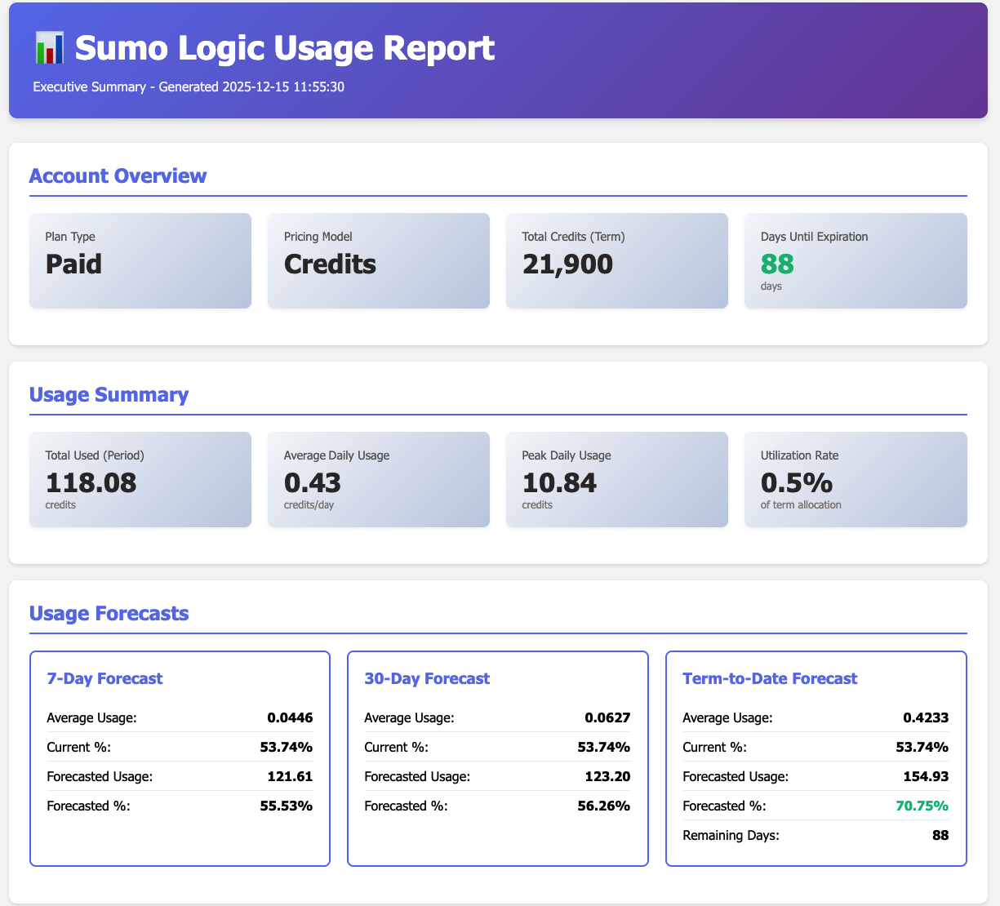
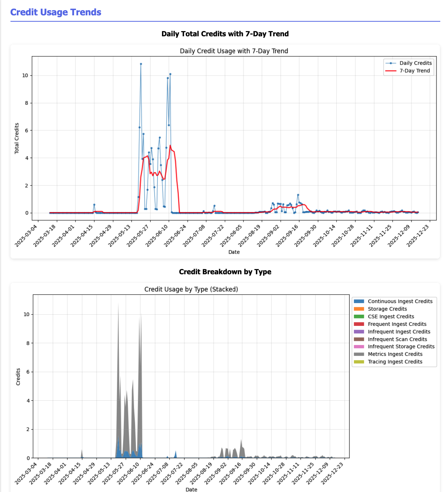
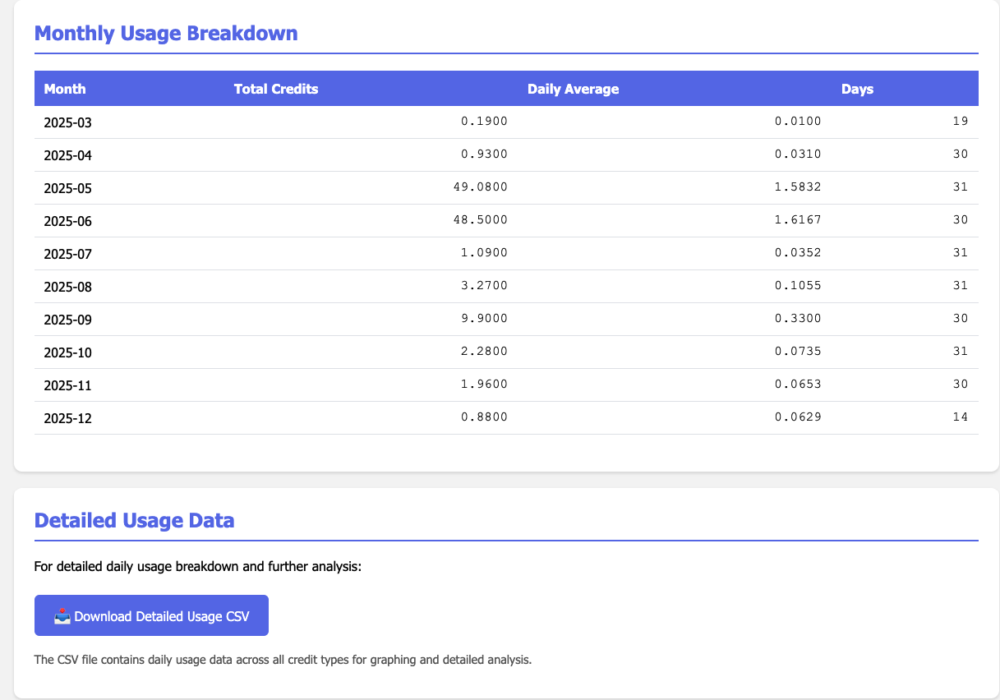

# Sumo Logic Account Management API Scripts

Python scripts for interacting with Sumo Logic Account Management APIs to retrieve account status, usage forecasts, and child organization usage data.

## Features

- **Account Status**: Get current account subscription, plan type, and usage information
- **Usage Forecast**: Retrieve projected usage for a specified number of days
- **Child Organization Usage**: Get usage data for all child organizations (parent orgs only)
- **Export Usage Report**: Export detailed usage reports for a date range (async job with CSV download)
- **Generate Usage Report**: Comprehensive executive report combining account status, forecasts, and usage trends with charts

## Installation

This project uses [uv](https://github.com/astral-sh/uv) for dependency management.

```bash
# Install dependencies
uv sync

# Or run scripts directly with uv
uv run python get_account_status.py --help
```

## Configuration

Set environment variables for your Sumo Logic credentials:

```bash
export SUMO_ACCESS_ID="your_access_id"
export SUMO_ACCESS_KEY="your_access_key"
```

## Usage

### Get Account Status

```bash
# Using environment variables
uv run python get_account_status.py --region au --output table

# With explicit credentials
uv run python get_account_status.py --region us2 --access-id YOUR_ID --access-key YOUR_KEY --output json
```

### Get Usage Forecast

```bash
# 30-day forecast
uv run python get_usage_forecast.py --region us2 --days 30 --output table

# 90-day forecast as JSON
uv run python get_usage_forecast.py --region au --days 90 --output json
```

### Get Child Organization Usage

```bash
# Table format
uv run python get_child_usages.py --region us1 --output table

# CSV export
uv run python get_child_usages.py --region us2 --output csv > child_usage.csv
```

### Export Usage Report

```bash
# Export usage report for January 2024
uv run python export_usage_report.py --region au --start-date 2024-01-01 --end-date 2024-01-31

# Export with custom output file
uv run python export_usage_report.py --region us2 --start-date 2024-01-01 --end-date 2024-01-31 --output jan_2024_usage.csv

# Export with custom polling settings
uv run python export_usage_report.py --region au --start-date 2024-01-01 --end-date 2024-01-31 --poll-interval 10 --timeout 600
```

**Note**: This script performs an async export operation:
1. Starts an export job with POST request
2. Polls job status every 5 seconds (configurable)
3. Downloads CSV report from S3 presigned URL (valid for 10 minutes)
4. Saves to local file (default: `usage_report.csv`)

### Generate Comprehensive Usage Report

Generate an executive-level HTML report with charts, forecasts, and monthly breakdowns.



the report includes predictions, charts of usage and a monthly usage table, with a link to download the usage report csv.





```bash
# Generate report using environment variables
sumo-generate-report --region au

# Generate report with custom output file
sumo-generate-report --region us2 --output custom_report.html

# Using uv run
uv run python generate_usage_report.py --region au
```

**Features**:
- Fetches account status (plan type, total credits, expiration)
- Gets usage forecasts (7-day, 30-day, term-to-date)
- Exports detailed daily usage data
- Generates visualizations:
  - Daily total credits with 7-day rolling average trend
  - Stacked area chart showing credit breakdown by type
- Monthly tabular breakdown with total credits and daily averages
- Color-coded status indicators
- Saves HTML report and CSV data to `reports/` directory

**Output**:
- `reports/usage_report_YYYYMMDD_HHMMSS.html` - Executive HTML report
- `reports/usage_report_YYYYMMDD_HHMMSS.csv` - Detailed usage data

## Available Regions

- `us1` - https://api.sumologic.com
- `us2` - https://api.us2.sumologic.com
- `eu` - https://api.eu.sumologic.com
- `au` - https://api.au.sumologic.com
- `de` - https://api.de.sumologic.com
- `jp` - https://api.jp.sumologic.com
- `ca` - https://api.ca.sumologic.com
- `in` - https://api.in.sumologic.com

## Output Formats

- **JSON**: Machine-readable format with complete data (account status, usage forecast, child usages)
- **Table**: Human-readable formatted output (account status, usage forecast, child usages)
- **CSV**: Comma-separated values (all scripts support CSV output; export usage report only produces CSV)

## API References

- [Account Status](https://api.us2.sumologic.com/docs/#operation/getStatus)
- [Usage Forecast](https://api.us2.sumologic.com/docs/#operation/getUsageForecast)
- [Child Usages](https://api.us2.sumologic.com/docs/#operation/getChildUsages)
- [Export Usage Report](https://api.us2.sumologic.com/docs/#operation/exportUsageReport)

## Requirements

- Python >= 3.9
- Dependencies:
  - matplotlib >= 3.9.4 (for report generation)
  - pandas >= 2.3.3 (for report generation)
  - All other scripts use stdlib only

## CLI Commands

After installation with `uv sync`, the following commands are available:

- `sumo-account-status` - Get account status
- `sumo-usage-forecast` - Get usage forecasts
- `sumo-child-usages` - Get child organization usage
- `sumo-export-usage` - Export detailed usage report
- `sumo-generate-report` - Generate comprehensive HTML report
