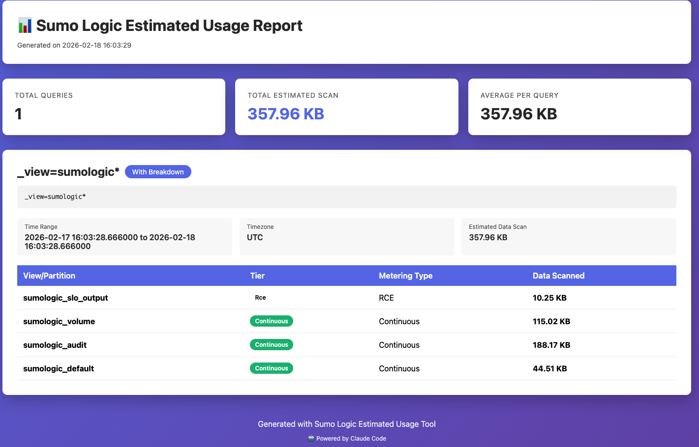
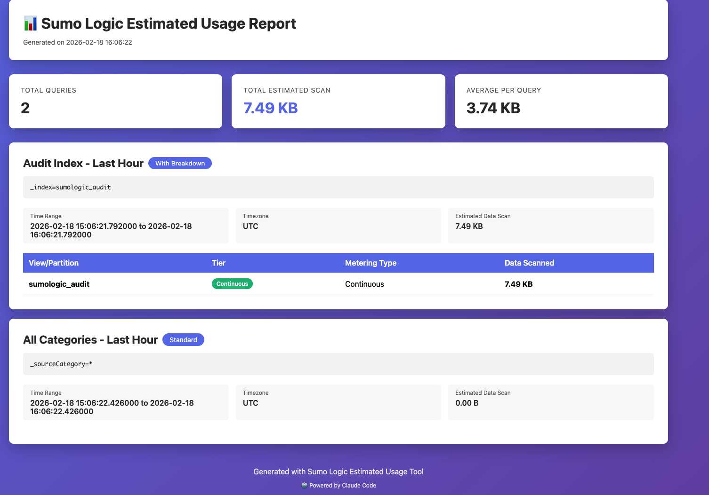

# Sumo Logic Log Search Estimated Usage

This script queries the estimated data volume that would be scanned for a given log search in the Infrequent Data Tier and Flex, over a particular time range.

In the Infrequent Data Tier and Flex, you pay per query based on the amount of data scanned. Use this endpoint to get an estimate of the total data that would be scanned before running a query, and refine your query to scan less data as necessary.

## Requirements

- Python 3.x
- No external dependencies (uses standard library only)

## Authentication

The script supports multiple authentication methods:

### Option 1: Command-line Arguments
```bash
python3 get_estimated_usage.py \
    --region=us2 \
    --access-id=YOUR_ACCESS_ID \
    --access-key=YOUR_ACCESS_KEY \
    --query='_sourceCategory=prod/app' \
    --from-time=-1h \
    --to-time=now
```

### Option 2: Environment Variables (Recommended)
```bash
export SUMO_ACCESS_ID=your_access_id
export SUMO_ACCESS_KEY=your_access_key
export SUMO_ENDPOINT=us2

python3 get_estimated_usage.py \
    --query='_sourceCategory=*' \
    --from-time=-24h \
    --to-time=now
```

## Usage

### Basic Syntax
```bash
python3 get_estimated_usage.py \
    --region=<region> \
    --access-id=<id> \
    --access-key=<key> \
    --query='<log_query>' \
    --from-time=<start_time> \
    --to-time=<end_time> \
    [--timezone=<timezone>] \
    [--output=<format>]
```

### Parameters

| Parameter | Required | Description | Example |
|-----------|----------|-------------|---------|
| `--region` | Yes* | Sumo Logic region code | `us1`, `us2`, `eu`, `au`, `de`, `jp`, `ca`, `in` |
| `--endpoint` | Yes* | Full API endpoint URL (alternative to --region) | `https://api.us2.sumologic.com` |
| `--access-id` | Yes** | Sumo Logic access ID | Your access ID |
| `--access-key` | Yes** | Sumo Logic access key | Your access key |
| `--query` | Yes | Log search query | `_sourceCategory=prod/app` |
| `--from-time` | Yes | Start time | `-1h`, `2024-01-01T00:00:00Z`, `1704067200000` |
| `--to-time` | Yes | End time | `now`, `2024-01-01T01:00:00Z`, `1704070800000` |
| `--timezone` | No | Time zone (default: UTC) | `UTC`, `America/Los_Angeles`, `Europe/London` |
| `--by-view` | No | Get breakdown by view/partition | Flag (no value needed) |
| `--output` | No | Output format (default: summary) | `json`, `table`, `summary`, `webview` |
| `--batch-file` | No | Path to YAML batch configuration file | `batch_queries.yaml` |
| `--output-file` | No | Path for output file (webview/json with batch) | `report.html`, `results.json` |
| `--log-level` | No | Logging level (default: INFO) | `DEBUG`, `INFO`, `WARNING`, `ERROR` |

\* Either `--region` or `--endpoint` is required (or set `SUMO_ENDPOINT` environment variable)
\*\* Can be provided via environment variables `SUMO_ACCESS_ID` and `SUMO_ACCESS_KEY`

### API Endpoints

The script supports two different API endpoints:

1. **Standard Endpoint** (default): `/api/v1/logSearches/estimatedUsage`
   - Returns total estimated data volume to be scanned
   - Faster response time

2. **By-View Endpoint** (with `--by-view` flag): `/api/v1/logSearches/estimatedUsageByView`
   - Returns breakdown by view/partition
   - Shows data tier information (Continuous, Frequent, Infrequent)
   - Shows metering type
   - More detailed but slightly slower
   - **Note**: The default partition (data not in a named partition) is displayed as `sumologic_default`

### Time Format Options

The script supports multiple time formats:

#### Relative Times
- `-1h` - 1 hour ago
- `-30m` - 30 minutes ago
- `-2d` - 2 days ago
- `-1w` - 1 week ago
- `now` - Current time

#### ISO Format
- `2024-01-01T00:00:00Z`
- `2024-01-01T00:00:00.000Z`
- `2024-01-01 00:00:00`
- `2024-01-01`

#### Epoch Milliseconds
- `1704067200000` (13-digit epoch timestamp)

**Important**: When using relative times with `-`, use the `=` syntax to avoid shell parsing issues:
```bash
--from-time=-24h    # Correct
--from-time '-24h'  # Also correct (quoted)
--from-time -24h    # Wrong (shell interprets -24h as a flag)
```

## Examples

### Example 1: Simple Query (Summary Output)
```bash
python3 get_estimated_usage.py \
    --region=us2 \
    --access-id=YOUR_ID \
    --access-key=YOUR_KEY \
    --query='_sourceCategory=prod/app' \
    --from-time=-1h \
    --to-time=now
```

Output:
```
Estimated data to scan: 1.23 GB
```

### Example 2: Table Format Output
```bash
python3 get_estimated_usage.py \
    --region=us2 \
    --access-id=YOUR_ID \
    --access-key=YOUR_KEY \
    --query='_sourceCategory=prod/app | count by _sourceHost' \
    --from-time='2024-01-01T00:00:00Z' \
    --to-time='2024-01-01T01:00:00Z' \
    --timezone='America/Los_Angeles' \
    --output=table
```

Output:
```
=== Estimated Usage ===
Query: _sourceCategory=prod/app | count by _sourceHost
Time Range: 2024-01-01 00:00:00 to 2024-01-01 01:00:00
Time Zone: America/Los_Angeles

Results:
  estimatedUsage: 1.23 GB (1234567890 bytes)
```

### Example 3: JSON Output for Automation
```bash
python3 get_estimated_usage.py \
    --region=us2 \
    --access-id=YOUR_ID \
    --access-key=YOUR_KEY \
    --query='_sourceCategory=*' \
    --from-time=-24h \
    --to-time=now \
    --output=json
```

Output:
```json
{
  "estimatedUsage": 1234567890,
  "query": "_sourceCategory=*",
  "from": 1704067200000,
  "to": 1704153600000
}
```

### Example 4: Using Environment Variables
```bash
# Set credentials once
export SUMO_ACCESS_ID=your_access_id
export SUMO_ACCESS_KEY=your_access_key
export SUMO_ENDPOINT=us2

# Run multiple queries without repeating credentials
python3 get_estimated_usage.py \
    --query='_sourceCategory=logs/web' \
    --from-time=-7d \
    --to-time=now \
    --output=summary

python3 get_estimated_usage.py \
    --query='_sourceCategory=logs/api' \
    --from-time=-7d \
    --to-time=now \
    --output=summary
```

### Example 5: Get Breakdown by View/Partition
```bash
python3 get_estimated_usage.py \
    --region=us2 \
    --access-id=YOUR_ID \
    --access-key=YOUR_KEY \
    --query='_view=my_view' \
    --from-time=-7d \
    --to-time=now \
    --by-view \
    --output=table
```

Output:
```
=== Estimated Usage ===
Query: _view=my_view
Time Range: 2024-01-01 00:00:00 to 2024-01-08 00:00:00
Time Zone: UTC
Breakdown By View: Yes

Results:
  Total Estimated Data to Scan: 15.34 GB (16,467,890,123 bytes)
  Run by Receipt Time: False
  Interval Time Type: messageTime

  Breakdown by View/Partition:
    - my_view (Continuous/Continuous): 10.23 GB (10,987,654,321 bytes)
    - sumologic_system_events (Continuous/Continuous): 5.11 GB (5,480,235,802 bytes)
    - sumologic_default (Frequent/Frequent): 2.34 GB (2,512,345,678 bytes)
```

*Note: `sumologic_default` represents data in the default partition (reported as empty string by the API).*

### Example 6: Webview HTML Report (Single Query)
```bash
python3 get_estimated_usage.py \
    --region=us2 \
    --access-id=YOUR_ID \
    --access-key=YOUR_KEY \
    --query='_view=sumologic*' \
    --from-time=-24h \
    --to-time=now \
    --by-view \
    --output=webview
```

Output:
```
HTML report generated: usage_report.html
Total estimated data to scan: 358.07 KB
```

This creates a beautiful HTML report with:
- Summary statistics
- Query details with time range
- Partition/view breakdown table with tier information
- Responsive design with gradient styling



### Example 7: Batch Mode with YAML Configuration
```bash
# Create a batch configuration file (batch_queries.yaml)
cat > batch_queries.yaml << 'EOF'
description: "Daily Usage Analysis"
queries:
  - name: "Audit Logs - Last 24h"
    query: "_index=sumologic_audit"
    from: "-24h"
    to: "now"
    timezone: "UTC"
    byView: true

  - name: "System Events - Last Week"
    query: "_view=sumologic_system_events"
    from: "-7d"
    to: "now"
    timezone: "UTC"
    byView: false

  - name: "Production App Logs"
    query: "_sourceCategory=prod/app"
    from: "2024-01-01T00:00:00Z"
    to: "2024-01-02T00:00:00Z"
    timezone: "America/Los_Angeles"
    byView: true
EOF

# Execute batch with webview output
python3 get_estimated_usage.py \
    --region=us2 \
    --access-id=YOUR_ID \
    --access-key=YOUR_KEY \
    --batch-file=batch_queries.yaml \
    --output=webview \
    --output-file=usage_analysis.html
```

Output:
```
HTML report generated: usage_analysis.html
```

The generated HTML report includes:
- Overall summary with total queries and estimated scan volume
- Individual query cards with full details
- Breakdown tables for queries with `byView: true`
- Timestamp and execution metadata



### Example 8: Batch Mode with Summary Output
```bash
python3 get_estimated_usage.py \
    --batch-file=batch_queries.yaml \
    --output=summary
```

Output:
```
=== Batch Estimated Usage Report ===
Total queries: 3
Total estimated scan: 45.67 GB

1. Audit Logs - Last 24h: 187.88 KB
2. System Events - Last Week: 12.34 GB
3. Production App Logs: 33.33 GB
```

### Example 9: Debug Mode
```bash
python3 get_estimated_usage.py \
    --region=us2 \
    --access-id=YOUR_ID \
    --access-key=YOUR_KEY \
    --query='_index=sumologic_audit' \
    --from-time=-1h \
    --to-time=now \
    --log-level=DEBUG
```

## Batch Mode

Batch mode allows you to execute multiple queries and generate consolidated reports. This is useful for:
- Regular usage analysis across multiple log sources
- Comparing estimated costs for different queries
- Generating reports for stakeholders

### YAML Configuration Format

```yaml
description: "Optional description of this batch"  # Optional
queries:
  - name: "Query Name"          # Required: Display name for the query
    query: "log search query"   # Required: The Sumo Logic query
    from: "-24h"                # Required: Start time (relative, ISO, or epoch)
    to: "now"                   # Required: End time (relative, ISO, or epoch)
    timezone: "UTC"             # Optional: Default is UTC
    byView: true                # Optional: Enable breakdown by partition/view (default: false)
```

### Batch Output Formats

#### Summary Format (Console)
Quick overview of all queries:
```bash
python3 get_estimated_usage.py --batch-file=config.yaml --output=summary
```

#### JSON Format (Automation)
Full structured data for processing:
```bash
python3 get_estimated_usage.py --batch-file=config.yaml --output=json --output-file=results.json
```

#### Webview Format (Reports)
Beautiful HTML report for sharing:
```bash
python3 get_estimated_usage.py --batch-file=config.yaml --output=webview --output-file=report.html
```

## Output Formats

### `summary` (default)
Displays key metrics in human-readable format:
```
Estimated data to scan: 1.23 GB
```

### `table`
Displays all response fields in a formatted table:
```
=== Estimated Usage ===
Query: _sourceCategory=prod/app
Time Range: 2024-01-01 00:00:00 to 2024-01-01 01:00:00
Time Zone: UTC

Results:
  estimatedUsage: 1.23 GB (1234567890 bytes)
```

### `json`
Outputs raw JSON response (useful for scripting):
```json
{
  "estimatedUsage": 1234567890
}
```

### `webview`
Generates a beautiful HTML report with:
- Gradient-styled header
- Summary cards showing total queries, total scan volume, average per query
- Individual query cards with:
  - Query text and metadata (time range, timezone)
  - Estimated data scan volume
  - Breakdown table (when using `--by-view`)
- Responsive design optimized for viewing in browsers

**Single Query Mode:**
```bash
python3 get_estimated_usage.py \
    --query='_view=sumologic*' \
    --from-time=-24h \
    --to-time=now \
    --by-view \
    --output=webview
# Creates: usage_report.html
```

**Batch Mode:**
```bash
python3 get_estimated_usage.py \
    --batch-file=queries.yaml \
    --output=webview \
    --output-file=custom_report.html
# Creates: custom_report.html
```

**Default Output Locations:**
- Single query: `usage_report.html` (in current directory)
- Batch mode: `usage_report.html` (in current directory)
- Custom location: Use `--output-file=/path/to/report.html`

## API Endpoint

The script calls:
```
POST /api/v1/logSearches/estimatedUsage
```

Request body:
```json
{
  "query": "string",
  "from": 1234567890000,
  "to": 1234567890000,
  "timeZone": "UTC"
}
```

## Related Documentation

- [Sumo Logic Log Search Estimated Usage API](https://help.sumologic.com/docs/api/log-search-estimated-usage/)
- [Sumo Logic API Authentication](https://help.sumologic.com/docs/api/)
- [Data Tiers Overview](https://help.sumologic.com/docs/manage/partitions-data-tiers/)

## See Also

- [../search_job/](../search_job/) - Execute search jobs and retrieve results
