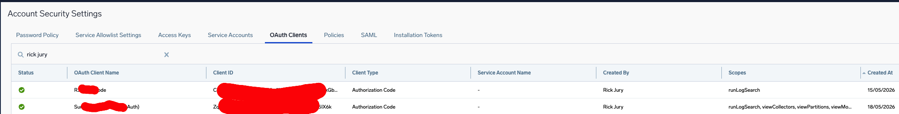
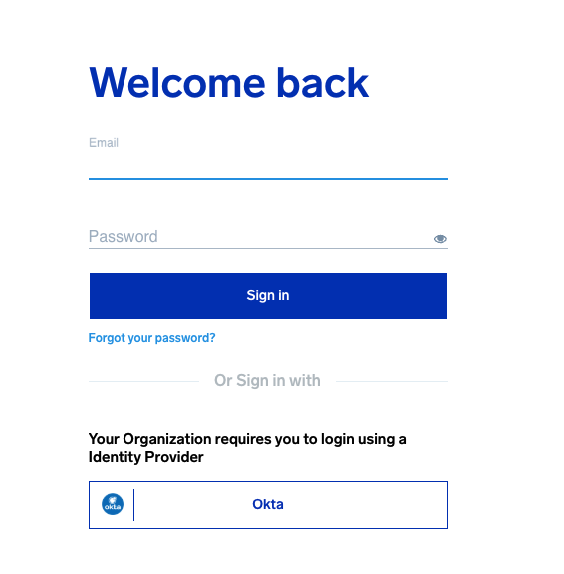
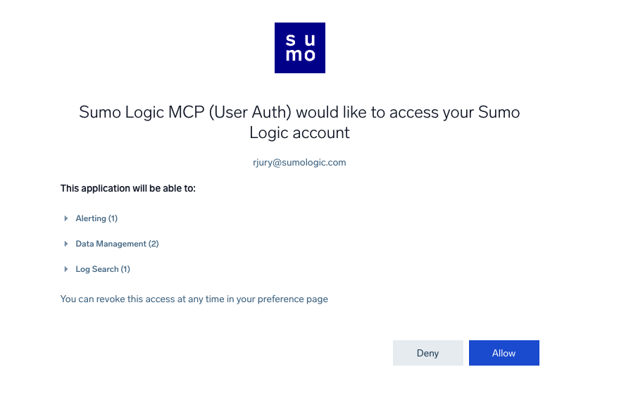
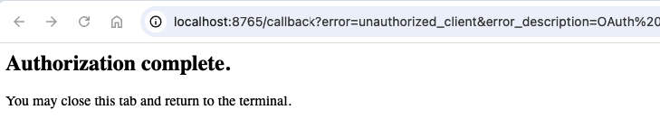
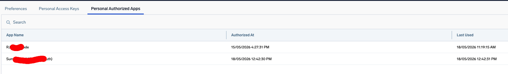

# Sumo Logic MCP Server Setup with sumo-oauth

This guide walks through configuring the Sumo Logic MCP server using the `sumo-oauth` CLI. It covers Steps 1–3 of the [official setup docs](https://www.sumologic.com/help/docs/api/mcp-server/). For IDE configuration (Claude Code, VS Code + GitHub Copilot) refer to that page directly.

## Choosing an authentication approach

Two OAuth client types are supported, each with a different runtime identity and token flow:

### Workflow A — ClientCredentialsClient (machine-to-machine)

The MCP client authenticates using a **client ID and secret** directly — no browser required. The MCP server runs as a designated **service account**, so all actions are performed under that account's roles. Token refresh is fully automatic.

**Best for:** automated tooling, CI pipelines, shared MCP servers, or any context where a persistent non-interactive credential is needed.

### Workflow B — AuthorizationCodeClient (user identity, experimental)

The MCP client opens a **browser window** so you log in as yourself. After you approve the consent screen, an authorization code is returned to a local callback listener, exchanged for an access + refresh token, and stored in the OS keychain. The MCP server sees **your user identity** scoped to the OAuth client's declared scopes. Re-authentication via browser is only required if the refresh token is revoked.

**Best for:** interactive developer use, personal MCP access, or when you want server actions to run as your own identity.

| | Workflow A | Workflow B |
| --- | --- | --- |
| **Client type** | `ClientCredentialsClient` | `AuthorizationCodeClient` |
| **Runtime identity** | Service account | Logged-in user (browser) |
| **Login command** | `sumo-oauth login` | `sumo-oauth auth-code-login` |
| **Browser required** | No | Yes (once; refresh token reused) |
| **Token refresh** | Automatic | Automatic via refresh token |
| **Status** | Supported | Experimental |

---

## Common prerequisites

- Sumo Logic Administrator role (required — only Administrators can create/modify/delete OAuth clients)
- `sumo-oauth` installed — see [README.md](README.md) for installation steps
- MCP-compatible client (Claude Code CLI or VS Code + GitHub Copilot)

> **Note:** Sumo Logic does not support Dynamic Client Registration or Client ID Metadata Documents (CIMD). OAuth clients must be created manually via the UI or CLI before connecting an MCP client.

## Understanding credential types

`sumo-oauth` uses two separate credential types depending on the operation:

| Credential type | What it's for | Commands that use it |
| --- | --- | --- |
| **Access ID + Access Key** (Basic auth) | Admin API operations — listing users, service accounts, OAuth clients and scopes | `service-accounts`, `users`, `oauth-clients`, `oauth-scopes`, `create-oauth-client`, `delete-oauth-client` |
| **Client ID + Client Secret** (OAuth) | Obtaining a Bearer token for the MCP server | `login`, `auth-code-login`, `token` |

For Workflow A you will need both. For Workflow B, Basic auth is needed to create the OAuth client; after that only OAuth credentials are required.

---

## Workflow A: ClientCredentialsClient (machine-to-machine)

### Step 1: Configure Basic auth credentials

> **Skip if using the UI:** Basic auth is only needed to drive the CLI admin API commands in Steps 2 and 3. If you created your OAuth client in the Sumo Logic UI, store its credentials first (you will be prompted for the client secret), then skip to Step 4:

```bash
sumo-oauth store-creds --mode oauth --region <REGION> --client-id <YOUR_CLIENT_ID> --client-type client-credentials
```

Basic auth (access ID + access key) is required for the admin API commands in Steps 2 and 3. You can generate an access key in the Sumo Logic UI under **Preferences → Access Keys**.

```bash
sumo-oauth store-creds --mode basic --region <REGION> --access-id <YOUR_ACCESS_ID>
```

Replace `<REGION>` with your deployment (e.g. `au`, `us1`, `us2`, `eu`). You will be prompted for your access key securely.

Verify the profile was saved:

```bash
sumo-oauth status
```

At this point `access_key_stored` should be `true`. `client_secret_stored` will be `false` — that is expected; the OAuth client does not exist yet.

### Step 2: Find your service account ID

The `ClientCredentialsClient` runs as a service account. You need its ID (`runAsId`) for the client configuration.

```bash
sumo-oauth service-accounts
```

Example output:

```text
ID                   | Name              | Email                        | Active | Created
---------------------+-------------------+------------------------------+--------+----------
0000000000A123456    | mcp-service-acct  | mcp-svc@example.com          | True   | 2026-01-15
```

Use `--filter` to narrow results if you have many accounts:

```bash
sumo-oauth service-accounts --filter "mcp"
```

Note the **ID** value — you will use it as `runAsId` in the next step.

### Step 3: Create the OAuth client

> **UI alternative:** OAuth clients can also be created and managed in the Sumo Logic UI under **Administration → Security → OAuth Clients**. Use the CLI steps below for scripted or repeatable setup, or the UI for one-off creation and ongoing client management.

#### 3a. Review available scopes

List all available OAuth scopes to select what the MCP client should be permitted to do:

```bash
sumo-oauth oauth-scopes
```

Filter by keyword to find relevant scopes:

```bash
sumo-oauth oauth-scopes --filter "log|search|alert|dashboard|insight"
```

The MCP server typically requires scopes covering log search, alerts, dashboards, and Cloud SIEM. Scopes are limited to the intersection of the service account's roles and the OAuth client's declared scopes, so there is no privilege escalation risk in requesting broadly.

#### 3b. Create a client config file

Create a JSON file describing the OAuth client. Replace the `runAsId` with the service account ID from Step 2, and adjust `scopes` to match your requirements.

```json
{
    "type": "ClientCredentialsClient",
    "name": "Sumo Logic MCP Client",
    "description": "OAuth client for MCP server access",
    "scopes": [
        "runLogSearch",
        "viewCollectors",
        "viewPartitions",
        "viewScheduledViews",
        "viewFields",
        "viewFieldExtractionRules",
        "viewMonitorsV2",
        "manageSlos",
        "viewSlos",
        "managePartitions",
        "manageScheduledViews",
        "manageFields",
        "manageFieldExtractionRules",
        "manageCollectors",
        "runMetricsQuery",
        "viewLibrary",
        "manageS3DataForwarding"
    ],
    "runAs": {
        "type": "ServiceAccount",
        "runAsId": "0000000000A123456"
    }
}
```

Save this as `mcp-client.json`.

Alternatively, pass the key options inline without a file:

```bash
sumo-oauth create-oauth-client \
  --type client-credentials \
  --name "Sumo Logic MCP Client" \
  --run-as-id 0000000000A123456 \
  --scopes "runLogSearch,viewCollectors,viewPartitions" \
  --save-creds
```

> **Note:** The `--name` value (or `"name"` in the JSON file) becomes the `clientName` shown when listing consent grants with `sumo-oauth oauth-consents`.

#### 3c. Create the client and save credentials

```bash
sumo-oauth create-oauth-client --from-file mcp-client.json --save-creds
```

The `--save-creds` flag automatically saves the returned `clientId` to your profile and stores the `clientSecret` in the OS keychain. The secret is only returned at creation time — `--save-creds` ensures you don't lose it.

Example output:

```text
OAuth client created.
  clientId                : ICIEWKrJok-7H6ctnIlKCGtcrzy_cBEjeJPFnGkiAiM
  name                    : Sumo Logic MCP Client
  ...

Credentials saved to profile 'default':
  client_id     : ICIEWKrJok-7H6ctnIlKCGtcrzy_cBEjeJPFnGkiAiM
  client_secret : stored in OS keychain
  oauth_client_type: ClientCredentialsClient
Run 'sumo-oauth login' to obtain a token with the new client.
```

To verify the client was created:

```bash
sumo-oauth oauth-clients --type cc --filter "MCP"
```

The new client is also visible in the Sumo Logic UI under **Administration → Security → OAuth Clients**.



### Step 4: Obtain a token

```bash
sumo-oauth login
```

This exchanges the client credentials for a Bearer token (valid 30 minutes) and stores it in your session profile. The token is automatically refreshed when it expires.

---

## Workflow B: AuthorizationCodeClient (experimental)

> **Experimental.** The authorization endpoint URL is inferred from the token endpoint and has not been validated against all Sumo Logic deployments. Please open an issue if you encounter problems.

This flow authenticates as a **real user** via the browser. The resulting token is scoped to that user's roles intersected with the OAuth client's declared scopes.

### Step 1: Configure Basic auth credentials (same as Workflow A)

> **Skip if using the UI:** Basic auth is only needed to drive the CLI admin API commands in Step 2. If you created your OAuth client in the Sumo Logic UI, store its credentials first (you will be prompted for the client secret), then skip to Step 3:

```bash
sumo-oauth store-creds --mode oauth --region <REGION> --client-id <YOUR_CLIENT_ID> --client-type authorization-code
```

You need Basic auth to create the OAuth client via the admin API.

```bash
sumo-oauth store-creds --mode basic --region <REGION> --access-id <YOUR_ACCESS_ID>
```

### Step 2: Create the AuthorizationCodeClient

> **UI alternative:** OAuth clients can also be created and managed in the Sumo Logic UI under **Administration → Security → OAuth Clients**. Use the CLI steps below for scripted or repeatable setup, or the UI for one-off creation and ongoing client management.

`AuthorizationCodeClient` does not run as a service account — the user who authenticates via the browser is the identity. A redirect URI pointing to `localhost` is required for the PKCE callback.

```bash
sumo-oauth create-oauth-client \
  --type authorization-code \
  --name "Sumo Logic MCP (User Auth)" \
  --redirect-uris "http://localhost:8888/callback" \
  --scopes "runLogSearch,viewCollectors,viewPartitions,viewMonitorsV2" \
  --save-creds
```

Or from a JSON file:

```json
{
    "type": "AuthorizationCodeClient",
    "name": "Sumo Logic MCP (User Auth)",
    "description": "OAuth client for user-authenticated MCP access",
    "scopes": [
        "runLogSearch",
        "viewCollectors",
        "viewPartitions",
        "viewMonitorsV2",
        "viewSlos",
        "runMetricsQuery",
        "viewLibrary"
    ],
    "redirectUris": ["http://localhost:8888/callback"]
}
```

```bash
sumo-oauth create-oauth-client --from-file mcp-auth-code.json --save-creds
```

The `--save-creds` flag stores the `clientId` in your profile and the `clientSecret` in the OS keychain, and records `oauth_client_type = AuthorizationCodeClient`.

> **Note:** The `--name` value (or `"name"` in the JSON file) becomes the `clientName` shown when listing consent grants with `sumo-oauth oauth-consents`.

To verify the client was created (note the `Port` column confirms the redirect URI port):

```bash
sumo-oauth oauth-clients --type ac --filter "MCP"
```

The new client is also visible in the Sumo Logic UI under **Administration → Security → OAuth Clients**.

### Step 3: Authenticate via browser

```bash
sumo-oauth auth-code-login
```

This does the following:

1. Generates a PKCE code challenge
2. Opens your browser to the Sumo Logic authorization endpoint

   You must log in via browser (if no active session), accept the consent/scope screen, and will then be redirected to an authorization successful page.

   | Login | Accept consent | Authorization complete |
   |:---:|:---:|:---:|
   |  |  |  |

   While this happens the CLI listens on the local port for the redirect callback:

   ```text
   sumo-oauth auth-code-login --profile myprofile
   Opening browser for authorization (profile: myprofile)…
     Redirect URI  : http://localhost:8888/callback
     Timeout       : 120s

     NOTE: the redirect URI above must be registered on the OAuth client in Sumo Logic.

   12:42:30 INFO Authorization code received. Exchanging for tokens…
   12:42:31 INFO Profile 'myprofile' saved to /Users/username/.sumo_oauth_session.json (expires in 299s)
   Login successful (profile: myprofile, flow: authorization_code).
     Endpoint           : https://api.sumologic.com
     Client ID          : ABC123def-gHiJ-kLmN-oPqR-STuvWXyz012345
     Client type        : AuthorizationCodeClient
     Expires at (UTC)   : 2026-05-18T00:47:30Z  (00:04:58 remaining)
     Refresh token      : stored in OS keychain
   ```

3. Listens on `localhost:8888` for the OAuth callback
4. Exchanges the authorization code for an access token (and refresh token if issued)

The refresh token (if returned by Sumo Logic) is stored in the OS keychain under `{profile}:refresh_token`. Subsequent `token` commands will use the refresh token grant automatically, so re-authentication via browser is only needed if the refresh token is revoked.

**Scopes note:** Do not pass `--scopes` to `auth-code-login` — Sumo Logic returns `invalid_scope` if scopes are included in the authorization request. Effective scopes are configured on the OAuth client itself (Step 2).

Use a different callback port if 8888 is taken:

```bash
sumo-oauth auth-code-login --port 9000
# The redirect URI registered on the client must match: http://localhost:9000/callback
```

#### Verifying the authorization

After authenticating, you can confirm the consent grant was recorded using the `oauth-consents` command:

```bash
uv run sumo-oauth oauth-consents --profile myprofile --filter MCP
```

Authorized apps are also visible in the Sumo Logic UI. Click your user icon in the top-right corner and select **Personal Authorized Apps**.



---

## Step 4 (both workflows): Configure your MCP client

### Generate a ready-to-use config block

The `client-config` command reads your active profile and prints a ready-to-use configuration block for your AI client or IDE. The output format is **tailored to your OAuth client type**: an `AuthorizationCodeClient` profile emits OAuth browser-callback config (e.g. `callbackPort`), while a `ClientCredentialsClient` profile emits `clientId`/`clientSecret` or Bearer token config depending on the format.

```bash
# Claude Code CLI (default — prints the claude mcp add command)
sumo-oauth client-config

# Specific format
sumo-oauth client-config --format vscode
sumo-oauth client-config --format cursor
sumo-oauth client-config --format gemini

# All supported formats at once
sumo-oauth client-config --format all
```

The server name defaults to `sumologic` but Sumo Logic's convention is `sumo-mcp-<deployment-org>`. Pass `--server-name` to override:

```bash
uv run sumo-oauth client-config --format claude-code --server-name sumo-mcp-prod
```

Example — `claude-code-json` format with an `AuthorizationCodeClient` profile (token is auto-refreshed before output):

```text
uv run sumo-oauth client-config --format claude-code-json --profile myprofile
13:02:08 INFO Token for profile 'myprofile' expired or expiring – refreshing…
13:02:09 INFO Profile 'myprofile' saved to /Users/username/.sumo_oauth_session.json (expires in 299s)
# .mcp.json (project root) or merge mcpServers into ~/.claude.json
# NOTE: clientSecret is stored inline — do not commit this file to source control.
{
  "mcpServers": {
    "sumologic": {
      "type": "http",
      "url": "https://mcp.sumologic.com/mcp",
      "oauth": {
        "clientId": "<your-client-id>",
        "clientSecret": "<your-client-secret>",
        "authServerMetadataUrl": "https://service.sumologic.com/.well-known/oauth-authorization-server",
        "callbackPort": 8888
      }
    }
  }
}
```

Supported formats:

| Format | Config location | Auth approach |
| --- | --- | --- |
| `claude-code` | CLI command | OAuth authorization code + fixed callback port |
| `claude-code-json` | `.mcp.json` / `~/.claude.json` | OAuth authorization code + fixed callback port |
| `vscode` | `.vscode/mcp.json` | `clientId`/`clientSecret` inline |
| `cursor` | `~/.cursor/mcp.json` | Bearer token |
| `windsurf` | `~/.codeium/windsurf/mcp_config.json` | Bearer token |
| `gemini` | `~/.gemini/settings.json` | OAuth `dynamic_discovery` |
| `codex` | `~/.codex/config.toml` | OAuth callback port |
| `all` | — | All of the above |

### Setting the required environment variables

The official docs require these environment variables to be set before registering the MCP server. Use the `export-env` command to print them all at once — it retrieves the `client_secret` from the OS keychain and auto-refreshes the access token:

```bash
# Print all required exports (copy/paste or eval)
sumo-oauth export-env

# Or load them directly into your current shell session
eval $(sumo-oauth export-env)
```

Example output:

```bash
export SUMOLOGIC_MCP_URL="https://mcp.au.sumologic.com/mcp"
export SUMOLOGIC_OAUTH_CLIENT_ID="ICIEWKrJok-7H6ctnIlKCGtcrzy_cBEjeJPFnGkiAiM"
export SUMOLOGIC_OAUTH_CLIENT_SECRET="<secret from keychain>"
export SUMOLOGIC_OAUTH_TOKEN_URL="https://service.au.sumologic.com/oauth2/token"
export SUMOLOGIC_OAUTH_ACCESS_TOKEN="eyJ..."
```

For fish shell:

```bash
eval (sumo-oauth export-env --shell fish)
```

### Continue with the official docs

For IDE registration steps (Claude Code, VS Code + GitHub Copilot):

**[https://www.sumologic.com/help/docs/api/mcp-server/](https://www.sumologic.com/help/docs/api/mcp-server/)**

### Reference: individual values

If you need to retrieve values individually:

| Value | How to get it |
| --- | --- |
| `SUMOLOGIC_OAUTH_CLIENT_ID` | `sumo-oauth status` → `client_id` field |
| `SUMOLOGIC_OAUTH_CLIENT_SECRET` | `sumo-oauth export-env` (reads from OS keychain) |
| `SUMOLOGIC_OAUTH_ACCESS_TOKEN` | `sumo-oauth token --raw \| sed 's/Bearer //'` |
| `SUMOLOGIC_OAUTH_TOKEN_URL` | `sumo-oauth export-env` (derived from profile region) |
| `SUMOLOGIC_MCP_URL` | `sumo-oauth export-env` (derived from profile region) |

Region reference:

| Region | MCP URL | Token URL |
| --- | --- | --- |
| us1 (US East, N. Virginia) | `https://mcp.sumologic.com/mcp` | `https://service.sumologic.com/oauth2/token` |
| us2 (US West, Oregon) | `https://mcp.us2.sumologic.com/mcp` | `https://service.us2.sumologic.com/oauth2/token` |
| au (Asia Pacific, Sydney) | `https://mcp.au.sumologic.com/mcp` | `https://service.au.sumologic.com/oauth2/token` |
| eu (Europe, Ireland) | `https://mcp.eu.sumologic.com/mcp` | `https://service.eu.sumologic.com/oauth2/token` |
| de (Europe, Frankfurt) | `https://mcp.de.sumologic.com/mcp` | `https://service.de.sumologic.com/oauth2/token` |
| jp (Asia Pacific, Tokyo) | `https://mcp.jp.sumologic.com/mcp` | `https://service.jp.sumologic.com/oauth2/token` |
| ca (Canada, Central) | `https://mcp.ca.sumologic.com/mcp` | `https://service.ca.sumologic.com/oauth2/token` |
| in | `https://mcp.in.sumologic.com/mcp` | `https://service.in.sumologic.com/oauth2/token` |
| fed (US East, N. Virginia) | `https://mcp.fed.sumologic.com/mcp` | `https://service.fed.sumologic.com/oauth2/token` |
| kr (Asia Pacific, Seoul) | `https://mcp.kr.sumologic.com/mcp` | `https://service.kr.sumologic.com/oauth2/token` |
| ch (Europe, Zurich) | `https://mcp.ch.sumologic.com/mcp` | `https://service.ch.sumologic.com/oauth2/token` |
