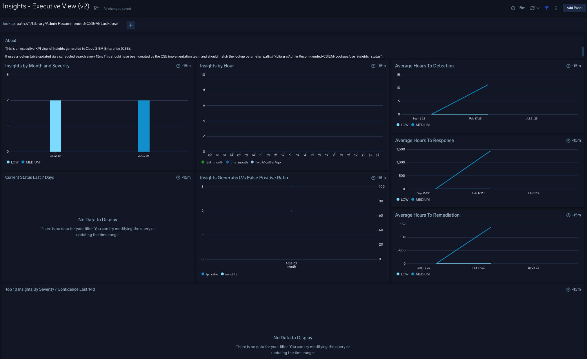

# CSE Phase II Insights KPI App
This is an example executive KPI app for Sumo Logic Cloud SIEM using insights events in sumologic_audit_events and sumologic_system_events indexes.

The KPI dashboard:
- show high level stats for insights
- use last state of each insight in order to present a consistent current state view.



# Solution Architecture
Sumo dashboards have a 30d back limit by default and the dashboard has a longer time range (several months typically). 

Using events (the sumologic_*_indexes), a 15m scheduled search can save to a v2 lookup table. The lookup table will maintain a current state view of insights that is time independent. This solves the issues around trying to use a time series view that could stretch back months to infer current state.

Each time an insight is created or update a scheduled search will save the current state event into the lookup table using insight_id as the primary key.
For query/ dashboards use the 'cat' operator vs the lookup table to get the current state of all in scope insights even using a '-5m' time range (because lookups are time agnostic). Timeslice can be reconstructred in query from the time columns in table.

There are size constraints on lookup v2 (max 100MB size). Insights are relatively low in volume so it should be feasible to maintain months or even years of insights in the lookukp table for a customer without exceeding the size limit.

# How to Setup the Solution and App
First setup the lookup table. If you try to inport content with a lookup table reference it will fail unless the path already exists.

## setup lookup table cse_insights_status
switch to content admin mode.
Create folder: admin recommended / CSIEM / Lookups

Either :
a) import cse_insights_status.json from the import folder.
or 
b) follow the manual lookup creation steps in docs/create_cse_insights_lookup.md 

If your resulting path is NOT **path://"/Library/Admin Recommended/CSIEM/Lookups/cse_insights_status"** you will need to make extra changes further down the track to the import content.

**Make sure this lookup is shared to required users** (ideally via a share on the parent folder in Admin recommended)

## backfill the lookup table for -90d or whatever time seems appropriate
Run this query for a time to backfill up till now. It will be quite slow past 30d!
You can not save **more than 500 records at one time** so you might have to backfill in stages say -120d -90d, -90d -60d etc...

```
// Use this query to generate a csv you can download then upload to create a lookup table
(_index=sumologic_audit_events _sourcecategory=cseinsight insightupdated
OR
_index=sumologic_system_events _sourcecategory=cseinsight insightcreated)

| json field=_raw "eventName"
| json field=_raw "insightIdentity.id" as id
| json field=_raw "insightIdentity.readableId" as insightid
| json field=_raw "insight.status" as status
| json field=_raw "insight.name" as name
| json field=_raw "insight.entityType" as entitytype
| json field=_raw "insight.entityValue" as entityvalue
| json field=_raw "insight.tags" as tags
| json field=_raw "insight.severity" as severity
| json field=_raw "insight.confidence" as confidence
| json field=_raw "insight.signals" as signals

// in closed events
| json field=_raw "insight.assignee" as assignee nodrop
| json field=_raw "insight.resolution" as resolution nodrop

// in update events 
//| json field=_raw "to" as last_change nodrop

// may exist after an update
| json field=_raw "insight.timeToResponse" as timeToResponse nodrop
| json field=_raw "insight.timeToDetection" as timeToDetection nodrop
| json field=_raw "insight.timeToRemediation" as timeToRemediation nodrop

| if (isnull(timeToResponse),-1,timeToResponse) as timeToResponse
| if (isnull(timeToDetection),-1,timeToDetection) as timeToDetection
| if (isnull(timeToRemediation),-1,timeToRemediation) as timeToRemediation
| sort _messagetime

// ensure we only store the most recent result
| count as events, max(_messagetime) as _messagetime,first(status) as status,first(tags) as tags, max(severity) as severity,first(confidence) as confidence,first(assignee) as assignee,first(resolution) as resolution,first(timeToResponse) as timeToResponse,first(timeToDetection) as timeToDetection,first(timeToRemediation) as timeToRemediation,first(signals) as signals,values(eventname) as eventnames by id,insightid,name,entitytype,entityvalue 

// lets squash down size of the signals field so we don't generate a massive lookup
| parse regex field=signals "\"ruleId\":\"(?<rule>[^\"]+\",\"ruleName\":\"[^\"]+\")" multi
| replace (rule,"\"","") as rule
| replace (rule,"ruleName","") as rule

// final aggregation to save to a lookup with only one row for most recent status of insight
| values(rule) as rules,max(_messagetime) as time,first(status) as status,first(tags) as tags, max(severity) as severity,first(confidence) as confidence,first(assignee) as assignee,first(resolution) as resolution,first(timeToResponse) as timeToResponse,first(timeToDetection) as timeToDetection,first(timeToRemediation) as timeToRemediation,first(eventnames) as eventnames by id,insightid,name,entitytype,entityvalue // first(signals) as signals,

// enable this line to write data to populate the lookup table with backdated data say one time for -90d
// Schedule a version of this search to save to the lookup every 15m for -15m 
| save path://"/Library/Admin Recommended/CSIEM/Lookups/cse_insights_status"
```

check the lookup table is updated with query below you should see some insight data. Sometimes it takes 30s or so to appear:
```
cat path://"/Library/Admin Recommended/CSIEM/Lookups/cse_insights_status"
``` 

## Schedule ongoing updates every 15m via a scheduled search
create a scheduled search similar to above with we will use save to lookup as the action.
create the scheduled search using steps in ../docs/create_update_cse_insights_ss.md

Every 15m going forwards, this should overwrite each row with the most recent insight-xxx value as it turns up in the audit log and over time we will still end up with one row with the most recent status update.

## import the app
in the import folder import: ./import/insight.kpi.app.json using the library. A good place for this would be admin recommended with a name such as CSIEM KPI


For the two insights lookup sourced dashboards you may have to edit the lookup path parameter if you are using a different lookup table path.