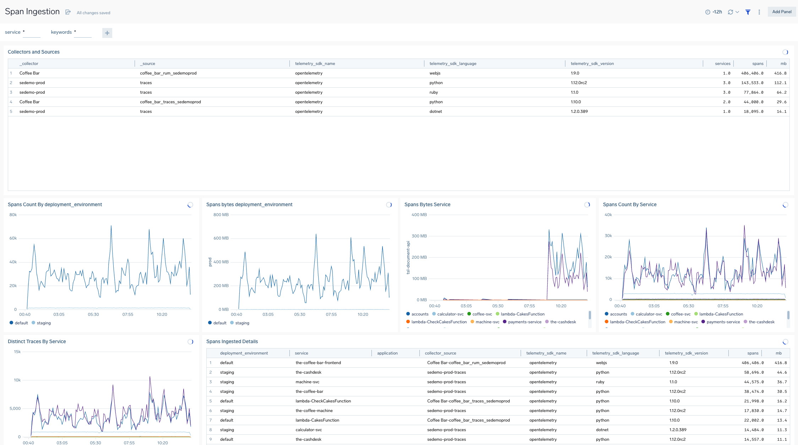

# Span ingestion
A dashboard using the spans index to show detailed info about spans ingested by tracing sdk, service, envrionment and more.


# otelcol-k8s-containers
A dashboard showing prometheus metrics about auto instrucmentation otelcol containers in sumologic kubernetes solution.
https://help.sumologic.com/docs/apm/traces/get-started-transaction-tracing/set-up-traces-collection-for-kubernetes-environments/

# Tracing errors - span details
Unifies high level trace metrics and trace panels for errors with detailed search capability vs the ```_index=_trace_spans  ``` Span analytics log index.
This enables users to 
- quickly understand what spans might have been flagged as errors to generate ```_contenttype=metricfromtrace metric=service_operation_errors```  metrics
- do detailed drilldown into span errors by keywords or key fields
- correleate specific errors to matching traces
- understand error breakdown and trend by service or environment.

note: change the url param to point to your instance for the click through in the table to a trace to work.

