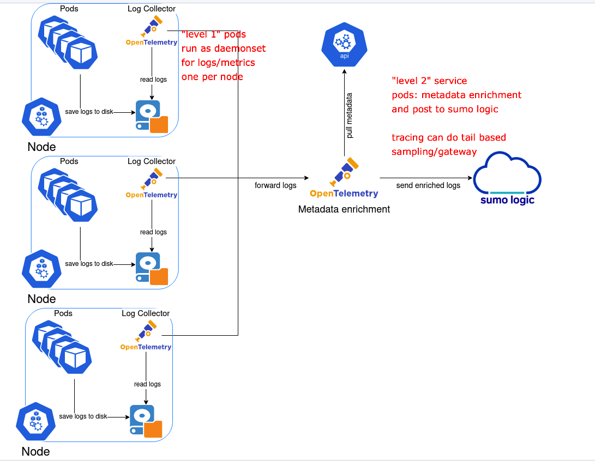

# general commands

Troubleshooting collection docs page:
https://help.sumologic.com/docs/send-data/kubernetes/troubleshoot-collection/

Customer support issues information required
https://github.com/SumoLogic/sumologic-kubernetes-collection/blob/main/docs/support.md

# collection architecture
see the installation page diagram for your version e.g https://github.com/SumoLogic/sumologic-kubernetes-collection/blob/release-v4.11/docs/README.md



## helm version
Version of Sumo Logic Kubernetes Collection Helm Chart use one of these examples:
```
helm ls -A
helm list -A
helm list -A --namespace sumologic
```

## values minus acccessKey
```
helm get values sumologic -n sumologic | grep -v accessKey
```

## get sumologic pods
```
kubectl get pods -n sumologic
```

For a full setup with all options enabled on 3 node cluster this would look like this 
```
NAME                                                READY   STATUS    RESTARTS      AGE
sumo-metrics-collector-0                            1/1     Running   9 (50m ago)   42h
sumo-metrics-targetallocator-7c568f698f-s8b5z       1/1     Running   2 (53m ago)   42h
sumo-otelcol-events-0                               1/1     Running   1 (54m ago)   42h
sumo-otelcol-instrumentation-0                      1/1     Running   1 (54m ago)   42h
sumo-otelcol-instrumentation-1                      1/1     Running   1 (54m ago)   42h
sumo-otelcol-instrumentation-2                      1/1     Running   1 (54m ago)   42h
sumo-otelcol-logs-0                                 1/1     Running   1 (54m ago)   42h
sumo-otelcol-logs-1                                 1/1     Running   1 (54m ago)   42h
sumo-otelcol-logs-2                                 1/1     Running   1 (54m ago)   42h
sumo-otelcol-logs-collector-cbh5t                   1/1     Running   1 (54m ago)   42h
sumo-otelcol-logs-collector-kt5jn                   1/1     Running   1 (54m ago)   42h
sumo-otelcol-logs-collector-md795                   1/1     Running   0             42h
sumo-otelcol-metrics-0                              1/1     Running   1 (54m ago)   42h
sumo-otelcol-metrics-1                              1/1     Running   1 (54m ago)   42h
sumo-otelcol-metrics-2                              1/1     Running   1 (54m ago)   42h
sumo-traces-gateway-858dc9475d-28gjt                1/1     Running   1 (54m ago)   42h
sumo-traces-sampler-6c5b84bc8c-bp9d7                1/1     Running   1 (54m ago)   42h
sumologic-kube-state-metrics-58584b64db-q9gkg       1/1     Running   2 (54m ago)   42h
sumologic-opentelemetry-operator-6bbbd45954-97h7j   2/2     Running   2 (54m ago)   42h
sumologic-prometheus-node-exporter-25x6n            1/1     Running   1 (54m ago)   42h
sumologic-prometheus-node-exporter-49snr            1/1     Running   0             42h
sumologic-prometheus-node-exporter-b5zhp            1/1     Running   1 (54m ago)   42h
```

## events
Starting with events is a really good summary to start investigations for possible issues.
```
kubectl events -n sumologic
```

# otel configs are stored in configmaps

to see the configmaps
```
kubectl get configmap -n sumologic
```

to see specific otel configs in place check relevant config map e.g
```
# log forwarding/enrichment container
kubectl describe configmap sumo-otelcol-logs -n sumologic

# per node collection container
kubectl describe configmap sumo-otelcol-logs-collector -n sumologic
```

# crds
In some cases manual changes might ned to be made to crd such as when upgrading 3x to 4x
https://help.sumologic.com/docs/send-data/kubernetes/v4/important-changes/

To see crds:
```
kubectl get crd -n sumologic

```

For example:
```
NAME                                        CREATED AT
alertmanagerconfigs.monitoring.coreos.com   2025-05-19T03:24:01Z
alertmanagers.monitoring.coreos.com         2025-05-19T03:24:01Z
instrumentations.opentelemetry.io           2025-05-19T03:24:02Z
opampbridges.opentelemetry.io               2025-05-19T03:24:02Z
opentelemetrycollectors.opentelemetry.io    2025-05-19T03:24:02Z
podmonitors.monitoring.coreos.com           2025-05-19T03:24:01Z
probes.monitoring.coreos.com                2025-05-19T03:24:01Z
prometheuses.monitoring.coreos.com          2025-05-19T03:24:01Z
prometheusrules.monitoring.coreos.com       2025-05-19T03:24:01Z
servicemonitors.monitoring.coreos.com       2025-05-19T03:24:01Z
thanosrulers.monitoring.coreos.com          2025-05-19T03:24:02Z
```

# "level 2" services for logs enrichment and forwarding service: sumo-metadata-logs
The second tier service pods that posts logs to Sumo Logic and does metadata enrichment

These pods have a number on end e.g
```
sumo-otelcol-logs-0                                 1/1     Running   1 (54m ago)   42h
sumo-otelcol-logs-1                                 1/1     Running   1 (54m ago)   42h
sumo-otelcol-logs-2                                 1/1     Running   1 (54m ago)   42h
```

## get logs

for service:
```
kubectl logs service/sumo-otelcol-events -n sumologic
kubectl logs service/sumo-metadata-logs -n sumologic

```

```
kubectl logs sumo-otelcol-logs-0 -n sumologic
```

## describe this service
```
kubectl describe  service sumo-metadata-logs -n sumologic

# to tail incoming use
kubectl logs service/sumo-otelcol-events -n sumologic -f
```

# "level 1" daemonsets
Each node will have a daemonset container to collect say local metrics or logs

These pods have a id string on the end and there is one per node, unless cluster has special configuration (eg taints to prevent them running on some nodes)
```
sumo-otelcol-logs-collector-cbh5t                   1/1     Running   1 (54m ago)   42h
sumo-otelcol-logs-collector-kt5jn                   1/1     Running   1 (54m ago)   42h
sumo-otelcol-logs-collector-md795                   1/1     Running   0             42h
```

```
kubectl get daemonset -n sumologic
```

for example:
```
NAME                                 DESIRED   CURRENT   READY   UP-TO-DATE   AVAILABLE   NODE SELECTOR            AGE
sumo-otelcol-logs-collector          3         3         2       3            2           kubernetes.io/os=linux   42h
sumologic-prometheus-node-exporter   3         3         2       3            2           kubernetes.io/os=linux   42h
```

To describe the daemonset for logs collection:
```
kubectl describe daemonset sumo-otelcol-logs-collector -n sumologic
```

To check logs for a specific pod, they have a unique code on end. 
```
kubectl logs sumo-otelcol-logs-collector-cbh5t -n sumologic
```

# Secrets that define the endpoints to post to sumo

list values
This script is used to list the base64 encoded values of the Sumo Logic secret in Kubernetes.
```
kubectl get secret sumologic -n sumologic -o jsonpath='{.data}' | jq 
```

The following commands can be used to decode the base64 values:
```
kubectl get secret sumologic -n sumologic -o jsonpath='{.data.endpoint-logs}' | base64 --decode
kubectl get secret sumologic -n sumologic -o jsonpath='{.data.endpoint-logs-otlp}' | base64 --decode
kubectl get secret sumologic -n sumologic -o jsonpath='{.data.endpoint-metrics-node-exporter}' | base64 --decode
```

# HPA 
Below is the command to check HPA.
```
kubectl get hpa --all-namespaces
```
NAMESPACE   NAME                                             REFERENCE                                                    TARGETS                        MINPODS   MAXPODS   REPLICAS   AGE
k8so        sumo-collection-sumolo-metrics-collector         OpenTelemetryCollector/sumo-collection-sumolo-metrics        1%/70%, 4%/70%   1         10        1          21m
k8so        sumo-collection-sumolo-otelcol-instrumentation   StatefulSet/sumo-collection-sumolo-otelcol-instrumentation   1%/100%                 3         10        3          21m
k8so        sumo-collection-sumolo-otelcol-logs              StatefulSet/sumo-collection-sumolo-otelcol-logs              1%/80%                  3         10        3          21m
k8so        sumo-collection-sumolo-otelcol-metrics           StatefulSet/sumo-collection-sumolo-otelcol-metrics          1%/80%                  3         10        3          21m
k8so        sumo-collection-sumolo-traces-gateway            Deployment/sumo-collection-sumolo-traces-gateway             1%/100%                 1         10        1          21m
```

If there is performance issue, even though HPA is configured correctly, we can increase minimum replicas with the command below. If we manually increase the pod itself, it will not work because of HPA. So we need to increase minimum replica.
```
kubectl -n k8so patch hpa/sumo-collection-sumolo-otelcol-logs  --patch '{"spec":{"minReplicas":5}}'
```