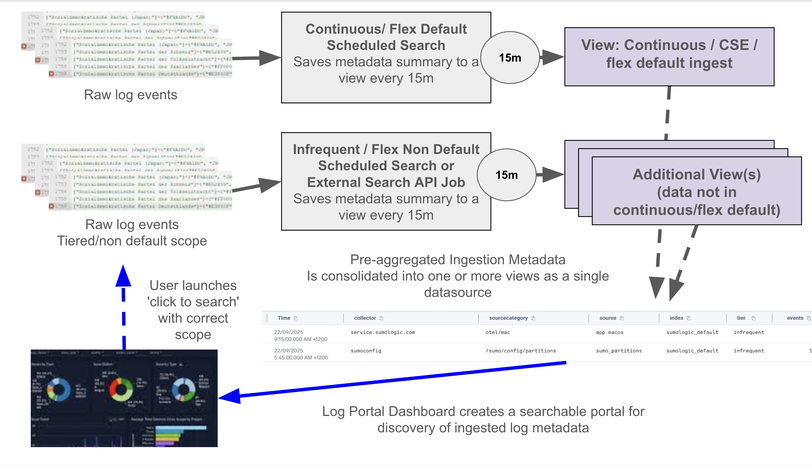
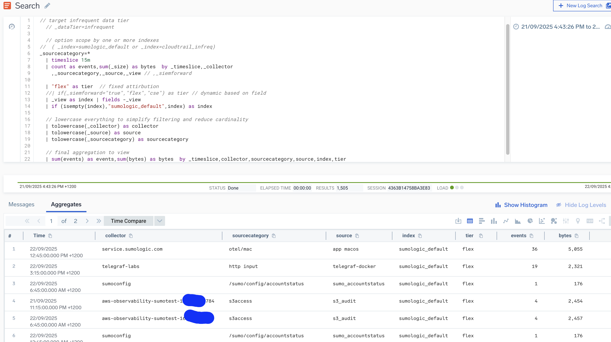
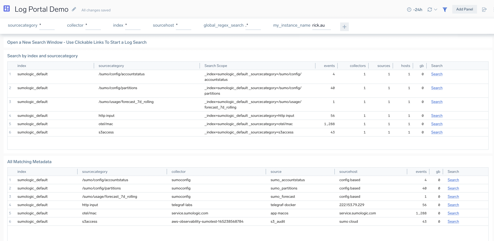

# Log Portal

Log discovery is a challenge for users in many large sumologic environments:
- new users struggle to know what is the correct metadata scopes to use to query their logs 
- this is especially when using infrequent tier, or for flex partitions outside of the default scope where log discovery is more challenging
- Open ended 'fishing trip' searches in infrequent tier or flex accounts can be inefficient and expensive.

It's possible with some pre-planning and engineering work to pre-compute ingestion metadata and provide users with a simple log entry point to speed up the metadata discovery phase.
  
This is a demonstration project to show how to build a log metadata summary view using search schedules and to provide a simple high level log discovery entry portal dashbaord that:
- enables users to search ingested log metadata using metadata such as sourcecategory, collector or index
- provide a simple 'click to search' interface to start users' search journey
- simplify the discovery of which is the correct index or other metadata to include in a search scope
- make infrequent or flex non-default metadata searchable without having to understand the metadata schema for the account and partition routing rules.

The goal of a log portal dashboard is to provide a metadata discovery portal for users, enabling them to search recently ingested metadata in an open ended way, and then click through to a search in the correct metadata context.

Similar approaches are possible using the data volume index - but that has a signifigant limitation that it only shows each metadata dimension separately, whereas a custom view can combine multiple dimensions into a single view.

- [Log Portal](#log-portal)
  - [Quickstart Demo](#quickstart-demo)
  - [Design](#design)
    - [The base summary view](#the-base-summary-view)
    - [Portal Dashboard(s)](#portal-dashboards)
    - [Base Schedule Example For Continuous/CSE or the Flex Default Search Scope](#base-schedule-example-for-continuouscse-or-the-flex-default-search-scope)
  - [Full Production Architecture Considerations](#full-production-architecture-considerations)
    - [Possible Architectures](#possible-architectures)
    - [Advanced Considerations and Enhancements](#advanced-considerations-and-enhancements)
      - [Including non-default indexes (in flex) or infrequent/frequent in enterprise suite](#including-non-default-indexes-in-flex-or-infrequentfrequent-in-enterprise-suite)
      - [Getting a list of partitions](#getting-a-list-of-partitions)
      - [Summarizing Flex non default Search Scope Logs](#summarizing-flex-non-default-search-scope-logs)
      - [Summarizing  Frequent or Infrequent Partitions in Enterprise Suite](#summarizing--frequent-or-infrequent-partitions-in-enterprise-suite)
  - [Possible extensions or enhancements to the solution](#possible-extensions-or-enhancements-to-the-solution)
    - [Use log sampling](#use-log-sampling)
    - [Add custom fields to the index](#add-custom-fields-to-the-index)
    - [Scaling and improving performance with a second tier "daily view"](#scaling-and-improving-performance-with-a-second-tier-daily-view)
    - [Removing high cardinality](#removing-high-cardinality)
    - [Advanced Enrichment Using Dashboard Parameters](#advanced-enrichment-using-dashboard-parameters)


## Quickstart Demo

This is a simple demo to show how a log portal solution would work. Since it only includes logs in the default search scope and uses a 1m scheduled view, it will work well for simple use cases in small - mid sized sumologic instances. For larger or tiered customers a more complex approach as is described later is recommended.

1. Using the [demo search](./demo.view.search.sumo) create a new scheduled view called "metadata_default_v1" and backfill this for 7 days. (It will take more time depending on your account size.)
2. Import the [portal demo dashboards](demo.portal.dash.json) an change the my_instance_name parameter default to match your sumologic instance name. This is important of the clickable links will not work.
3. Wait a few minutes for the view to start backfilling then open the dashboard. You should be able to see some ingested summarized log data and start searching by the parameters such as sourcecategory, collector or use the global_regex_search parameter.

## Design

There are two key parts to the solution:
1. one or more schedules write summary data about ingested logs to view(s)
2. a log portal dashboard provides a simple user interface to search logs. Using the [use a url to search](https://help.sumologic.com/docs/search/get-started-with-search/build-search/use-url-to-run-search/) and operators such as [tourl](https://help.sumologic.com/docs/search/search-query-language/search-operators/tourl/), the portal can provide a tabular summary result with click through links to start searches for specific matching logs.



### The base summary view

The view(s) form the foundation of the solution. The view or views aim to create a custom summary of ingested metadata, and potentially additional custom fields. In essence this is to summarize incoming log data by creating one or more schedules saving to a view  - typically every 15m for -15m, or to use a combination of scheduled view and schedules that save to a view to summarize this data at a higher level.



### Portal Dashboard(s)

Dashboards surfacing the view form the user interface layer - enabling users to quickly search ingested log metadata and then click to open a new log search for that specific scope.



### Base Schedule Example For Continuous/CSE or the Flex Default Search Scope

This is an example of a base query that could be scheduled typically every 15m for last 15m. You can also use a scheduled view - however that had the downside that you get one row per 1m. A less frequent view generates one row per say 15m so is easier to scale as a presentation layer.

```
_sourcecategory=*
| timeslice 15m
| count as events,sum(_size) as bytes  by _timeslice,_collector,_sourcecategory,_source,_sourcehost,_view // ,_siemforward
| "flex_default" as tier  // fixed attirbution
//| if(_siemforward="true","flex","cse") as tier // dynamic based on field
| _view as index | fields -_view  
| if (isempty(index),"sumologic_default",index) as index

// lowercase everything to simplify filtering and reduce cardinality
| tolowercase(_collector) as collector
| tolowercase(_source) as source
| tolowercase(_sourcecategory) as sourcecategory
| tolowercase(_sourcehost) as sourcehost

// final aggregation to view
| sum(events) as events,sum(bytes) as bytes  by _timeslice,collector,sourcecategory,source,sourcehost,index,tier
// only run this part of query for live schedule or backfilling operations
//| save view metadata_default_v1
```

## Full Production Architecture Considerations

This depends on factors like:
- account type: enterprise suite vs flex - do you have infrequent or flex non-default logs to include in the solution?
- layers: do you want to have just one view layer, or try to scale with a hierarchy of views. For example 1m or 15m schedules and view for the 'base' layer, and a daily summary view to use as the portal inteface to improve performance.

In desgins below:
- SV = scheduled view
- SSTV = Save search to View
- SJA = Search job api search scheduled externally

### Possible Architectures

| Design |  Description | Consider  |
|---|---|---|
| Simple Single View | One scheduled view (SV) or save to search view (SSTV) vs the default search scope. This is the example in the quickstart demo. | Won't include log sources that cannot be the target of a scheduled view (e.g infrequent tier) |
| Hybrid Base Views | Use SV or 'save to index' scheduled searches (SSTV) for logs that can be covered this way and externally scheduled searches via SJA where this is not supported. | Ensure views have a normalized name scheme and same column schema so they can be searched together as single entity e.g ```_view=metdata_base_*``` |
| Multi Level Views| One or more base views provide the initial aggregation. For better performance and scale a second layer of "save to index" schedules (SSTV) runs with a larger timeslice (1h, 1d etc) and a matching less frequent schedule. | Allows for fast much larger scale solution for very large accounts. |

### Advanced Considerations and Enhancements

#### Including non-default indexes (in flex) or infrequent/frequent in enterprise suite

We need more creative approach to these log types since we can't always directly schedule searches to incorporate non default search scopes for example:
- SJA - scripted search job summarized infrequent tier logs to be written to a view
- multiple SSTV run vs non-default flex views producing a view for each shard of non-defalt search scope views.

#### Getting a list of partitions

The two easiest ways to do this are:
1. use the data volume index using a query for example:
  
```
_index=sumologic_volume _sourceCategory = "view_and_tier_volume"
| parse regex "(?<data>\{[^\{]+\})" multi
| json field=data "field","dataTier","sizeInBytes","count" as view, dataTier, bytes, count
| bytes/1Gi as gbytes 
| sum(gbytes) as gbytes by view,datatier
| where dataTier = "Infrequent"
//| values(view) as partitions by datatier 

```
Note:
- CSE customers can have both CSE and non-CSE data in the same partition
- this shows ingestion to all partitions and views including scheduled views

2. Use the partitions api. See [sample python script apis/scripts/partitions/list_partitions.py](../../../apis/scripts/partitions/list_partitions.py). This enables advanced filters on whether the partition in included or excluded from Flex scope, or a specific tier type.

#### Summarizing Flex non default Search Scope Logs

It's possible to search non-defalt scope partitions by making an 'OR' scope expression to target them in a search. There are a few ways to get the list of non-default partitions:
1. in partition page in UI (suitable for small orgs only)
2. via partitions api
Determine the names of all non default scope indexes - this can be done by a query to the partitions api. To obtain a list of the required partitions use the [sample python script apis/scripts/partitions/list_partitions.py](../../../apis/scripts/partitions/list_partitions.py) - since this can filter on tier, default scope, name or routing scope, and output a list of matching partions to integrate in automation.
Create a SV or SSTV similar to above but for scope using an 'OR' vs each index required. You may need automation to update this scope from time to time as partitions are created or removed.

```
( _index=non_default_a or _index=non_default_b...)
...
| save view /metadata_nondefault_v1
```

Here is an example execution of the script to get a list of partitions that a non-default scope.
```
python3 apis/scripts/partitions/list_partitions.py --access-id=$SUMO_ACCESS_ID_DEMO --access-key=$SUMO_ACCESS_KEY_DEMO --endpoint https://api.sumologic.com --output list --output-properties name  --is-included-in-default-search-filter True --analytics-tier-filter '(?i)flex|cse'
```

#### Summarizing  Frequent or Infrequent Partitions in Enterprise Suite

Treatment of these indexes varies by the capability of your plan. In some cases scheduled "save to index" type searches are allowed (such as Infrequent + Pricing Plan). For these use cases it's still possible to make a SSTV that targets either ```_datatier=infrequent``` or specific indexes ```(_index=a or _index=b..)  ``` 

If a schedule is not possible in your pricing plan/scenario - another possible solution is to use an extenally scheduled search via the search job API (SJA).  

Here is an example of such a search below.

**Example Search Job to index infrequent tier ingested data**
```
 // target infrequent data tier
  _dataTier=infrequent 

  // option scope by one or more indexes is another option:
  // ( _index=infrequent_a or _index=cloudtrail_infreq ... )

  | timeslice 15m
  | count as events,sum(_size) as bytes  by _timeslice,_collector
    ,_sourcecategory,_source,_view // ,_siemforward

  | "infrequent" as tier
  | _view as index | fields -_view
  | if (isempty(index),"sumologic_default",index) as index
  
  // lowercase everything to simplify filtering and reduce cardinality
  | tolowercase(_collector) as collector
  | tolowercase(_source) as source
  | tolowercase(_sourcecategory) as sourcecategory
  
  // final aggregation to view
  | sum(events) as events,sum(bytes) as bytes  by _timeslice,collector,sourcecategory,source,index,tier

  // only uncomment to write directly a view during production search runs or backfilling 
  // | save view /metadata_infrequent_v1
  ```

There are two ways to get this data into a view in sumo:  

1. query and post it back to a HTTPS source endpoint with a new sourcecategory, then setup a SV or SSTV to summarize that to a view. Here is an example python script that can poll data via SJA and HTTPS POST it back again: [execute_search_job.md](../../../apis/scripts/search_job/execute_search_job.md). After each schedule we have new "log events" posted to an HTTPS endpoint, that can be included in the scope of a scheduled view or "save to view" schedule.

```
python3 ./execute_search_job.py --access-id=$SUMO_ACCESS_ID --access-key=$SUMO_ACCESS_KEY --region au --yaml-config=infrequent_search_config.yaml --mode records --output='sumo-https' --sumo-https-url='https://collectors.au.sumologic.com/receiver/v1/http/<yourendpoint>'
```

2. Use a schedule SJA with 'save view' operator at end of query. Here we directly execute the search on a schedule to create only but ```| save view /metadata_base_infrequent_v1``` or similar as the last line. For this use case no polling of job completion status or export of records is required. The script above has a 'create-only' mode for this type of use case.

## Possible extensions or enhancements to the solution

### Use log sampling

Use built in metadata fields to get a random log sample - this increases execution speed and scale but might produce incomplete dataset

```
// sampling option scope
* _messageid=*0

* (_messageid=*0 or _messageid=5*)

```

### Add custom fields to the index

You can add other fields to the search scope - FER(Field extraction rule) or pre-indexed fields are best for performance, search time parsing will slow down search and increase chance of scale issues in large accounts.
- a Cloud SIEM customer might include ```_siemforward``` to mark whether data is continuous/Flex or CSE.
- a customer where almost all logs are k8s might add key fields like: ```pod,namespace```
- a customer who has tagged all logs with key business fields like: ```team```, and ```costcenter``` could add these fields 

**View schema is critical for custom view solutions. Prototype first and go to production with one column schema. If you need custom fields do this from the start as changing later can be a lot of rework.**

Example view summary query line where custom fields are used:
```
| count as events,sum(_size) as bytes  by _timeslice,_collector
  ,_sourcecategory,_source,_view,_siemforward,pod,namespace,owner
```

### Scaling and improving performance with a second tier "daily view"

If you run the searches 15m intervals and get say 10,000 rows per run, over 24 hours thats:  1440/15 * 10,000 = 960,000 rows per day

It can make sense to run a second once per day search that precomputes a single view for the day, or last 7dso you had say:
- a -24h search of view has only ~10k rows per day not 960k
- a 'weekly' snapshot of the view might have only ~10k rows per week 
Actual row counts in a 2 tier view architecture will vary depending on cardinality over time. For example if you have ephemeral collector instances or containers metadata cardinality can still grow over time.

```
_view=/metadata_base_*
| sum(events) as events,sum(bytes) as bytes  by collector,sourcecategory,source,index,tier
| queryendtime() as _timeslice
| save view /metadata_summary_daily_v1
```

Your dashboard log portal could then use the daily or weekly pre-computed snapshot view and will execute faster and scale bigger as there would be a much smaller row count.

### Removing high cardinality

Be careful about field cardinality - overall row count for the view each 15m should be well below 100k or it will become slow and cumbersome to query. Some environments have very high cardinality values in metadata that can introduce scale and performance challenges.

You might have certain aspects of metadata that introduce unnecessary cardinality. The higher the cardinality of your < count by all the things >, the more likely it is you will run into scale/performance issues.

It might make sense to truncate these from the values in the view for example:
- only include certain metadata dimensions in thew view columns schema: for example most large customers will have big issues if they include _sourcename as it's the most prone to high cardinality strings
- shorten strings e.g ```substring(foo,0,50) as foo```
- remove known guids e.g ```replace(foo,/[0-9a-fA-F]{8}-[0-9a-fA-F]{4}-[0-9a-fA-F]{4}-[0-9a-fA-F]{4}-[0-9a-fA-F]{12}/,"<guid>")``` as foo

### Advanced Enrichment Using Dashboard Parameters

Sumo logic dashboards with parameters can be opened with a specific URL to provide the dashboard a starting scope. This means it's possible not just to have a 'click to search' link but to provide users option to open a dashboard tailored to specific key services or types.