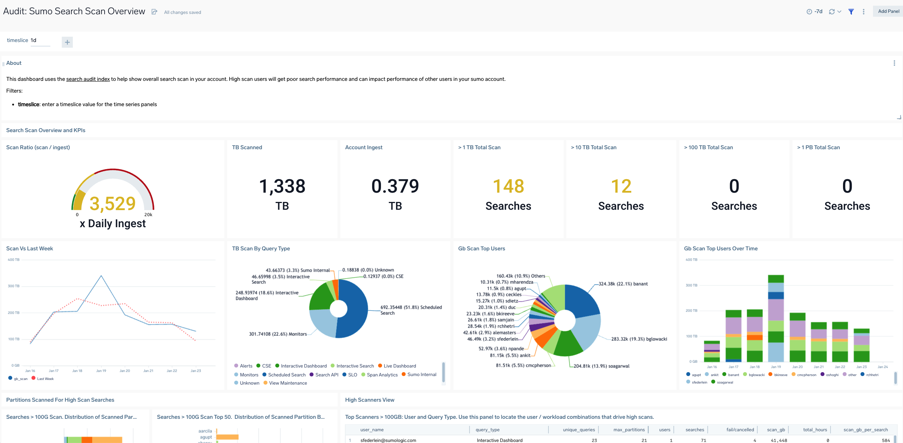
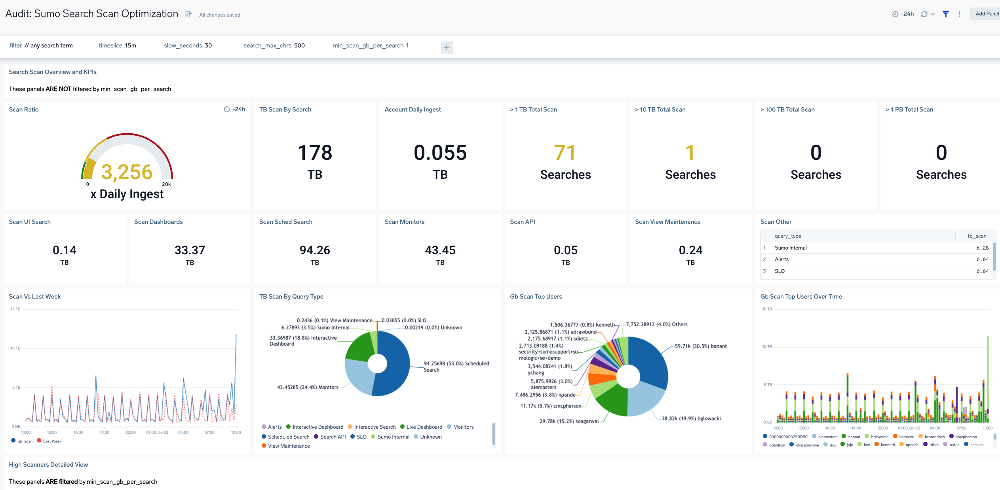
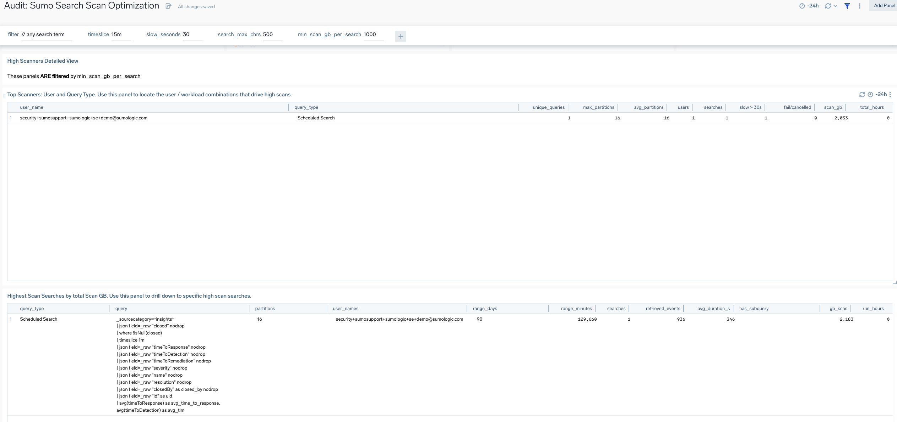

## Search Audit Apps

Dashboards for search audit index.
## Audit: Sumo Search Scan Overview
A high level overview of search scan volumes and activity in your sumo account.
Will show who high scanners are and total breakdown of scan by query type and user.

For detailed investigation use the Optimization dashboard below.



## Audit: Sumo Search Scan Optmization
This dashboard uses the [search audit index](https://help.sumologic.com/Manage/Security/Search_Audit_Index) to help you identify high search scan users who have inefficient searches that over scan your account - for example a monitor or schedule that scans all partitions will have poor performance and can degrade search performance for all users.

Filters:
- **filter**: any search term appended to line 1 of the query such as: ```query_type=interactive*``` or ```user_name=jane.doe*```. Search audit is a view not raw data so you must filter on view columns not keywords. Columns include: ```analytics_tier, data_retrieved_bytes, data_scanned_bytes, execution_duration_ms, is_aggregate, query, query_type, retrieved_message_count, scanned_bytes_breakdown, scanned_message_count, scanned_partition_count, session_id, status_message, user_name```
- **timeslice**: enter a timeslice value for the time series panels
- **slow_seconds**: a number of seconds to measure a query as slow vs fast.
- **search_max_chrs**: reduces length of search displayed in detailed tables
- **min_scan_gb_per_search**: many panels are filtered to exclude any low scanning searches below this number. Increasing the number allows you to locate higher scanners in the UI more easily. Bear in mind this is applied per search. Sometimes a user might have many searches running (such as a monitor running every minute) that might in aggregate incur a very high scan cost.

When troubleshooting high scan searches the following techniques are useful:
1. look for searches that scan **many or all partitions** by checking for high partition counts. Sumo's backend tries to optmize a search to a single partition by source category but this does not always work. For best performance train users to include an index e.g : ```_index=foo``` or ```_index=foo*``` or ``` * _index=foo or _index=bar```

2. If **searching data tiers use an specific index** rather than ```_datatier=all``` or ```_datatier=infrequent```

3. **Scan only the required time range**. For  example scheduled searches are most optimized if the range matches the schedule interval say -15m every 15m, vs -7d every 15m which will have a high overlapped scan.

4. For large searches that are repeated, **implement [scheduled views](https://help.sumologic.com/docs/manage/scheduled-views/) and query the view instead**. A pre-aggregated view will massively speed up query execution as well as reducing scan, and open up many new larger scale use cases.

5. Follow other search optimizaiton best practices being:
- include a **sourcecategory or another metadata field** like collector in every search 
- include 1 or a few **keyword expressions** to reduce the data required to be retrieved for processing. This is much faster than using parse ... where to filter later on.
- admins should implement **[Field extraction rules](https://help.sumologic.com/docs/manage/field-extractions/)** and train users to use indexed fields in search scope to speed up searches by reducing retrieved data. Search time parsing such as ```parse .... where``` is very flexible but indexed fields are much faster.






## Search Performance
A more general view of search performance from search audit showing detailed panels for investigating several common search issues such as:
- high gb scan
- longest running searches
- failed searches
