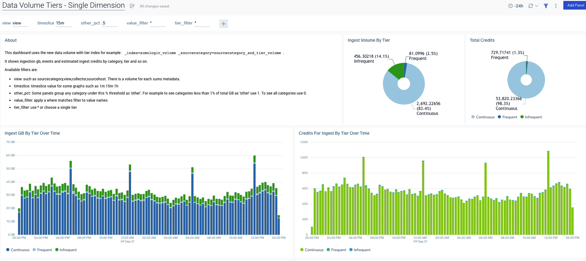
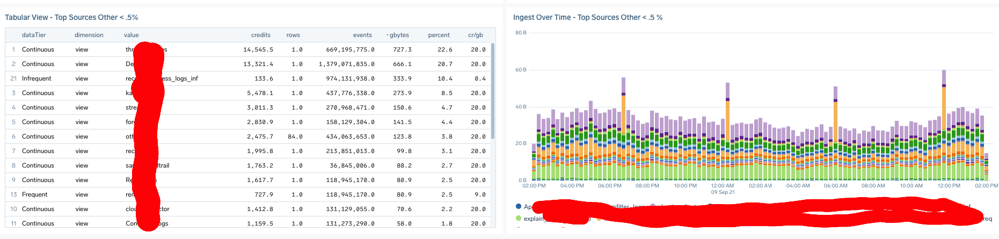

# data volume with tiers investigation dashboard

A filterable investigation dashboard for mapping ingestion by category, collector, view etc to data tier to understand both gb ingest size and credits consumed.

Uses the new data volume indexes that have a tier column for example:
```
_index=sumologic_volume _sourcecategory=sourcecategory_and_tier_volume
```
These screenshots show the data-volume-tiers-investigation-console.json dashboard.

Use Cases include:
- tracking gb or credits by cateogry, host etc over time.
- checking what data tiers one or more categories/hosts are ingesting into
- finding high credit consumers 



